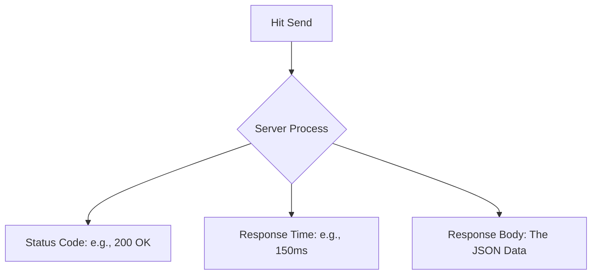

You’ve designed your endpoints, chosen your status codes, and secured them with JWT. Now, how do you actually "call" them? Since we don't have a frontend yet, we use **API Testing Tools**.

These tools act as a "Universal Client" that can send any HTTP request to any server.

## Top 3 Tools for Developers

<Tabs>
  <TabItem value="thunder" label="⚡ Thunder Client (Recommended)" default>

  ### Why we love it:
  It is a lightweight extension that lives inside **VS Code**. You don't need to switch between apps!

  * **Best For:** Quick testing during coding.
  * **Pros:** Fast, stays in your editor, supports "Collections" and "Environment Variables."
  * **Installation:** Search for "Thunder Client" in the VS Code Extensions marketplace.

  </TabItem>
  <TabItem value="postman" label="🚀 Postman">

  ### Why we love it:
  The industry leader. If you work at a big tech company, they probably use Postman to document and share APIs.

  * **Best For:** Complex projects and team collaboration.
  * **Pros:** Advanced automated testing, beautiful documentation, and cloud sync.

  </TabItem>
  <TabItem value="curl" label="💻 cURL">

  ### Why we love it:
  A command-line tool that comes pre-installed on almost every OS (Linux, Mac, Windows).

  * **Best For:** Quick checks and automation scripts.
  * **Example:**
    ```bash
    curl -X GET https://api.codeharborhub.com/v1/users
    ```

  </TabItem>
</Tabs>

## Anatomy of an API Request

When using these tools, you will need to configure four main parts:

1.  **Method:** Select GET, POST, PUT, or DELETE.
2.  **URL (Endpoint):** Where is your server running? (e.g., `http://localhost:5000/api/users`).
3.  **Headers:** This is where you put your **Content-Type** (usually `application/json`) and your **Authorization** tokens.
4.  **Body:** For POST and PUT requests, this is where you paste your JSON data.

## Understanding the Response

Once you hit "Send," the tool will show you:



## Professional Workflow: Environment Variables

Don't hardcode your URLs! Imagine you have 50 requests. If you change your port from `5000` to `8000`, you don't want to edit 50 requests manually.

**Use Variables:**

* Create a variable called `{{base_url}}`.
* Set it to `http://localhost:5000`.
* Your requests will look like: `{{base_url}}/users`.

*Now, when you go to production, you just change the variable once!*

## Summary Checklist

* [x] I have installed **Thunder Client** or **Postman**.
* [x] I know how to set the HTTP Method and URL.
* [x] I can send a JSON body in a POST request.
* [x] I understand how to read the Status Code and Response Body.

:::success 🎉 Module Complete!
You have mastered the theory of **Relational Databases** and **API Design**. You are now officially ready to start writing real code!
:::