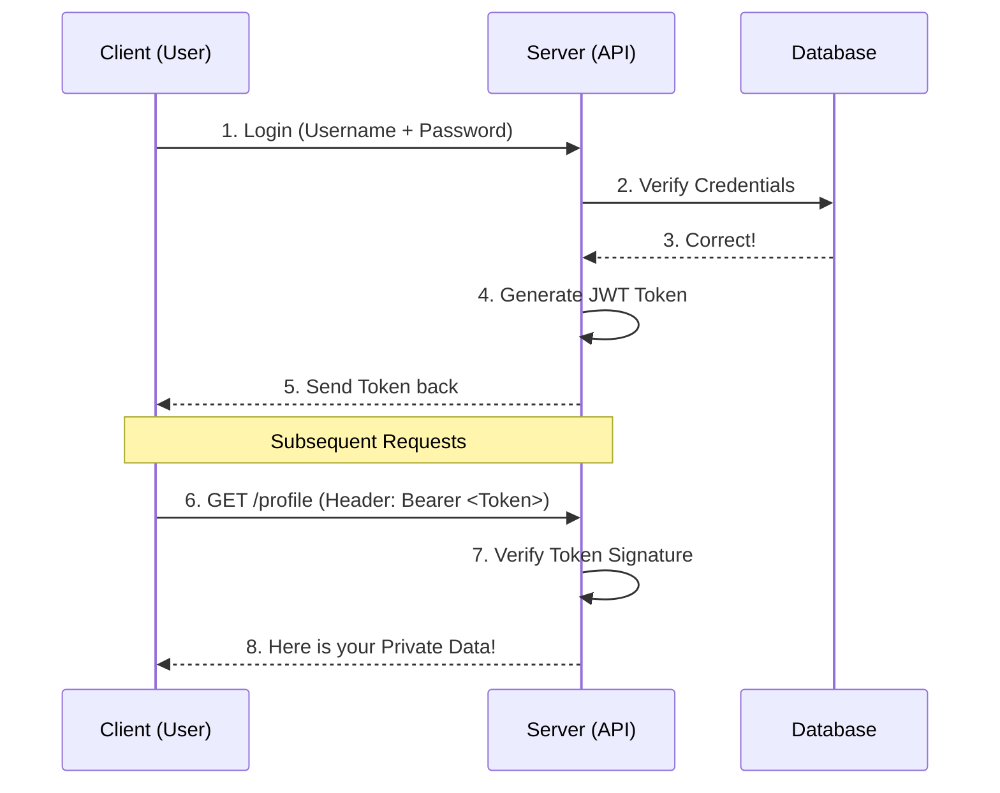

In the previous lessons, we built APIs that anyone could call. But in the real world, you don't want strangers deleting your data! **Authentication (AuthN)** is how the server verifies that a request is coming from a valid user.

## 🧐 Authentication vs. Authorization

These two sound similar, but they are very different. At **CodeHarborHub**, we use the "Office Building" analogy:

* **Authentication (AuthN):** Showing your ID card at the gate to enter the building. (*Who are you?*)
* **Authorization (AuthZ):** Your ID card only lets you into the 4th floor, not the CEO's office. (*What are you allowed to do?*)

## Common Auth Methods

Modern APIs usually use one of these three methods to keep things secure:

<Tabs>
  <TabItem value="apikey" label="🔑 API Keys" default>

  ### Simple & Fast
  The server gives the client a long, secret string (the Key). The client sends this key in the header of every request.
  * **Best For:** Public APIs (like Google Maps or Weather APIs).
  * **Risk:** If someone steals your key, they can act as you.

  </TabItem>
  <TabItem value="jwt" label="🎟️ JWT (Tokens)">

  ### The Industry Standard
  **JSON Web Tokens** are like a digital "Boarding Pass." Once you login, the server gives you a signed token. You show this token for every future request.
  * **Best For:** Modern Web and Mobile apps.
  * **Feature:** It's **Stateless** (the server doesn't need to check the database every time).

  </TabItem>
  <TabItem value="oauth" label="🤝 OAuth 2.0">

  ### Third-Party Login
  This allows you to "Login with Google" or "Login with GitHub."
  * **Best For:** User convenience and high security.
  * **Benefit:** You don't have to manage passwords; Google does it for you!

  </TabItem>
</Tabs>

## The Token-Based Workflow (JWT)

This is the most common flow you will build as a Backend Developer:

## Best Practices for API Security

1. **Always use HTTPS:** Never send passwords or tokens over `http`. They can be easily stolen.
2. **Use the Authorization Header:** Don't put tokens in the URL. Use the standard header:
`Authorization: Bearer <your_token_here>`
3. **Set Expiration:** Tokens should not last forever. If a token is stolen, it should expire in a few hours.
4. **Don't Store Secrets in Frontend:** Never hardcode your API keys in your React or HTML code. Use `.env` files.

## Summary Checklist

* [x] I understand that Authentication proves **identity**.
* [x] I know the difference between Authentication and Authorization.
* [x] I understand the JWT "Boarding Pass" workflow.
* [x] I know that sensitive data must always be sent over HTTPS.

:::danger Security Warning
Never, ever commit your API keys or Secrets to **GitHub**! If you do, hackers can find them in seconds. Always use a `.gitignore` file to hide your environment variables.
:::