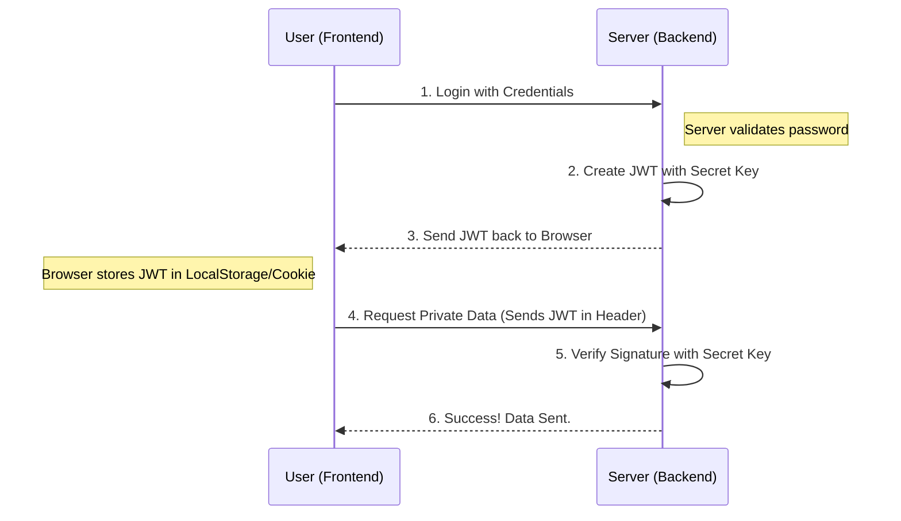

In traditional web apps, the server had to "remember" every logged-in user (Session). But in modern, scalable backends, we use **JWT**. It is **stateless**, meaning the server doesn't need to keep a list of active users in its memory.

## The Structure of a JWT

A JWT looks like a long string of random characters, but it is actually made of three parts separated by dots (`.`):

### 1. Header (The Type)
Contains information about the type of token and the hashing algorithm used (like HS256).

```json
{
  "alg": "HS256",
  "typ": "JWT"
}
```

### 2. Payload (The Data)

This is the heart of the token. It contains the user's info (claims). **Warning:** This part is only encoded, not encrypted. Never put passwords here!

```json
{
  "userId": "12345",
  "name": "Ajay Dhangar",
  "admin": true
}
```

### 3. Signature (The Security)

The server takes the encoded Header, the encoded Payload, and a **Secret Key** known only to the server, and mixes them together. This ensures that if a hacker changes the `userId`, the signature will no longer match!

## How the "Handshake" Works



## Pros vs. Cons

| Feature | Advantage | Disadvantage |
| --- | --- | --- |
| **Storage** | No server database needed for sessions. | Tokens can get large if you put too much data. |
| **Scalability** | Perfect for microservices and multiple servers. | **Impossible to "Log Out"** instantly (unless you use a blacklist). |
| **Security** | Highly secure against tampering. | If the Secret Key is leaked, your entire app is hacked. |

## Implementation Tips

<Tabs>
<TabItem value="storage" label="📦 Where to store?" default>
Don't store JWTs in `localStorage` if you are worried about XSS attacks. The most secure way is to use an **HttpOnly Cookie**.
</TabItem>
<TabItem value="expiry" label="⏱️ Expiration">
Always set an `exp` (expiration) claim. A token should usually last between 15 minutes and a few hours.
</TabItem>
<TabItem value="secret" label="🤫 Secret Keys">
Keep your secret key in an `.env` file.
`JWT_SECRET=my_ultra_secure_random_string_123`
</TabItem>
</Tabs>

## Summary Checklist

* [x] I know that JWT has 3 parts: Header, Payload, and Signature.
* [x] I understand that the **Signature** prevents data tampering.
* [x] I know that anyone can read the **Payload**, so I won't put passwords in it.
* [x] I understand that JWTs make my backend **Stateless**.

:::info Pro-Tip
You can debug and inspect any JWT at **[jwt.io](https://jwt.io)**. Try pasting a token there to see the header and payload instantly!
:::