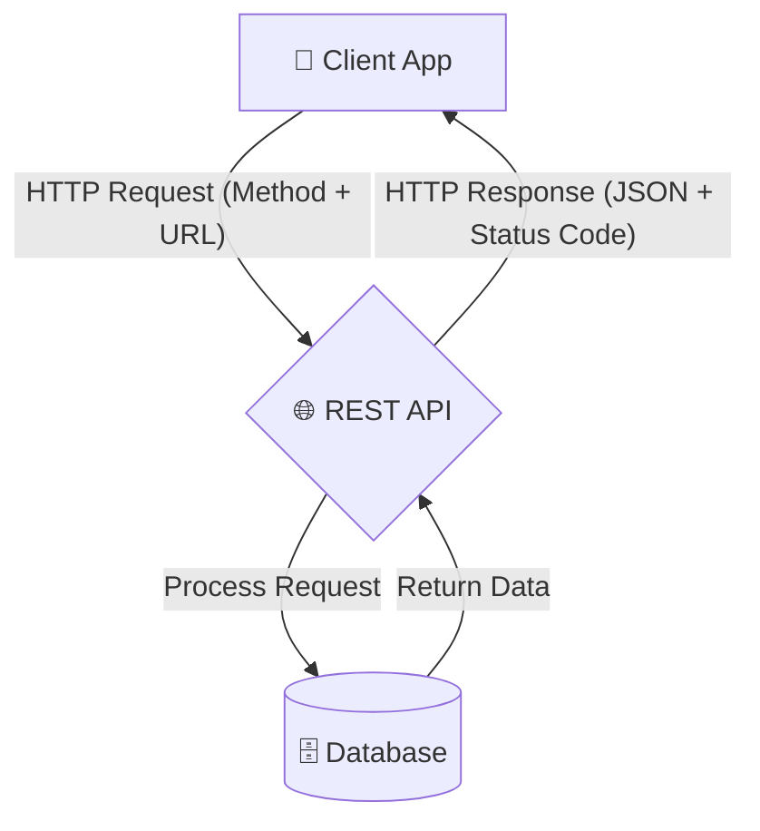

**REST** stands for **Representational State Transfer**. It is not a programming language or a tool; it is an **architectural style**. 

Think of REST as the "Traffic Rules" for the internet. If everyone follows the same rules, communication between different systems (like a Mobile App and a Java Server) becomes seamless.

## The 5 Core Principles of REST

To be called a **RESTful API**, a system must follow these specific constraints:

<Tabs>
  <TabItem value="stateless" label="☁️ Statelessness" default>

  ### No Memory
  The server does **not** store any info about your previous requests. Every single request must contain all the information (like a Token or ID) needed to understand it.
  
  * **Analogy:** It's like a vending machine. It doesn't care if you bought a soda 5 minutes ago; you must put in the money and press the button every single time.

  </TabItem>
  <TabItem value="client-server" label="📱 Client-Server">

  ### Separation of Concerns
  The Frontend (Client) and Backend (Server) are independent. 
  
  * You can completely redesign your Android app without ever touching your database code. As long as the API "Contract" stays the same, everything works!

  </TabItem>
  <TabItem value="uniform" label="🛤️ Uniform Interface">

  ### Consistency

  Every resource (User, Post, Product) must have a unique URL. You should always use standard HTTP methods (GET, POST, etc.) to interact with them.
  
  * **Standard:** `GET /users/1` should always return user data, no matter which company built the API.

  </TabItem>
</Tabs>

## The REST Communication Flow

In a RESTful system, the communication is always initiated by the **Client**. The server just waits, listens, and responds.

## Resources: The Heart of REST

In REST, everything is a **Resource**. A resource is any piece of data that the API can provide.

* **Collections:** A list of items (e.g., `/products`)
* **Individual Items:** One specific item (e.g., `/products/101`)

### How we identify them:

We use **URIs** (Uniform Resource Identifiers). A good RESTful URI should use **nouns**, not verbs.

* **Bad (Action-based):** `https://api.com/getNewOrders`
* **Good (Resource-based):** `https://api.com/orders`

## Summary Checklist

* [x] I understand that REST is an architectural style, not a language.
* [x] I know that **Statelessness** means every request is independent.
* [x] I understand that Client and Server are separate entities.
* [x] I recognize that resources should be named with **Nouns**.