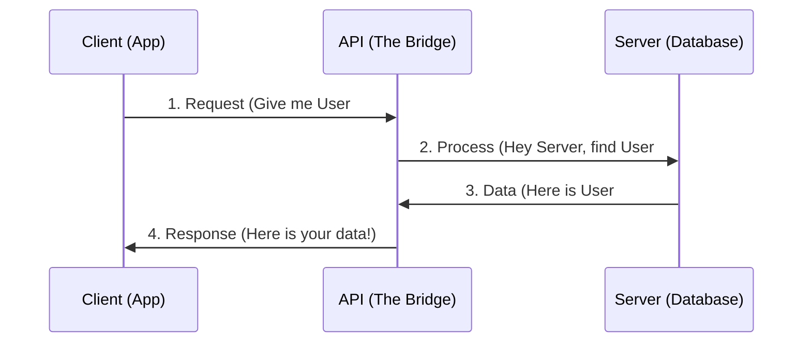

You hear the term **API** everywhere in tech. But what does it actually mean? **API** stands for **Application Programming Interface**. 

To understand this without the "tech-speak," let's look at a scenario every Indian knows well: **Ordering food at a restaurant.**

## The Restaurant Analogy

Imagine you are sitting at a table in a restaurant (the **Client**). You want to eat a *Masala Dosa* (the **Data/Resource**). 

1.  **The Client (You):** You are sitting at the table with a menu. You know what you want, but you can't go into the kitchen yourself.
2.  **The Server (The Kitchen):** This is where the chef prepares the food. It has all the ingredients and the stove.
3.  **The API (The Waiter):** The waiter comes to your table. You give the waiter your order. The waiter goes to the kitchen, tells the chef, and then brings the Dosa back to your table.

**Without the waiter (API), you wouldn't know how to talk to the kitchen, and the kitchen wouldn't know what you want!**

## What is an API in Software?

In the digital world, an API is a set of defined rules that allow one software application to talk to another.

* **Your Frontend (React/Vue):** Is the Client.
* **Your Backend (Node.js/Python):** Is the Server.
* **The API:** Is the "Endpoint" (URL) that connects them.

### Real-World Digital Examples

<Tabs>
  <TabItem value="weather" label="🌤️ Weather Apps" default>
    When you search "Weather in Bhopal" on Google, Google doesn't own weather satellites. It uses an **API** to ask a Weather Station for the data and shows it to you.
  </TabItem>
  <TabItem value="payment" label="💸 UPI/Payments">
    When you buy something on an app and use **PhonePe** or **GPay**, that app uses a Payment Gateway **API** to talk to your bank securely.
  </TabItem>
  <TabItem value="login" label="🔑 Social Login">
    "Login with Google" or "Login with GitHub" buttons use **APIs** to verify your identity without the website ever seeing your password.
  </TabItem>
</Tabs>

## How an API Request Works

Every time an API is called, a 4-step cycle happens:

## Key API Terminology

* **Endpoint:** The specific URL where the API can be accessed (e.g., `https://api.codeharborhub.com/v1/users`).
* **Request:** The "order" you send to the API.
* **Response:** The "result" the API gives back (usually in **JSON** format).
* **JSON:** The most common language APIs speak. It looks like a JavaScript object.

## Summary Checklist

* [x] I understand that an API is a messenger between a Client and a Server.
* [x] I can explain the Restaurant/Waiter analogy.
* [x] I know that APIs allow different systems to share data safely.
* [x] I understand that endpoints are the URLs we use to talk to an API.

:::info Why do we need APIs?
Security! An API acts as a gatekeeper. It allows the server to share *only* the data you are allowed to see, without giving you full access to the entire database.
:::