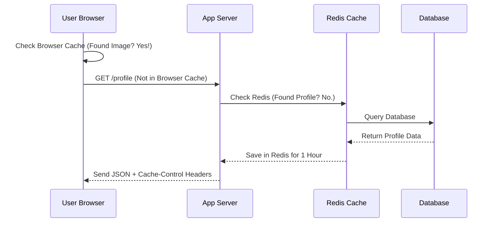

Caching isn't a single "thing" you turn on; it’s a strategy that happens at different points along the journey of a web request. 

## 1. Client-Side Caching (The Browser)

This happens directly on the user's device (Phone, Laptop). The browser decides to save certain files locally so it doesn't have to ask the server for them again.

### What is cached here?
* **Static Assets:** Images, Logos, CSS stylesheets, and JavaScript files.
* **HTML:** Sometimes the entire structure of a page.

### How do we control it?
We use **HTTP Headers** sent from the server:
* `Cache-Control: max-age=31536000` (Tells the browser: "Keep this for 1 year!")
* `ETag`: A unique "fingerprint" of a file. If the fingerprint hasn't changed, the browser uses the local copy.

## 2. Server-Side Caching (The Backend)

This happens on your server (where your Node.js/Python code lives). Instead of the user saving data, **you** save the data to avoid doing heavy work.

### What is cached here?
* **Database Queries:** Results of "Top 10 Courses" or "User Profile."
* **API Responses:** The JSON output from a third-party API.
* **Computed Data:** Results of a complex mathematical calculation.

### How do we control it?
We use in-memory stores like **Redis** or **Memcached**. The server checks the cache before it ever touches the database.

## The Comparison

| Feature | Client-Side Caching | Server-Side Caching |
| :--- | :--- | :--- |
| **Location** | User's Browser/Device | Your Backend Infrastructure |
| **Best For** | Images, UI, Scripts | Data, Logic, Database Results |
| **Control** | Suggestion (via Headers) | Full Control (via Code) |
| **Goal** | Faster Page Load Time | Reduced Database Load |

## The Hybrid Flow

In a professional app at **CodeHarborHub**, we use **both**. 

## Summary Checklist

  * [x] I know that Client-side caching saves files on the user's device.
  * [x] I understand that `Cache-Control` headers manage browser behavior.
  * [x] I know that Server-side caching prevents repeated database queries.
  * [x] I understand that tools like Redis are used for server-side caching.

:::warning The "Clear Cache" Problem
If you update your CSS file but the user's browser has it cached for a year, they won't see your changes! This is why we use **Cache Busting** (adding a version number like `style.css?v=2`).
:::