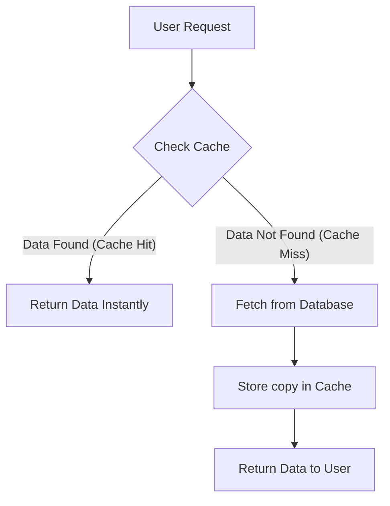

In the world of Backend Development, **Speed is King**. If your website takes 10 seconds to load, users will leave. **Caching** is the most powerful tool we have to make applications feel lightning-fast.

## The "Notebook vs. Library" Analogy

Imagine you are a researcher in a giant library (the **Database**). You are studying "Modern Web Architecture."

1.  **The Library (Database):** Contains millions of books. To find a specific fact, you have to walk to the correct floor, find the shelf, and flip through pages. It takes **5 minutes**.
2.  **Your Notebook (The Cache):** You find the fact and write it down in a small notebook on your desk. 
3.  **The Next Time:** Someone asks you that same fact. Instead of walking back into the library, you just look at your notebook. It takes **2 seconds**.

**Caching is the act of storing a copy of data in a high-speed "notebook" so that future requests for that data can be served faster.**

## How it works in a Web App

When a user requests data (like a list of top-selling products), the server follows this logic:

## Where can we Cache?

Caching happens at multiple levels of the "Stack."

<Tabs>
<TabItem value="browser" label="🌐 Browser Cache" default >
Your browser saves images, CSS, and JS files on your computer's hard drive so it doesn't have to download them every time you refresh.
</TabItem>
<TabItem value="cdn" label="☁️ CDN Cache">
Content Delivery Networks (like Cloudflare) store your website's files on servers physically close to the user (e.g., a server in Mumbai for a user in MP).
</TabItem>
<TabItem value="server" label="🖥️ Server Cache">
The backend saves the result of heavy database queries in the RAM (using tools like **Redis**) so the database doesn't get overwhelmed.
</TabItem>
</Tabs>

## Why do we need Caching?

1.  **Speed (Lower Latency):** Users get their data in milliseconds instead of seconds.
2.  **Reduced Load:** Your database doesn't have to work as hard, which saves money and prevents crashes.
3.  **Predictability:** Even if 1 million people visit your site at once, the cache can handle the traffic better than a traditional database.

## Key Vocabulary

  * **Cache Hit:** When the data is found in the cache. ⚡ (Fast!)
  * **Cache Miss:** When the data is not in the cache and must be fetched from the source. 🐢 (Slower)
  * **Stale Data:** When the data in the cache is old and different from the database. (The "Enemy" of caching!)

## Summary Checklist

  * [x] I understand that caching is about storing data closer to the user for speed.
  * [x] I can explain the difference between a Cache Hit and a Cache Miss.
  * [x] I know that caching can happen in the browser, on a CDN, or on the server.
  * [x] I understand that caching protects the database from heavy traffic.

:::info Fun Fact
Google Search is so fast because almost everything you search for is already cached in a server near you!
:::