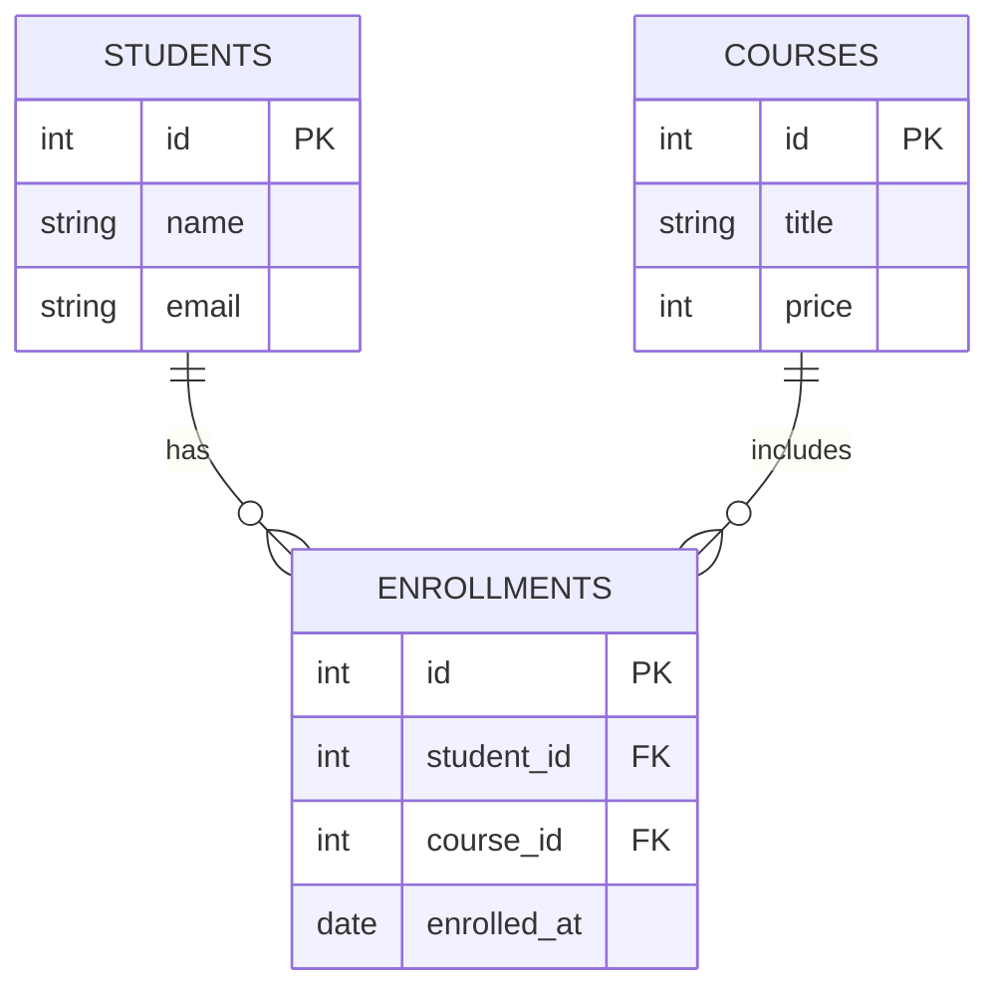

In a relational database, we don't store everything in one giant table. Instead, we split data into smaller, logical tables (like `Users`, `Courses`, and `Enrollments`). 

**Keys** are the unique identifiers that allow these tables to talk to each other.

## 1. The Primary Key (PK)

A **Primary Key** is a column (or group of columns) that uniquely identifies each row in a table. Think of it as the "Digital DNA" of a record.

### The 3 Golden Rules of Primary Keys:
1.  **Unique:** No two rows can have the same Primary Key.
2.  **Not Null:** It can never be empty. Every record *must* have an ID.
3.  **Immutable:** Once assigned, it should never change.

* **Real-World Examples:** Your Aadhar Card Number, a Roll Number, or a random UUID (Universally Unique Identifier).

## 2. The Foreign Key (FK)

A **Foreign Key** is a column in one table that refers to the Primary Key of **another** table. This is how we create a "Relationship."

### How it works:
Imagine you have a `Users` table and an `Orders` table.
* The `Users` table has a PK called `user_id`.
* The `Orders` table has its own PK, but it also has a column called `user_id`. 
* This `user_id` in the `Orders` table is a **Foreign Key** pointing back to the `Users` table.

## Visualizing the Connection

Let's look at how **CodeHarborHub** might link a student to their enrolled courses:

## Referential Integrity

When you use Foreign Keys, the database enforces a rule called **Referential Integrity**.

This means you cannot have an "Orphan" record. For example, you cannot create an `Order` for a `User` that doesn't exist in the `Users` table. The database will throw an error to protect your data!

## Summary Checklist

  * [x] I know that a **Primary Key** uniquely identifies a single row.
  * [x] I understand that a **Foreign Key** links two tables together.
  * [x] I know that Primary Keys must be unique and cannot be null.
  * [x] I understand that keys prevent "bad data" (orphaned records) from entering the system.

:::tip Best Practice
Avoid using real data (like an Email or Phone Number) as a Primary Key. Instead, use an **Auto-Incrementing Integer** (`1, 2, 3...`) or a **UUID**. This ensures that even if a user changes their email, their ID remains the same\!
:::