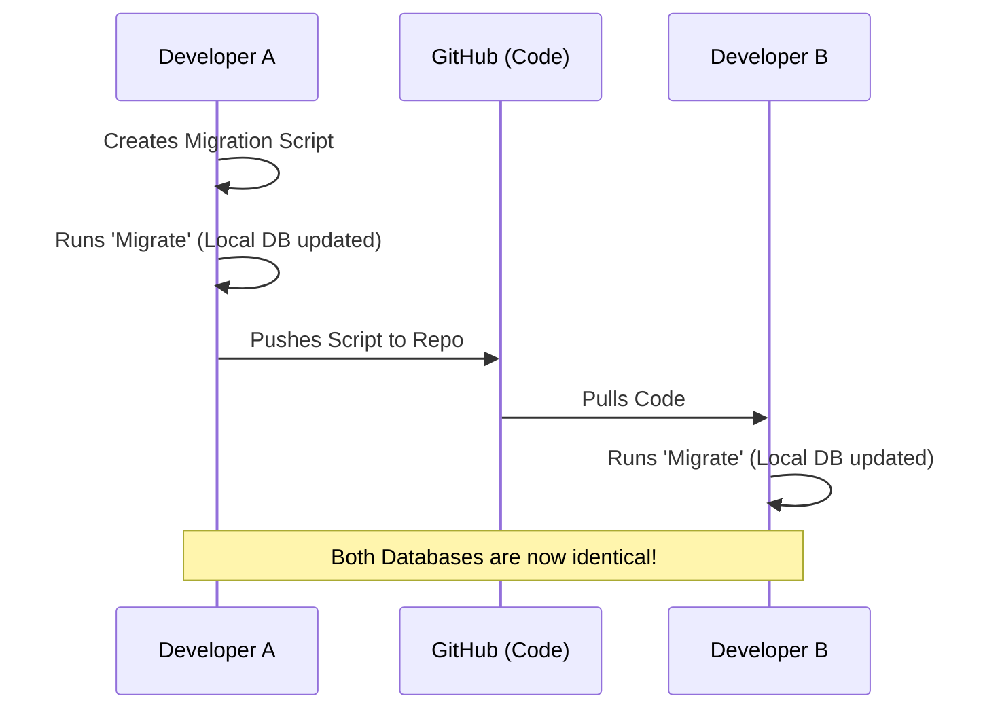

Have you ever added a new column to a table on your laptop, but then your teammate's code crashed because *their* database didn't have that column? 

In the old days, you had to send a `.sql` file to your friend and say, "Hey, run this command." **Database Migrations** solve this problem by automating the process.

## 🧐 What is a Migration?

A **Migration** is a small script (usually in JavaScript, Python, or SQL) that describes a specific change to your database structure. 

* **Migration Files** are kept in your GitHub repository.
* When a teammate pulls your code, they run one command, and their database is instantly updated to match yours.

## How Migrations Work: UP and DOWN

Every migration file has two main functions:

1.  **UP:** What should happen when we apply the migration? (e.g., Create a table).
2.  **DOWN:** How do we "Undo" this change if we made a mistake? (e.g., Drop the table).

<Tabs>
  <TabItem value="js" label="💻 Migration Example (JavaScript)" default>

  ```javascript
  // Adding a 'phone_number' column to the Users table
  export async function up(knex) {
    return knex.schema.table('users', (table) => {
      table.string('phone_number').nullable();
    });
  }

  // Undoing the change
  export async function down(knex) {
    return knex.schema.table('users', (table) => {
      table.dropColumn('phone_number');
    });
  }

```

</TabItem>
<TabItem value="sql" label="🔍 Migration Example (Raw SQL)">

```sql
-- UP: Apply the change
ALTER TABLE Users ADD COLUMN phone_number VARCHAR(15);

-- DOWN: Undo the change
ALTER TABLE Users DROP COLUMN phone_number;

```

</TabItem>
</Tabs>

---

## The Migration Workflow

At **CodeHarborHub**, we follow this industrial workflow to keep our data in sync:

1. **Create:** You generate a new migration file (e.g., `20260313_add_bio_to_users.js`).
2. **Write:** You define the `up` and `down` logic.
3. **Run:** You execute the migration command (e.g., `npx knex migrate:latest`).
4. **Commit:** You push the migration file to **GitHub**.
5. **Sync:** Your teammates pull the code and run the same command. **Boom! Everyone is on the same page.**



---

## Why You Should NEVER Edit Tables Manually

If you go into your database tool (like pgAdmin or MySQL Workbench) and manually add a column:

* **Production will crash:** When you deploy your code, the live server won't have that column.
* **Loss of History:** You won't know *when* or *why* that change was made.
* **Team Friction:** Your teammates will constantly get "Table not found" errors.

## Summary Checklist

* [x] I understand that Migrations are "Version Control" for my database.
* [x] I know that `up` applies changes and `down` reverts them.
* [x] I understand that migration files should be committed to GitHub.
* [x] I promise to never manually edit my database schema in production.

:::tip Career Secret
In a job interview, if you mention that you use **Migrations** to manage your schema instead of manual SQL scripts, you immediately look like a 10x more experienced developer. It shows you know how to work in a **real team**.
:::