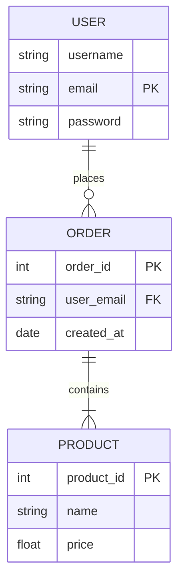

In the world of Backend Development, data is everything. But how do we store it so that it stays organized, secure, and easy to find? We use a **Relational Database Management System (RDBMS)**.

## 🧐 The "Spreadsheet" Analogy

The easiest way to understand a Relational Database is to think of it as a collection of **Excel Spreadsheets** that are linked together. 

Imagine you are running a school:
* One sheet for **Students** (Name, Roll No, Age).
* One sheet for **Courses** (Course Name, Teacher).
* One sheet for **Enrollments** (Which Student is in which Course).

Instead of repeating a student's name 10 times, you just link their unique **Roll Number**. That is the "Relationship" in Relational Database!

## Core Components of RDBMS

Every Relational Database is built using these three specific parts:

<Tabs>
  <TabItem value="tables" label="📊 Tables" default>
    The basic container. Everything in RDBMS is a table. 
    * **Rows (Records):** Represent a single item (e.g., One specific student).
    * **Columns (Fields):** Represent a property (e.g., Student's Email).
  </TabItem>
  <TabItem value="keys" label="🔑 Keys">
    Keys are the "Glue" that holds tables together.
    * **Primary Key (PK):** A unique ID that identifies a specific row (e.g., Roll No).
    * **Foreign Key (FK):** A link used to refer to a Primary Key in another table.
  </TabItem>
  <TabItem value="constraints" label="⛓️ Constraints">
    Rules that the data must follow.
    * **NOT NULL:** This column cannot be empty.
    * **UNIQUE:** No two rows can have the same value in this column.
  </TabItem>
</Tabs>

## Visualizing the Relationship

Using a **Mermaid Diagram**, we can see how an E-commerce database actually "relates" different tables:

## Why do we use RDBMS?

:::tip The Golden Rule
If your data is **structured** (fits into rows and columns) and needs to be **100% accurate** (like a bank balance), use an RDBMS.
:::

1. **Data Integrity:** It ensures that you cannot delete a user if they still have active orders.
2. **Scalability:** Modern RDBMS like PostgreSQL can handle millions of rows without slowing down.
3. **Security:** You can control exactly who can read or write to specific tables.
4. **Standard Language:** Almost every RDBMS uses **SQL**, making your skills transferable.

## ACID: The Security Shield

Relational Databases follow the **ACID** principle to ensure that even if the server crashes, your data remains safe.

:::info Quick Definition

* **Atomicity:** All parts of a transaction succeed, or none do.
* **Consistency:** Data follows all defined rules.
* **Isolation:** Transactions don't interfere with each other.
* **Durability:** Once saved, data stays saved even during power failure.
:::

## Summary Checklist

* [x] I know that RDBMS stands for Relational Database Management System.
* [x] I understand that tables are linked using **Primary** and **Foreign Keys**.
* [x] I recognize that data is stored in Rows and Columns.
* [x] I understand why ACID properties are important for data safety.

:::note Homework
Think about a Social Media app like Instagram. What tables would you need? (Hint: Users, Posts, Comments). Try to imagine which columns would be the "Primary Keys"!
:::