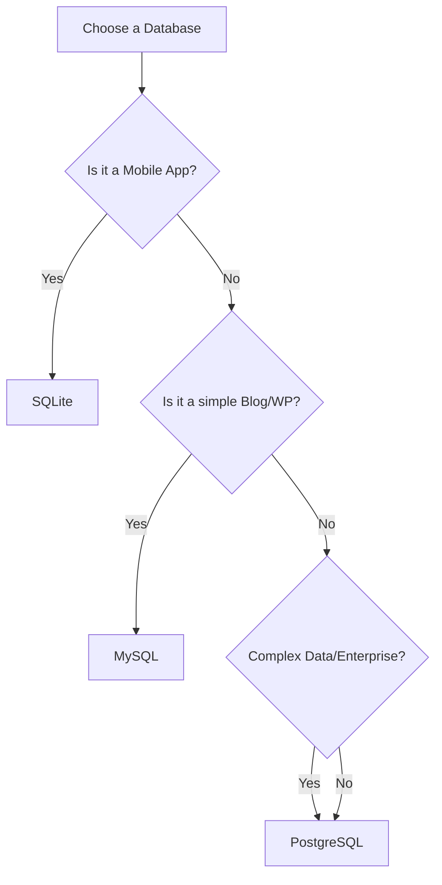

Not all Relational Databases are the same. While they all use SQL, they are built for different purposes. At **CodeHarborHub**, we want you to pick the right tool for your specific project.

## The "Big Three" Comparison

<Tabs>
  <TabItem value="postgres" label="🐘 PostgreSQL" default>

  ### The "Gold Standard"
  PostgreSQL (or Postgres) is the most advanced open-source database. It is famous for being extremely reliable and feature-rich.

  * **Best For:** Complex applications, data analysis, and large-scale backends.
  * **Killer Feature:** It handles "JSON" data very well, almost like a NoSQL database.
  * **Pro Tip:** If you aren't sure which one to pick, **choose Postgres**. It's the industry favorite for a reason.

  </TabItem>
  <TabItem value="mysql" label="🐬 MySQL">

  ### The "Web Pioneer"
  MySQL is the world's most popular database for web applications. It powers giants like **Facebook, YouTube, and WordPress**.

  * **Best For:** Standard web apps, blogs, and e-commerce sites.
  * **Killer Feature:** Extremely fast for "Read-Heavy" applications (where users are mostly looking at data rather than changing it).
  * **Pro Tip:** Great for beginners because it has massive community support and hosting is very cheap.

  </TabItem>
  <TabItem value="sqlite" label="🪶 SQLite">

  ### The "Lightweight"
  SQLite is unique because it isn't a "Server." It’s just a **single file** that sits in your project folder.

  * **Best For:** Mobile apps (Android/iOS), IoT devices, and local testing.
  * **Killer Feature:** Zero configuration! You don't need to install or manage a database server.
  * **Pro Tip:** Use this during development to move fast, then switch to Postgres for production.

  </TabItem>
</Tabs>

## Feature Matrix

| Feature | PostgreSQL | MySQL | SQLite |
| :--- | :--- | :--- | :--- |
| **Type** | Client-Server | Client-Server | Serverless (File-based) |
| **Performance** | High (Write/Read) | High (Read) | Medium |
| **Difficulty** | Medium | Easy | Very Easy |
| **JSON Support** | Excellent | Good | Limited |
| **Concurrency** | Amazing (Many Users) | High | Low (One writer at a time) |

## Which one should you pick for your project?

## Summary Checklist

* [x] I understand that **PostgreSQL** is the most powerful and feature-rich.
* [x] I know that **MySQL** is the most popular for web applications.
* [x] I recognize that **SQLite** is perfect for local testing and mobile apps.
* [x] I can choose a database based on my project's complexity.

:::info Fun Fact
Did you know that **SQLite** is the most deployed database in the world? Every single Android phone and iPhone has multiple SQLite databases inside it to store your messages, contacts, and settings!
:::