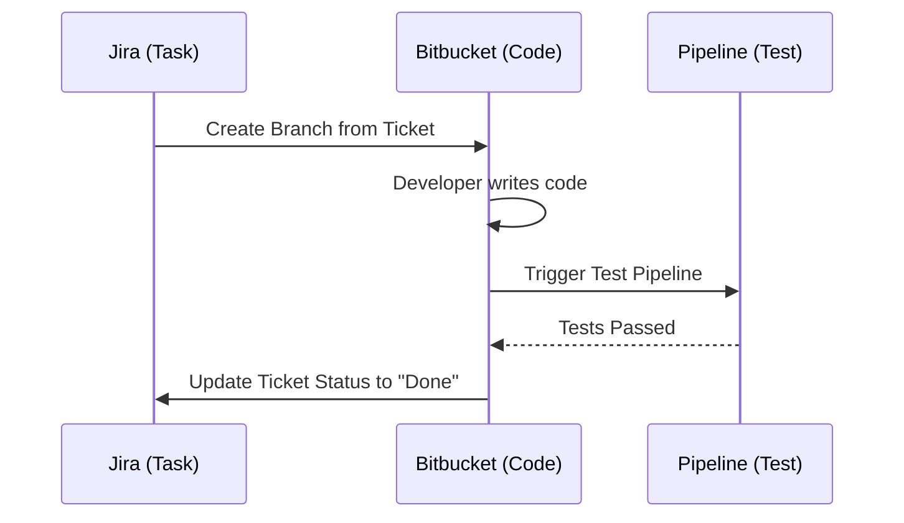

**Bitbucket** is a Git-based source code repository hosting service owned by **Atlassian**. Its superpower isn't just hosting code; it’s how perfectly it connects with the tools professional project managers use to track work.

## Why Professional Teams Use Bitbucket

1.  **Deep Jira Integration:** If a manager creates a "Bug" ticket in Jira, a developer can create a "Fix" branch in Bitbucket that is automatically linked to that ticket.
2.  **Trello Integration:** You can see the status of your code commits directly on your Trello cards.
3.  **Superior Code Review:** Bitbucket’s interface for reviewing code (Pull Requests) is designed to handle very large teams with complex approval rules.
4.  **IP Whitelisting:** For high-security companies, Bitbucket allows you to restrict code access so it can only be viewed from specific office IP addresses.

## Key Bitbucket Features

<Tabs>
  <TabItem value="atlassian" label="🔗 Atlassian Sync" default>

  * **Jira Links:** See build status and pull requests directly inside Jira tickets.
  * **Confluence:** Embed your code documentation and READMEs into your company's internal wiki automatically.

  </TabItem>
  <TabItem value="cicd" label="🚀 Pipelines">

  * **Bitbucket Pipelines:** An integrated CI/CD service built right into the UI. It uses a `bitbucket-pipelines.yml` file to automate your builds and deployments.
  * **Zero-Downtime Deploys:** Easily push code to AWS, Azure, or Google Cloud without your website ever going offline.

  </TabItem>
  <TabItem value="security" label="🔒 Security">

  * **Git Guard:** Scans your commits to ensure you don't accidentally push sensitive data like API keys.
  * **Deployment Permissions:** Control exactly who is allowed to push code to the "Production" server.

  </TabItem>
</Tabs>

## The Agile Workflow

In Bitbucket, the workflow is often driven by **Agile Sprints**. 

## Bitbucket vs. The Others

| Feature | Bitbucket | GitHub | GitLab |
| --- | --- | --- | --- |
| **Parent Company** | Atlassian | Microsoft | Independent |
| **Best Integration** | Jira / Trello | VS Code / Azure | Kubernetes / Linux |
| **Focus** | Project Management | Community/Social | DevOps Lifecycle |
| **Private Repos** | Free for up to 5 users | Free for everyone | Free for everyone |

## Recommended Resources

* **[Bitbucket Tutorials](https://www.atlassian.com/git/tutorials)**: Some of the best Git tutorials on the internet are actually written by the Bitbucket team.
* **[Bitbucket Cloud Docs](https://support.atlassian.com/bitbucket-cloud/)**: Official guide for setting up your first workspace.
* **[Jira & Bitbucket Guide](https://www.atlassian.com/software/jira/bitbucket-integration)**: Learn how to connect your code to your tasks.

## Summary Checklist

* [x] I understand that Bitbucket is owned by Atlassian.
* [x] I know that Bitbucket is the best choice for teams using Jira.
* [x] I understand that "Pipelines" is Bitbucket's automation tool.
* [x] I recognize that Bitbucket focuses on private, professional team security.

:::tip Fun Fact
Unlike GitHub, which only supported Git from the start, Bitbucket used to be a major host for **Mercurial** repositories! They eventually switched to focus exclusively on Git to match the industry standard.
:::