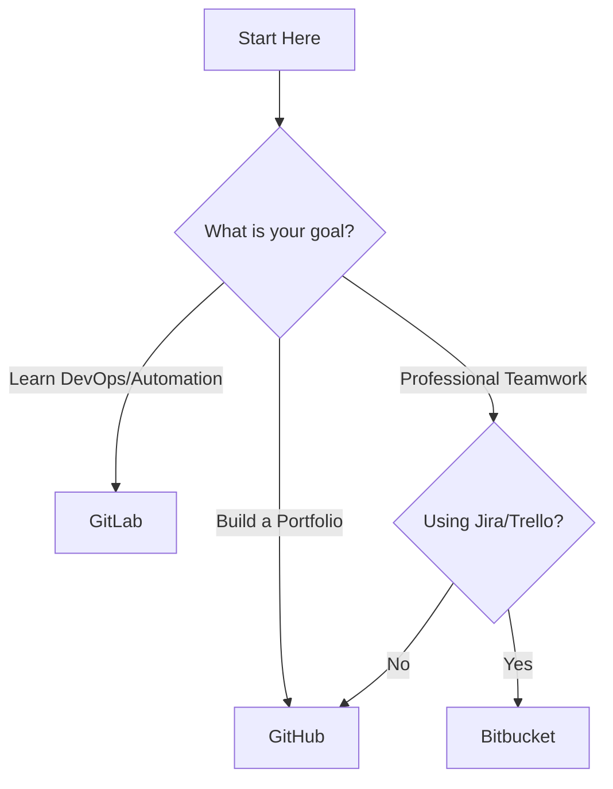

You’ve explored the "Big Three" of the hosting world: **GitHub**, **GitLab**, and **Bitbucket**. While they all speak the language of Git, they are built for different types of developers and workflows.

This guide will help you make the right choice for your next **CodeHarborHub** project.

## The "Quick-Start" Decision Tree

If you are in a hurry, follow this logic:

## Feature-by-Feature Comparison

| Feature | 🐙 GitHub | 🦊 GitLab | 🟦 Bitbucket |
| --- | --- | --- | --- |
| **Best For** | Open Source & Portfolios | Private DevOps & Security | Agile Teams & Jira Users |
| **CI/CD Tool** | GitHub Actions | GitLab CI (Native) | Bitbucket Pipelines |
| **Project Tracking** | Issues & Projects (Simple) | Epics & Milestones (Deep) | Deep Jira Integration |
| **Community** | 100M+ Developers | Medium / Enterprise | Corporate / Professional |
| **Self-Hosting** | Hard / Expensive | Easy / Core Feature | Available for Data Centers |

## The "CodeHarborHub" Recommendations

### 1. The Student & Job Seeker Path

**Winner: GitHub** If you are a student (like a B.Tech graduate) looking for an internship or your first job, **GitHub is non-negotiable**. Recruiters check your GitHub profile to see your "Green Squares" (consistency) and the quality of your code.

* **Your Move:** Start here to build your public presence.

### 2. The Private Startup Path

**Winner: GitLab** If you are building a secret project with a small team and want the most powerful automation tools for free, GitLab is incredible. Its built-in security scanning helps you catch bugs before you even launch.

* **Your Move:** Choose this if you want to master "DevOps" early.

### 3. The Corporate / Freelance Path

**Winner: Bitbucket** If you are working with a client who uses Jira to manage their business, Bitbucket is the most efficient choice. It bridges the gap between the manager’s "To-Do" list and your "Code."

* **Your Move:** Choose this for professional, organized team projects.

## Can I use more than one?

**Yes!** Many developers have:

* A **GitHub** account for their public open-source contributions.
* A **GitLab** account for their private "side-hustle" experiments.
* A **Bitbucket** account provided by their employer.

Because they all use **Git**, your commands (`git add`, `git commit`, `git push`) stay exactly the same. You just change the "Remote URL"!

## Final Summary Checklist

* [x] I know that GitHub is the best for my public resume.
* [x] I understand that GitLab offers an all-in-one DevOps experience.
* [x] I recognize that Bitbucket is the king of project management integration.
* [x] I am ready to pick a host and push my first project.

:::success Recommendation for Beginners
At **CodeHarborHub**, we recommend starting with **GitHub**. It has the most tutorials, the most users, and it’s where our community projects live.
:::