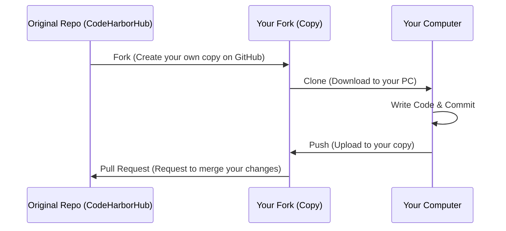

**GitHub** is the largest and most influential code-hosting platform in the world. Since its acquisition by Microsoft in 2018, it has evolved from a simple repository host into a complete developer ecosystem. If you are building a career in tech, your GitHub profile is your **professional identity**.

## Why GitHub is the Standard

GitHub is more than just a place for Git; it is a **Social Network for Code**.

1.  **Open Source Culture:** Almost every major library (React, Node.js, TensorFlow) is hosted here. You can read their code, report bugs, and even contribute.
2.  **Pull Requests (PRs):** This is GitHub's "Killer Feature." It allows you to propose changes to a project. The maintainer can review your code, comment on specific lines, and then "merge" it into the project.
3.  **The "Green Square" Grid:** Your profile shows a contribution graph. This visual representation of your activity is often checked by recruiters as a sign of consistency.

## Key GitHub Features

<Tabs>
  <TabItem value="collaboration" label="👥 Collaboration" default>

  * **Issues:** A built-in task tracker to report bugs or suggest new features.
  * **Discussions:** A forum-style space for community chat.
  * **Projects:** Kanban-style boards (like Trello) to manage your development workflow.

  </TabItem>
  <TabItem value="automation" label="🤖 Automation">

  * **GitHub Actions:** Automate your software workflows. You can set it up to run tests every time you "push" code.
  * **Dependabot:** Automatically checks your project for outdated or insecure libraries and creates a PR to fix them.

  </TabItem>
  <TabItem value="hosting" label="🚀 Hosting">

  * **GitHub Pages:** Turn any repository into a live website for free (great for your portfolio!).
  * **GitHub Gists:** A simple way to share small snippets of code or notes.

  </TabItem>
</Tabs>

## The Professional Workflow: Forking & Pull Requests

In a professional environment, you don't usually push code directly to the "Main" branch. Instead, you use the **Fork and PR** workflow.

## Essential GitHub Terms

* **Repository (Repo):** Your project folder stored on GitHub.
* **Star:** Like a "Like" button; it helps you bookmark projects you find useful.
* **Fork:** Creating a personal copy of someone else's repository.
* **Watch:** Notifying you every time there is a new update or discussion in a repo.
* **README.md:** The "Face" of your project. It's the first thing people see and should explain what your project does.

## Summary Checklist

* [x] I understand that GitHub is the cloud host for Git repositories.
* [x] I know that my GitHub profile acts as a public resume.
* [x] I understand what a **Pull Request** is used for.
* [x] I recognize that **GitHub Actions** can automate my testing.

:::success Pro-Tip
At **CodeHarborHub**, we encourage you to customize your **Profile README**. Create a repository with the exact same name as your username (e.g., `github.com/yourname/yourname`) and add a README. It will appear on your main profile page as a beautiful bio!
:::