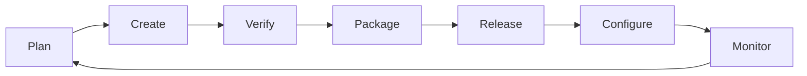

**GitLab** is a complete, web-based DevOps platform that provides everything you need to manage a project from start to finish. While GitHub is famous for "Open Source," GitLab is famous for its **"All-in-One"** philosophy—handling planning, coding, security, and deployment in a single app.

## Why Professionals Choose GitLab

1.  **Powerful Built-in CI/CD:** GitLab was the first to build "Continuous Integration" directly into the platform. You don't need a third-party tool; the automation engine is already there.
2.  **Self-Hosting:** Many companies (like NASA and Sony) use GitLab because they can install it on their **own private servers**. This ensures their code never leaves their internal network.
3.  **Security First:** GitLab automatically scans your code for security vulnerabilities, secret leaks, and even license compliance as soon as you push your code.
4.  **Free Private Repositories:** GitLab was one of the first platforms to offer unlimited private repositories for free, making it a favorite for private startups.

## The GitLab Architecture: "The DevOps Loop"

GitLab covers every stage of the software development lifecycle. In the industry, we call this the **DevOps Lifecycle**.

## Key GitLab Features

<Tabs>
<TabItem value="automation" label="⚙️ Automation" default>

* **GitLab CI/CD:** Uses a simple file called `.gitlab-ci.yml` to run tests and deploy code automatically.
* **Auto DevOps:** Automatically detects the language you are using and sets up a best-practice pipeline for you.

</TabItem>
<TabItem value="management" label="📋 Project Management">

* **Milestones:** Track groups of issues related to a specific release date.
* **Epics:** High-level goals that contain multiple issues (great for long-term planning).
* **Time Tracking:** Built-in tools to estimate and track how much time developers spend on tasks.

</TabItem>
<TabItem value="security" label="🛡️ Security">

* **SAST (Static Analysis):** Checks your source code for common security flaws.
* **Dependency Scanning:** Alerts you if any of your `npm` or `pip` packages have known bugs.

</TabItem>
</Tabs>

## GitLab vs. GitHub

| Feature | GitLab | GitHub |
| --- | --- | --- |
| **Philosophy** | All-in-one integrated tool. | Modular (integrates with other apps). |
| **CI/CD** | Deeply integrated and native. | GitHub Actions (Powerful but separate). |
| **Self-Hosting** | Primary feature (GitLab CE/EE). | Available but very expensive (Enterprise). |
| **Community** | Professional & Enterprise. | Largest Open Source community. |

## Recommended Resources

* **[GitLab Docs](https://docs.gitlab.com/)**: Extremely detailed documentation for every feature.
* **[GitLab University](https://about.gitlab.com/learn/)**: Video tutorials and paths to become a certified GitLab Associate.
* **[GitLab for Students](https://about.gitlab.com/solutions/education/)**: Check if your university qualifies for a free GitLab Ultimate license!

## Summary Checklist

* [x] I understand that GitLab is an "All-in-One" DevOps platform.
* [x] I know that GitLab is famous for its built-in CI/CD pipelines.
* [x] I understand that companies use GitLab because it can be self-hosted.
* [x] I recognize the "DevOps Loop" stages.

:::tip Pro-Tip
If you ever want to run your own code-hosting server at home on a **Raspberry Pi**, GitLab is the perfect software to install. It gives you full control over your code without relying on any company!
:::