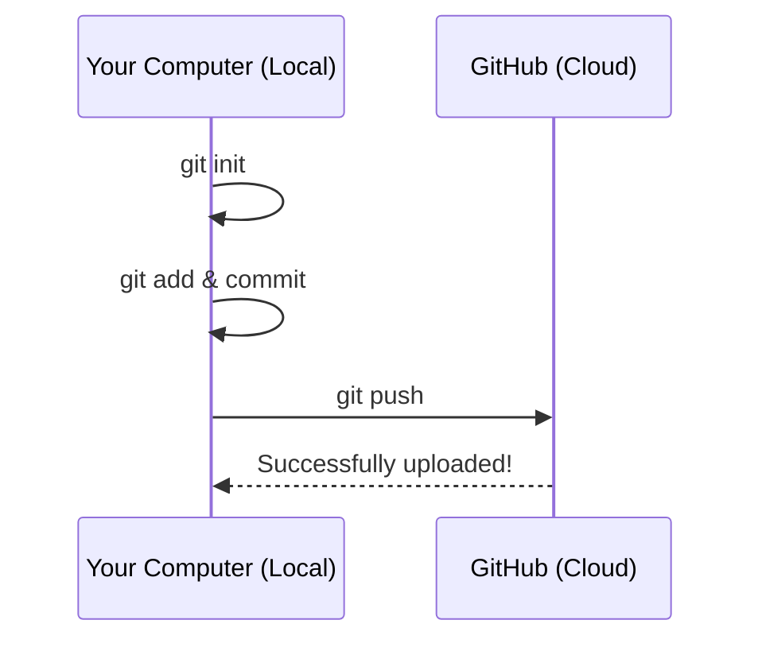

It’s time to stop reading and start doing! In this guide, we will transform your computer into a developer workstation.

## Step 1: Install Git

First, we need to get the Git engine running on your machine.

<Tabs>
  <TabItem value="windows" label="🪟 Windows" default>

  1. Download the **[Git for Windows](https://git-scm.com/download/win)** installer.
  2. Run the `.exe` file. 
  3. **Important:** When asked about the "Default Editor," you can choose **Visual Studio Code**.
  4. Keep all other settings as "Default" and click **Install**.

  </TabItem>
  <TabItem value="mac" label="🍎 macOS">

  1. Open your Terminal (Command + Space, type `Terminal`).
  2. Type `git --version` and hit Enter.
  3. If you don't have it, a popup will ask you to install **Xcode Command Line Tools**. Click **Install**.
  4. Alternatively, if you use [Homebrew](https://brew.sh/), run: `brew install git`.

  </TabItem>
  <TabItem value="linux" label="🐧 Linux">

  Open your terminal and run the command for your distribution:
  * **Ubuntu/Debian:** `sudo apt install git-all`
  * **Fedora:** `sudo dnf install git-all`

  </TabItem>
</Tabs>

## Step 2: Configure Your Identity

Git needs to know who is making changes. Open your terminal (or **Git Bash** on Windows) and type these two lines:

```bash
git config --global user.name "Your Name"
git config --global user.email "your-email@example.com"
```

*Note: Use the same email address you plan to use for your GitHub account.*

## Step 3: Create Your First Repository

Let's create a "Hello World" project and track it with Git.

### 1. Create a Folder

```bash
mkdir my-first-repo
cd my-first-repo
```

### 2. Initialize Git

This creates a hidden `.git` folder. This is where the "Time Machine" lives!

```bash
git init
```

### 3. Create a File

Create a simple file named `hello.txt` and add some text to it.

### 4. The Magic Sequence (Add & Commit)

```bash
# Add the file to the Staging Area
git add hello.txt

# Save the snapshot to the Local Repository
git commit -m "feat: my very first commit"
```

## Step 4: Connect to GitHub

Now, let's put your code in the cloud so the world can see it.

1. Go to **[GitHub.com](https://github.com)** and create a free account.
2. Click the **+** icon in the top right and select **New Repository**.
3. Name it `my-first-repo` and click **Create repository**.
4. GitHub will give you a "Remote URL" (it looks like `https://github.com/your-username/my-first-repo.git`).

**Run these commands in your terminal to link your computer to GitHub:**

```bash
# Link your local repo to the cloud
git remote add origin https://github.com/your-username/my-first-repo.git

# Rename your main branch to 'main' (standard practice)
git branch -M main

# Upload your code!
git push -u origin main
```

## How to Check Your Work

Refresh your GitHub repository page. You should see your `hello.txt` file sitting there!



## Common Commands Cheat Sheet

| Command | Purpose |
| --- | --- |
| `git status` | See which files are modified or staged. |
| `git log` | See the history of all your commits. |
| `git diff` | See exactly what lines changed in your files. |
| `git branch` | List your current branches. |

:::success 🎉 Congratulations!
You are now officially using Version Control. You have a local history on your computer and a backup in the cloud. You are ready to start building real backend applications!
:::