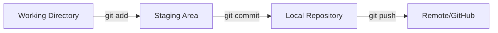
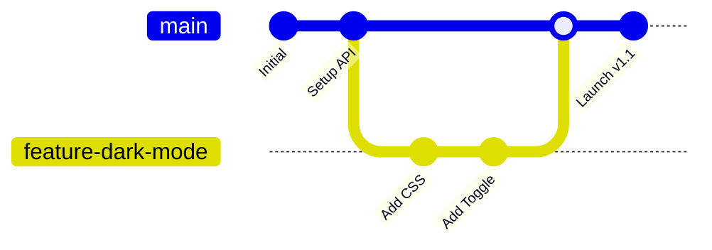

**Git** is a distributed version control system. This means that every developer’s computer contains the **entire history** of the project. It is fast, efficient, and used by millions of companies including Google, Microsoft, and Netflix.

## The Git Workflow

Before typing commands, you must understand the **Three Stages** of Git. Think of it like taking a professional photo:

1.  **Working Directory:** You are posing for the photo (Writing code).
2.  **Staging Area:** You are "frozen" in the frame, but the shutter hasn't clicked (Preparing code).
3.  **Local Repository:** The photo is saved to the memory card (Saved forever).



## Essential Git Commands

How do you actually use it? You can choose between using the **Terminal** (for power users) or a **GUI** (for a visual experience).

<Tabs>
<TabItem value="terminal" label="💻 Terminal" default>

```bash
# 1. Start a new repository
git init

# 2. Check what has changed
git status

# 3. Add a specific file to the 'Staging Area'
git add index.js

# 4. Save the snapshot with a message
git commit -m "feat: add user login logic"

# 5. Send your code to GitHub
git push origin main

```

</TabItem>
<TabItem value="gui" label="🖱️ Desktop App / VS Code">

1. **VS Code:** Click the "Source Control" icon on the left sidebar.
2. **Staging:** Click the **+** icon next to the file name.
3. **Commit:** Type your message in the box and click **Commit**.
4. **Sync:** Click **Sync Changes** to push to the cloud.

</TabItem>
</Tabs>

## Branching: Parallel Realities

The most powerful feature of Git is **Branching**.

Imagine you want to add a "Dark Mode" to your app, but you don't want to risk breaking the current working version. You create a branch.



## Why CodeHarborHub Recommends Git

* **Offline Capability:** You can save your progress while traveling or if your internet is down.
* **Safety:** Every "Commit" is a checksum (a unique ID). It is almost impossible to lose data or corrupt the history.
* **The Ecosystem:** Since Git is the standard, it integrates with every major tool like **VS Code**, **Docker**, and **Vercel**.

## Recommended Resources

* **[Oh My Git!](https://ohmygit.org/)**: An open-source game to learn Git visually.
* **[Git Cheat Sheet by GitHub](https://education.github.com/git-cheat-sheet-education.pdf)**: A handy PDF to keep on your desk.

## Summary Checklist

* [x] I understand the 3 stages: Working Directory, Staging, and Repository.
* [x] I can initialize a project with `git init`.
* [x] I know that `git add` prepares my changes and `git commit` saves them.
* [x] I understand that branches allow for safe experimentation.

:::tip Pro-Tip
Always write **clear commit messages**. Instead of writing "Fixed stuff," write "fix: resolve login button alignment on mobile." Your future self (and your team) will thank you!
:::