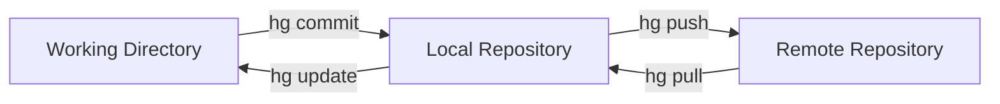

**Mercurial** (often shortened to **hg**, the chemical symbol for Mercury) is a **Distributed Version Control System (DVCS)**. It was released at almost the exact same time as Git. While Git focused on being powerful and flexible, Mercurial focused on being **predictable, efficient, and easy to use.**

## Why Choose Mercurial?

Many major tech companies (like **Meta/Facebook** in their early years) chose Mercurial over Git for several reasons:

1.  **Consistent Commands:** In Git, a single command might do five different things depending on the "flags" you use. In Mercurial, each command has one clear purpose.
2.  **Safety First:** Mercurial makes it very difficult to "rewrite history." While Git allows you to delete or change old saves (which can be dangerous), Mercurial treats history as a permanent record.
3.  **Scalability:** Mercurial is world-class at handling repositories with millions of files and thousands of developers.
4.  **The "Extension" Model:** The core of Mercurial is very simple. If you want advanced features (like branching or special logs), you turn on "extensions" only when you need them.

## The Mercurial Workflow

Mercurial uses a "Commit-to-Local" workflow similar to Git, but it skips the "Staging Area." You go directly from your files to a save point.



## Essential Mercurial Commands

If you know Git, these will look very familiar, but notice how the "Staging" step is missing:

<Tabs>
<TabItem value="terminal" label="💻 Terminal" default>

```bash
# 1. Create a new repository
hg init

# 2. Add files to be tracked (only need to do this once)
hg add

# 3. Save your changes directly
hg commit -m "feat: added basic routing logic"

# 4. Pull changes from the server
hg pull

# 5. Update your local files with what you just pulled
hg update

# 6. Send your changes to the server
hg push

```

</TabItem>
<TabItem value="gui" label="🖱️ GUI (TortoiseHg)">

Just like SVN has TortoiseSVN, Mercurial has **TortoiseHg**:

1. **Workbench:** A powerful visual tool to see your "Changelog" (history tree).
2. **Commit Tool:** A side-by-side view where you can see exactly which lines of code changed before you save.
3. **Sync:** Dedicated buttons for Pull, Update, and Push.

</TabItem>
</Tabs>

## Mercurial vs. Git

| Feature | Mercurial (hg) | Git |
| --- | --- | --- |
| **Staging Area** | No (Direct Commits) | Yes (`git add`) |
| **Command Logic** | Intuitive and consistent | Powerful but complex |
| **History** | Usually permanent (Safe) | Can be modified (Flexible) |
| **Performance** | Excellent for huge repos | Fast, but can lag on massive monorepos |

## Recommended Resources

* **[Mercurial: The Definitive Guide](http://hgbook.red-bean.com/)**: A comprehensive online book for learning Mercurial from scratch.
* **[Hg Init](http://hginit.com/)**: A famous tutorial by Joel Spolsky (founder of Stack Overflow) designed specifically for people moving from SVN to Mercurial.
* **[Official Mercurial Wiki](https://www.mercurial-scm.org/wiki/)**: The go-to spot for technical documentation and extension lists.

## Summary Checklist

* [x] I understand that Mercurial is a "Distributed" system like Git.
* [x] I know that Mercurial (hg) uses a simpler workflow without a staging area.
* [x] I recognize that Mercurial is built for safety and scalability.
* [x] I have seen the `hg commit` and `hg push` commands.

:::tip Fun Fact
Because Mercurial is written largely in **Python**, it is very easy for developers to write their own custom extensions to change how the tool works!
:::