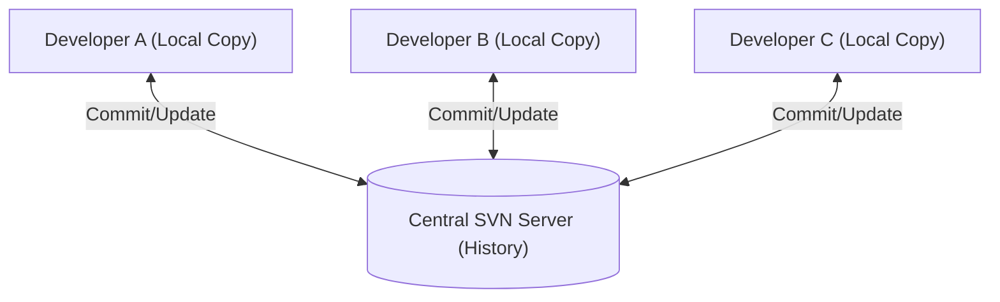

Before Git existed, **SVN** was the industry standard. It is a **Centralized Version Control System (CVCS)**. Unlike Git, where everyone has a full copy of the project, SVN relies on a **single central server** that holds all the versions of your code.

## The Centralized Model

In SVN, you don't "clone" a whole history. Instead, you "checkout" a working copy of the current code from the server. When you make changes, you commit them directly back to that central server.



## Why do companies still use SVN?

If Git is so popular, why does SVN still exist? Here are the primary use cases:

1. **Massive Files:** Git struggles with very large binary files (like 4K video assets or high-res 3D models). SVN handles them with ease.
2. **Granular Permissions:** You can restrict access to specific folders within a project. In Git, if you have access to the repo, you usually have access to everything.
3. **File Locking:** SVN allows you to "Lock" a file. This tells your teammates: *"I am editing this file right now, please don't touch it."* This is great for files that can't be merged easily (like Photoshop files).

## Essential SVN Commands

The vocabulary in SVN is slightly different from Git. Let's look at the most common actions:

<Tabs>
<TabItem value="terminal" label="💻 Terminal" default>

```bash
# 1. Get the code from the server for the first time
svn checkout http://svn.example.com/repos/project

# 2. Get the latest changes from your teammates
svn update

# 3. See what you have changed locally
svn status

# 4. Save your changes to the central server
svn commit -m "docs: updated the README file"

```

</TabItem>
<TabItem value="gui" label="🖱️ GUI (TortoiseSVN)">

Most Windows developers use **TortoiseSVN**, which integrates directly into your File Explorer:

1. **Update:** Right-click a folder and select **SVN Update**.
2. **Commit:** Right-click, select **SVN Commit**, and type your message.
3. **Icons:** SVN adds small overlays to your icons (Green check = Saved, Red exclamation = Modified).

</TabItem>
</Tabs>

## SVN vs. Git: The Key Differences

| Feature | SVN (Centralized) | Git (Distributed) |
| --- | --- | --- |
| **History** | Stored ONLY on the server. | Stored on every developer's machine. |
| **Offline Work** | Limited. You need internet to commit. | Full. You can commit/branch offline. |
| **Speed** | Can be slow (depends on network). | Very fast (most operations are local). |
| **Branching** | Possible, but "heavy" and complex. | Extremely lightweight and easy. |

## Recommended Resources

* **[Version Control with Subversion](https://svnbook.red-bean.com/)**: The official free book (often called the "Red Bean" book).
* **[Apache Subversion FAQ](https://subversion.apache.org/faq.html)**: Quick answers to common technical hurdles.
* **[TortoiseSVN Guide](https://tortoisesvn.net/support.html)**: The best resource for Windows users.

## Summary Checklist

* [x] I understand that SVN uses a single central server.
* [x] I know the difference between `svn checkout` (getting code) and `svn update` (syncing code).
* [x] I understand when to choose SVN over Git (large files, folder permissions).
* [x] I recognize the "Locking" feature used for binary files.

:::warning Important Note
Because SVN is centralized, if the server goes down, you **cannot** commit your work or see the project history until it is back online. Always make sure your server is backed up!
:::