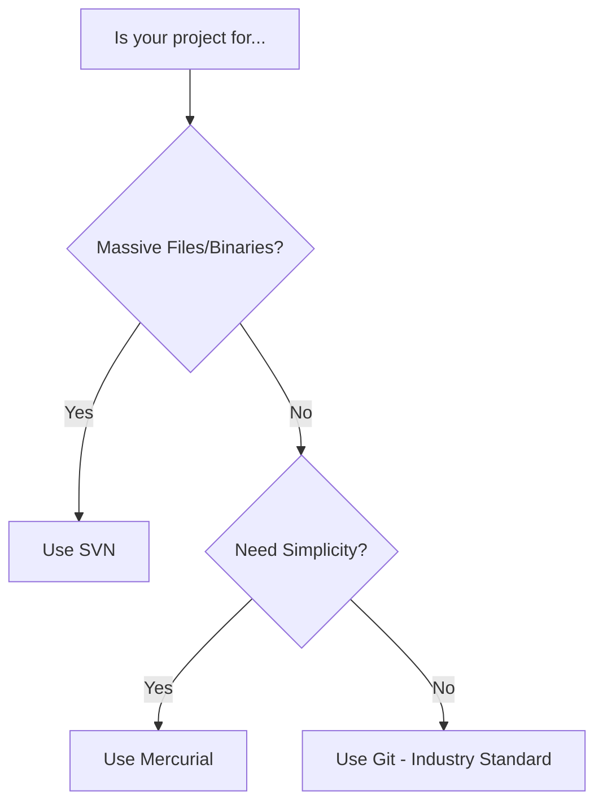

Learning Version Control is like learning to drive, it feels overwhelming at first, but soon it becomes second nature. Here are the most common questions we get from learners at **CodeHarborHub**.

## The Big Concept Questions

<b>1. Is Git the same thing as GitHub?</b>

 
No! This is the most common mistake. 
<ul>
  <li><b>Git</b> is the software (the tool) that runs on your computer to track changes.</li>
  <li><b>GitHub</b> (or GitLab/Bitbucket) is a website that hosts your Git repositories in the cloud so others can see them.</li>
</ul>
<i>Analogy: Git is the <b>Camera</b>; GitHub is <b>Instagram</b>. You use the camera to take the photo, and Instagram to share it with the world.</i>

<b>2. If I use a Distributed VCS (Git), do I still need the Cloud?</b>

 
Technically, no. You can use Git entirely on your local machine to keep track of your own history. However, using a cloud provider like GitHub acts as a <b>Backup</b> and allows for <b>Collaboration</b> with other developers.

<b>3. What happens if two people edit the same line of code?</b>

 
This creates a <b>Merge Conflict</b>. The VCS will stop and ask you to "Resolve" it. It will show you both versions of the code side-by-side and ask you to pick which one to keep (or combine both).

## Practical Workflow Questions

<b>4. How often should I "Commit" my code?</b>

 
<b>Rule of thumb:</b> Commit every time you finish a small, logical task. 
 
✅ <i>Good:</i> "Add login button styling" 
 
❌ <i>Bad:</i> "Worked for 5 hours and changed 20 files."
 
Small commits make it much easier to find bugs later!

<b>5. I accidentally committed a password or secret key! What do I do?</b>

 
<b>Stop!</b> Do not just delete it and commit again. The password is still in your <i>history</i>. You must use tools like `git filter-repo` or "BFG Repo-Cleaner" to scrub it from the entire history. Better yet: Use a <code>.gitignore</code> file from the start to prevent secrets from being tracked.

<b>6. Should I use the Terminal or a GUI (Desktop App)?</b>

 
Both are fine! 
<ul>
  <li><b>Terminal:</b> Faster for expert users and works on remote servers.</li>
  <li><b>GUI (Visual):</b> Much better for seeing "Diffs" (exactly what lines changed) and understanding complex branching.</li>
</ul>
At <b>CodeHarborHub</b>, we recommend learning the basic terminal commands first so you understand what the buttons in the GUI are actually doing.

## Comparison Doubts

<b>7. Why is everyone moving away from SVN to Git?</b>

 
Mainly because of <b>Branching</b>. In SVN, creating a branch is "heavy" and slow. In Git, it is near-instant. Modern software development relies on fast experimentation, which makes Git's speed a huge advantage.

## Summary Comparison

## Final Advice for Beginners

1. **Don't Panic:** If you get a scary error message, Google it. Every developer has been stuck on a "Merge Conflict" or a "Detached HEAD" before.
2. **Read your Diffs:** Before you commit, look at what you changed. It helps you catch "console.log" statements or temporary notes you forgot to delete.
3. **The `.gitignore` is your friend:** Always include one to keep your `node_modules` or `__pycache__` out of your repository.

:::success Module Complete!
You now have the theoretical knowledge of Version Control. You know the **What, Why, and How**.
:::