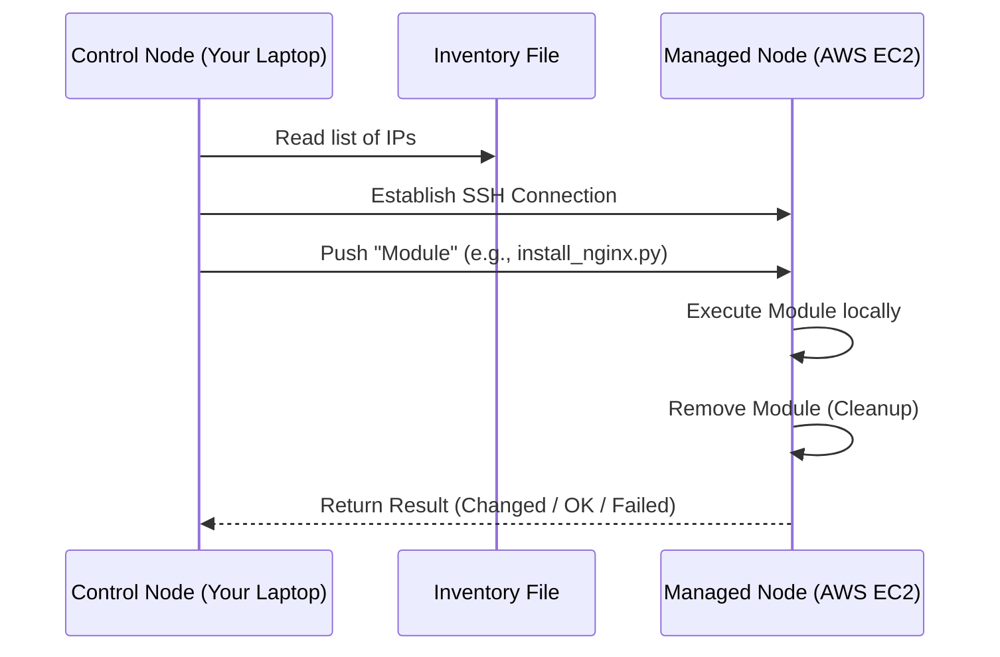
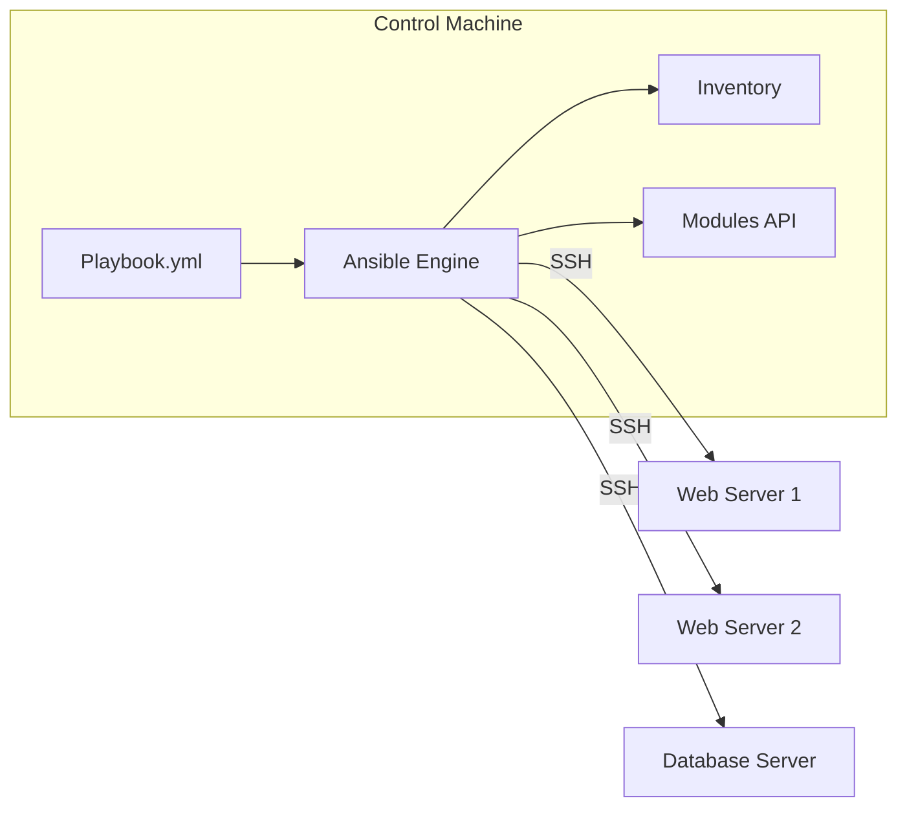

To master automation at **CodeHarborHub**, you must understand how Ansible communicates across a network. Unlike other tools that require a "Resident Agent" on every server, Ansible is **Agentless**. It sits on one machine and "talks" to others using standard protocols.

:::info
This lesson is crucial for understanding how Ansible operates under the hood. It will help you troubleshoot issues and optimize your automation workflows.
:::

## The Core Components

Ansible’s architecture consists of four primary building blocks that work together to execute your "Industrial Level" automation.

### 1. The Control Node
This is the machine where Ansible is installed. It is the "Brain" of your operations.
* **Requirements:** Any Unix-like machine (Linux, macOS). *Note: Windows cannot be a Control Node, but it can be a Managed Node.*
* **Action:** This is where you write your Playbooks and run the `ansible-playbook` command.

### 2. Managed Nodes (Hosts)
These are the remote systems (Servers, Network Devices, or Containers) that you are managing with Ansible.
* **Requirements:** They only need **Python** installed and an **SSH** connection.
* **Action:** They receive instructions from the Control Node and execute them locally.

### 3. Inventory
A list of Managed Nodes. It tells Ansible "Who" to talk to. 
* It can be a simple static file (`hosts.ini`) or a dynamic script that pulls data from AWS or Azure.

### 4. Modules
The "Tools" in the toolbox. Modules are small programs that Ansible pushes to the Managed Nodes to perform specific tasks (like installing a package or restarting a service).

## The "Push" Model

Most automation tools use a "Pull" model (where servers ask for updates). Ansible uses a **Push Model**.

## Architecture Features

| Feature | Description | Why it matters? |
| :--- | :--- | :--- |
| **Agentless** | No software to update or manage on target servers. | Reduces security vulnerabilities and "resource bloat." |
| **SSH Transport** | Uses standard OpenSSH for secure communication. | No need to open extra firewall ports. |
| **Facts Engine** | Automatically discovers system info (OS, IP, CPU). | Allows you to write logic like "If OS is Ubuntu, use `apt`." |

## How Modules Work (The Execution)

When you run a task, Ansible doesn't just send a command string. It follows a professional execution lifecycle:

<Tabs>
<TabItem value="connect" label="1. Connect" default>

Ansible opens an SSH connection to the Managed Node using your SSH keys.

</TabItem>
<TabItem value="transfer" label="2. Transfer">

It copies the required **Python Module** to a temporary folder on the remote machine.

</TabItem>
<TabItem value="execute" label="3. Execute">

It runs the Python script on the remote machine. This script checks the current state and makes changes if necessary.

</TabItem>
<TabItem value="cleanup" label="4. Cleanup">

Once the task is done, Ansible deletes the temporary Python script, leaving the server clean.

</TabItem>
</Tabs>

## Visualizing the Workflow

:::info
Because Ansible is agentless, you can start managing a server the **second** it finishes booting up. There is no "registration" or "handshake" process required.
:::