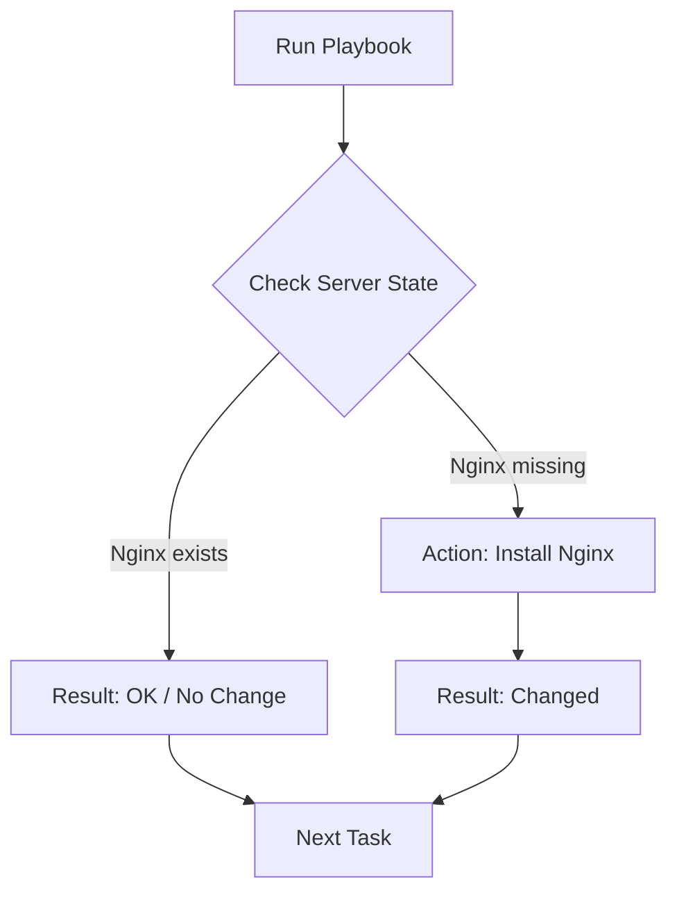

As a **Full-Stack Developer** or **DevOps Engineer** at **CodeHarborHub**, you will eventually manage more than just one server. Imagine having to install Node.js, configure Nginx, and create users on **50 different AWS EC2 instances** manually. 

This is where **Ansible** comes in. Ansible is an open-source IT automation engine that automates provisioning, configuration management, and application deployment.

## The "Furniture" Analogy

To understand where Ansible fits in the DevOps lifecycle, compare it to building a house:

* **Terraform:** Builds the "House" (The VPC, the Subnets, the empty EC2 instances).
* **Ansible:** Installs the "Furniture" and "Utilities" (Installing Node.js, setting up the Database, adding SSH keys for the team).

## Why Ansible? (The 3 Agentless Pillars)

Ansible stands out from other tools like Chef or Puppet because of its simplicity and "Industrial Level" efficiency.

| Feature | Explanation | Benefit |
| :--- | :--- | :--- |
| **Agentless** | No software to install on the target servers. | Less overhead and higher security. |
| **Idempotent** | Only makes changes if the current state doesn't match the desired state. | Safe to run the same script 100 times. |
| **YAML Based** | Uses "Playbooks" written in simple, human-readable English. | Easy for the whole team to read and edit. |

## Understanding Idempotency

This is the most critical concept in Ansible. If you tell Ansible to "Ensure Nginx is installed," it first checks the server. 

In a manual script, running an "install" command twice might cause an error. In Ansible, it simply says **"OK"** and moves on.

## How it Connects: The SSH Secret

Ansible doesn't use a special "calling" system. It uses **SSH (Secure Shell)**, the same tool you use to log into your servers manually.

<Tabs>
<TabItem value="traditional" label="Traditional Tools" default>

  * Require a "Client" software installed on every server.
  * Require specific ports to be opened.
  * High maintenance as you scale.

</TabItem>
<TabItem value="ansible" label="The Ansible Way">

  * Uses the existing SSH connection.
  * Works as soon as the server is launched.
  * **Push Model:** You push configurations from your laptop to the servers.

</TabItem>

</Tabs>

## Essential Vocabulary

Before we move to the next chapter, familiarize yourself with these terms:

1.  **Control Node:** The machine where Ansible is installed (usually your laptop or a CI/CD runner).
2.  **Managed Nodes:** The remote servers you are managing.
3.  **Inventory:** A simple list of IP addresses for your Managed Nodes.
4.  **Playbook:** The YAML file containing your list of automation tasks.

:::info
Ansible is perfect for **Full-Stack Developers**. You can write a single "Playbook" that sets up your entire MERN stack environment (Linux + Node.js + MongoDB + Nginx) in under 2 minutes.
:::

## Learning Challenge

Think about a task you do repeatedly on your local Linux machine (like updating packages or cleaning logs). In the next few lessons, we will learn how to turn that manual process into a reusable **Ansible Task**.