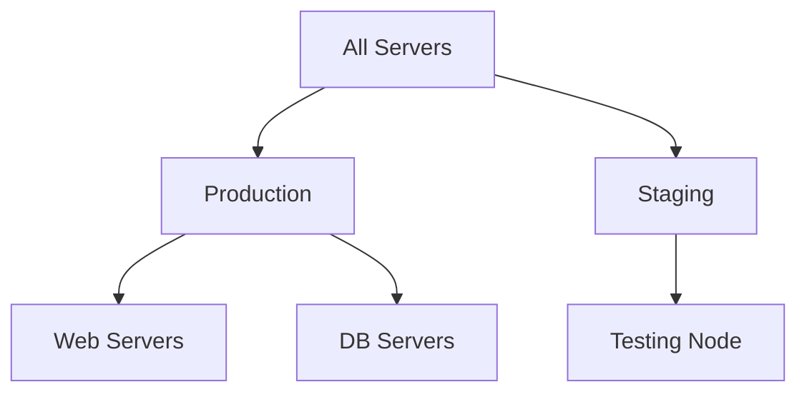

An **Inventory** is a simple file that tells Ansible which servers to manage. In a professional **CodeHarborHub** workflow, we don't just list IP addresses; we organize them into logical groups like `webservers`, `dbservers`, and `staging` vs `production`.

:::info Why Inventory Management Matters
Proper inventory management is crucial for scaling your automation. It allows you to target specific tasks to specific servers, manage different environments, and maintain a clear structure as your infrastructure grows.
:::

## Inventory Formats

Ansible supports two primary formats for static inventories: **INI** (the classic way) and **YAML** (the modern, structured way).

<Tabs>
  <TabItem value="ini" label="INI Format (Classic)" default>

Easy to read and great for beginners, but can get messy with large inventories.

```ini title="hosts.ini"
[webservers]
web1.codeharborhub.com
13.233.10.45 ansible_user=ubuntu

[dbservers]
db-primary.internal

[india:children]
webservers
dbservers
```

</TabItem>
<TabItem value="yaml" label="YAML Format (Modern)">

Best for complex configurations and nested groups, but has a steeper learning curve.

```yaml title="hosts.yaml"
all:
  children:
    webservers:
      hosts:
        web1.codeharborhub.com:
        13.233.10.45:
          ansible_user: ubuntu
    dbservers:
      hosts:
        db-primary.internal:
```

</TabItem>
</Tabs>

## Grouping & Hierarchy

Grouping allows you to target specific tasks to specific servers. For example, you only want to install **Node.js** on your web servers, not your database servers.

### Parent and Child Groups

You can nest groups to create a hierarchy. This is "Industrial Level" practice for managing multiple environments.



```ini title="hosts.ini"
[prod_web]
web-01.prod.com
web-02.prod.com

[prod_db]
db-01.prod.com

[production:children]
prod_web
prod_db
```

In this example, `production` is a parent group that includes both `prod_web` and `prod_db`. You can run tasks on all production servers or target just the web or database servers.

## Inventory Variables

Sometimes, servers in the same group need different settings (e.g., a different SSH port or a specific API key). You can define these directly in the inventory.

| Variable | Purpose |
| :--- | :--- |
| `ansible_host` | The actual IP/FQDN if the alias is different. |
| `ansible_port` | The SSH port (default is 22). |
| `ansible_user` | The username to log in with (e.g., `ubuntu` or `ec2-user`). |
| `ansible_ssh_private_key_file` | Path to your `.pem` or `.pub` key. |


## Static vs. Dynamic Inventory

At **CodeHarborHub**, we use different inventory types based on the project size.

| Type | Best For... | Example |
| :--- | :--- | :--- |
| **Static** | Small projects, fixed IPs, or local labs. | `hosts.ini` file. |
| **Dynamic** | Cloud environments (AWS, Azure, GCP). | A Python script that asks AWS: "Give me all running EC2 instances." |

:::info The AWS Plugin
In a real job, you won't manually type IP addresses. You will use the `aws_ec2` plugin, which automatically updates your inventory every time a new server is launched in your VPC.
:::

## Testing Your Inventory

Once you've created your `hosts.ini` file, use the **Ad-Hoc** command to test connectivity to all servers in a group:

```bash
# Syntax: ansible <group_name> -i <inventory_file> -m <module>
ansible webservers -i hosts.ini -m ping
```

**Expected Output:**

```json
13.233.10.45 | SUCCESS => {
    "changed": false,
    "ping": "pong"
}
```

If you see `SUCCESS`, it means Ansible can communicate with your server. If you get `UNREACHABLE`, check your SSH settings, firewall rules, and inventory configuration.

:::info Best Practices & Tips
* Always use descriptive group names (e.g., `prod_web` instead of just `web`).
* Keep your inventory organized and version-controlled (e.g., in Git).
* Use variables to avoid hardcoding sensitive information in your playbooks.
* Regularly test your inventory to ensure all servers are reachable before running playbooks.
:::

## Learning Challenge

1.  Create a file named `my_hosts.ini`.
2.  Add your local machine as a host (use `127.0.0.1 ansible_connection=local`).
3.  Create a group named `[local]`.
4.  Run `ansible local -i my_hosts.ini -m setup` to see all the "Facts" Ansible can discover about your computer!