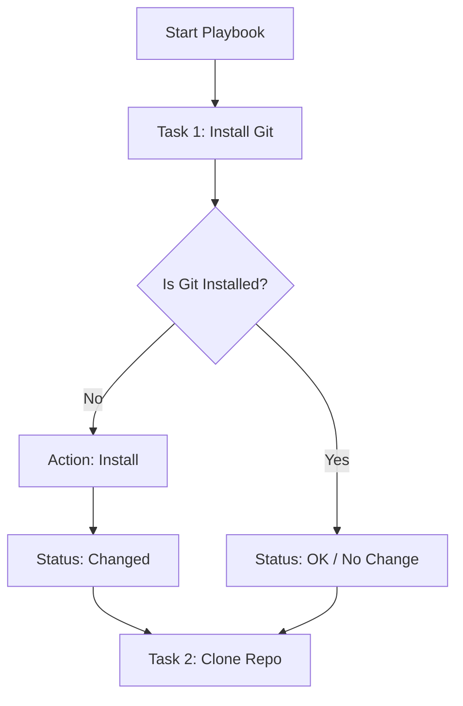

If an **Inventory** is the "Address Book" of your servers, a **Playbook** is the "Instruction Manual." Playbooks are where you define the **Desired State** of your infrastructure using a simple, human-readable language called **YAML**.

At **CodeHarborHub**, we use Playbooks to ensure that every server in our cluster is configured exactly the same way, every time.

:::info Why Playbooks Matter
Playbooks allow you to automate complex tasks across multiple servers with a single command. They are idempotent, meaning you can run them multiple times without causing unintended changes. This makes them essential for maintaining consistency and reliability in your infrastructure.
:::

## The Anatomy of a Playbook

A Playbook consists of one or more **Plays**. A Play maps a group of hosts to a list of **Tasks**.

<br />


<br />

### A Standard Web Server Playbook

Create a file named `setup-webserver.yml`:

```yaml title="setup-webserver.yml"
---
- name: Configure CodeHarborHub Frontend
  hosts: webservers
  become: yes # Run as sudo/root

  tasks:
    - name: Ensure Nginx is installed
      apt:
        name: nginx
        state: present

    - name: Start Nginx service
      service:
        name: nginx
        state: started
        enabled: yes
```

In this example, we have a single Play that targets the `webservers` group. It has two tasks: one to install Nginx and another to start the Nginx service. Notice how we use the `apt` module to manage packages and the `service` module to manage services. Each task has a descriptive name, making it easy to understand what the playbook does at a glance.

:::info
Always use `become: yes` for tasks that require elevated privileges (like installing software or modifying system configurations). This ensures your playbook can run successfully on servers where you don't have direct root access.
:::

## Understanding Tasks and Modules

A **Task** is the smallest unit of action in Ansible. Every task calls an **Ansible Module**.

| Component | Purpose | Example |
| :--- | :--- | :--- |
| **Name** | Describes what the task does (shown in logs). | `name: Install Node.js` |
| **Module** | The specialized tool used for the task. | `apt`, `yum`, `copy`, `git`. |
| **Arguments** | The specific settings for that module. | `name: nodejs`, `state: latest`. |

## The Idempotent Execution Flow

When you run a Playbook, Ansible executes tasks sequentially. For each task, it reports the status back to you.



## Essential Modules for Full-Stack Devs

To build an "Industrial Level" MERN stack environment, you will frequently use these modules:

<Tabs>
<TabItem value="pkg" label="Package Management" default>

**Modules:** `apt` (Ubuntu/Debian) or `yum` (CentOS/RHEL).

```yaml title="install-nodejs.yml"
- name: Install Node.js
  apt:
    name: nodejs
    state: present
    update_cache: yes
```

</TabItem>
<TabItem value="files" label="File Management">

**Modules:** `copy` (Transfer local files) or `template` (Dynamic files).

```yaml title="upload-nginx-config.yml"
- name: Upload Nginx Config
  copy:
    src: ./nginx.conf
    dest: /etc/nginx/sites-available/default
```

</TabItem>
<TabItem value="source" label="Source Control">

**Module:** `git`.

```yaml title="deploy-code.yml"
- name: Pull latest code from CodeHarborHub
  git:
    repo: 'https://github.com/codeharborhub/tutorial.git'
    dest: /var/www/html
    version: main
```

</TabItem>
</Tabs>

## Running Your First Playbook

Once your YAML file is ready, use the `ansible-playbook` command:

```bash
# Syntax: ansible-playbook -i <inventory> <playbook_file>
ansible-playbook -i hosts.ini setup-webserver.yml
```

:::tip The "Dry Run"

Before making real changes to your production servers, always run a simulation:

```bash
ansible-playbook -i hosts.ini setup-webserver.yml --check
```

*This will show you exactly what **would** change without actually touching the servers.*

Ansible will report each task as `OK` (already in desired state), `CHANGED` (action taken), or `FAILED` (something went wrong). This feedback loop is crucial for debugging and ensuring your playbooks work as intended.

:::

## Best Practices for Tasks

1.  **Meaningful Names:** Always start your task names with a verb (e.g., "Install...", "Configure...", "Verify...").
2.  **Use Handlers:** If you change a configuration file, use a `handler` to restart the service only when a change is detected.
3.  **State Matters:** Prefer `state: present` (ensure it exists) or `state: latest` over `state: absent` unless you are specifically uninstalling software.

## Learning Challenge

1.  Create a playbook that installs `htop` and `curl` on your local machine.
2.  Add a task to create a directory named `/tmp/codeharborhub-test`.
3.  Run the playbook twice. Observe how the second run shows "OK" (no changes) because the tasks are idempotent!