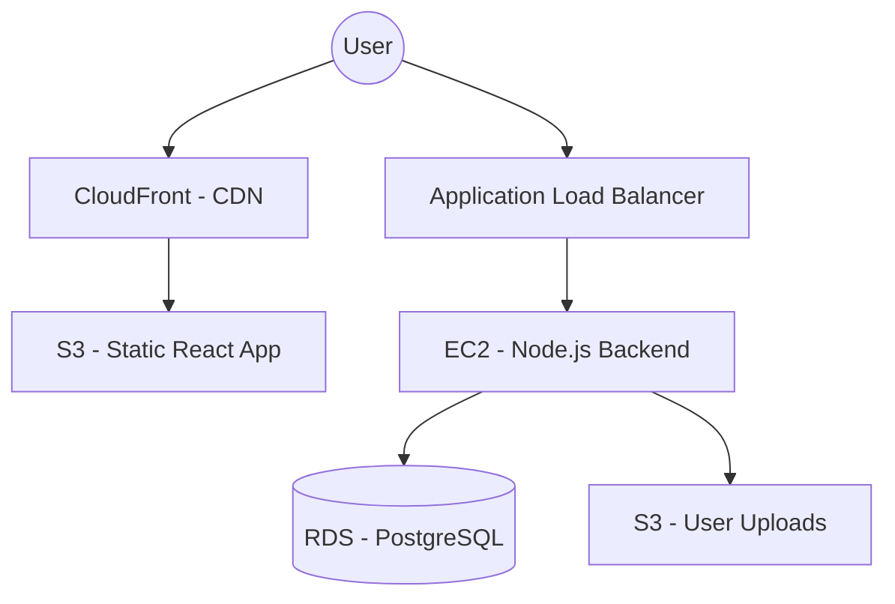

AWS offers hundreds of services, but as a **Full-Stack Developer** at **CodeHarborHub**, you only need to master the "Core 5" to build 90% of modern applications. We categorize these into **Compute**, **Storage**, **Database**, and **Networking**.

## 1. Compute Services: The Brains

Compute services provide the processing power for your applications. Whether you're running a Node.js API or a Python script, these services host your code.

### EC2 (Elastic Compute Cloud)
EC2 provides resizable virtual servers. It is the most flexible compute option.

* **Instance Types:** Optimized for different tasks (e.g., `t3.micro` for testing, `c5` for heavy computation).
* **AMIs (Amazon Machine Images):** Pre-configured templates (Ubuntu, Amazon Linux, Windows).

### Lambda (Serverless)
Run code without provisioning or managing servers. You only pay for the milliseconds your code executes.

If your application has unpredictable traffic or you want to avoid server management, Lambda is a great choice. For a MERN stack app, you might use Lambda for background tasks like image processing or sending emails.

## 2. Storage Services: The Memory

Where do your files, images, and backups live? AWS provides highly durable storage solutions.

<Tabs>
<TabItem value="s3" label="Amazon S3 (Object)" default>

**Simple Storage Service (S3)**

  * **Concept:** Store files as "Objects" in "Buckets."
  * **Durability:** 99.999999999% (11 nines). Your data is practically impossible to lose.
  * **Use Case:** Static website hosting, user profile pictures, logs.

</TabItem>
<TabItem value="ebs" label="Amazon EBS (Block)">

**Elastic Block Store (EBS)**

  * **Concept:** A virtual hard drive attached to an EC2 instance.
  * **Use Case:** Installing a database or an OS on a server.
  * **Scope:** Stays within a single Availability Zone.

</TabItem>

</Tabs>

## 3. Database Services: The Heart

Managing databases manually is hard. AWS RDS handles the heavy lifting like backups, patching, and scaling.

| Service | Type | Use Case |
| :--- | :--- | :--- |
| **Amazon RDS** | Relational (SQL) | Structured data, MySQL, PostgreSQL. |
| **DynamoDB** | NoSQL (Key-Value) | High-speed, serverless, great for MERN apps. |
| **ElastiCache** | In-Memory | Caching data for ultra-fast performance (Redis). |

## Service Interaction Map

Here is how a typical **CodeHarborHub** industrial-level architecture looks using these core services:

In this architecture:
* The user accesses the React frontend hosted on S3 via CloudFront for low latency.
* The backend API runs on EC2 instances behind an Application Load Balancer (ALB)
* The backend interacts with RDS for structured data and S3 for file storage.

## Quick Summary Table

| Service | Analogy | Why it's "Industrial Level"? |
| :--- | :--- | :--- |
| **EC2** | Your Laptop in the Cloud | Full control over the environment. |
| **S3** | Unlimited Dropbox | Scales to petabytes of data effortlessly. |
| **RDS** | A DBA in a Box | Automated backups and high availability. |
| **VPC** | Your Private Office | Isolates your resources from the public internet. |

:::tip Developer Note
If you are building a **MERN Stack** project, start with **EC2** for your Express server and **MongoDB Atlas** (or AWS DocumentDB). As you grow, move your frontend to **S3 + CloudFront** for global speed!
:::