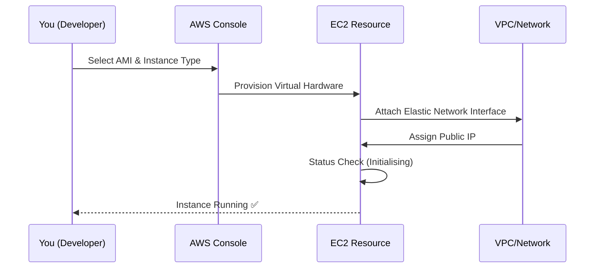

Welcome to the final capstone of the **CodeHarborHub** AWS Beginner series! Today, you will move from theory to practice by launching a live **Ubuntu Linux** server in the AWS Cloud.

:::info Why This Matters
Deploying your own server is a critical milestone in your DevOps journey. It gives you hands-on experience with cloud infrastructure, security, and server management. This lab will prepare you for real-world scenarios where you'll need to deploy and manage applications in the cloud.
:::

## The Deployment Lifecycle

Before we click the buttons, let's look at what happens behind the scenes when you request a server.



In this lifecycle:
1.  You select the **AMI** (Amazon Machine Image) and **Instance Type** (virtual hardware).
2.  AWS provisions the virtual server and attaches it to the network.
3.  The server undergoes status checks to ensure it's healthy before you can connect.

## Step-by-Step Implementation

Follow these steps carefully. At **CodeHarborHub**, we use the **Free Tier** to ensure you learn without incurring costs.

### 1. Launch the Instance

1.  Log in to the [AWS Management Console](https://aws.amazon.com/console/).
2.  In the search bar, type **EC2** and select it.
3.  Click the orange **"Launch instance"** button.

### 2. Name and Application Image (AMI)

  * **Name:** `CodeHarborHub-Web-Server`
  * **AMI:** Select **Ubuntu** (Choose the `Ubuntu Server 24.04 LTS` - Free tier eligible).

### 3. Instance Type & Key Pair

  * **Instance Type:** Select `t2.micro` (1 vCPU, 1 GiB Memory).
  * **Key pair:** Click **"Create new key pair"**.
      * **Name:** `codeharbor-key`
      * **Format:** `.pem` (for OpenSSH/Mac/Linux) or `.ppk` (for PuTTY/Windows).
      * **Action:** Download and save this file safely! **You cannot download it again.**

### 4. Network Settings (Security Groups)

The Security Group acts as a virtual firewall.

* **Allow SSH traffic from:** Anywhere (0.0.0.0/0) — *For production, use "My IP".*
* **Allow HTTPS traffic** (Port 443).
* **Allow HTTP traffic** (Port 80).
* **Review and Launch** your instance.

## Connecting to Your Server

Once the instance state says **"Running"**, it's time to log in via your terminal.

<Tabs>
<TabItem value="linux-mac" label="Linux / macOS" default>

1.  Open your terminal and navigate to the folder containing your `.pem` file.
2.  Set permissions (Security requirement):
    ```bash
    chmod 400 codeharbor-key.pem
    ```
3.  Connect using the Public IP:
    ```bash
    ssh -i "codeharbor-key.pem" ubuntu@<YOUR_PUBLIC_IP>
    ```

</TabItem>
<TabItem value="windows" label="Windows (PowerShell)">

1.  Open PowerShell as Administrator.
2.  Navigate to your key folder and run:
    ```powershell
    ssh -i .\codeharbor-key.pem ubuntu@<YOUR_PUBLIC_IP>
    ```

    *(Note: Modern Windows 10/11 has OpenSSH built-in\!)*

</TabItem>
</Tabs>

## Industrial Level Commands

Once you are inside your server, run these commands to prepare it for a **MERN Stack** deployment:

```bash
# Update the package manager
sudo apt update && sudo apt upgrade -y

# Install Node.js (Current LTS)
curl -fsSL https://deb.nodesource.com/setup_20.x | sudo -E bash -
sudo apt-get install -y nodejs

# Verify installation
node -v
```

:::info Best Practice

Always keep your server updated to patch security vulnerabilities. Use `sudo apt update && sudo apt upgrade -y` regularly to maintain a secure environment.

:::


## The "Wallet Safety" Rule

To keep your AWS account free, you must manage your resources. At the end of your practice session:

1.  Go to the **Instances** dashboard.
2.  Select your instance.
3.  Click **Instance state** -> **Terminate instance**.

:::danger Warning
**Stopping** an instance saves the data but might still charge for EBS storage. **Terminating** deletes the instance and stops all billing for that resource.
:::

## Graduation Challenge

Now that your server is running, try to install **Nginx** (`sudo apt install nginx`) and paste your instance's **Public IP** into a browser. If you see the "Welcome to nginx!" page, you have successfully deployed a web server to the cloud!