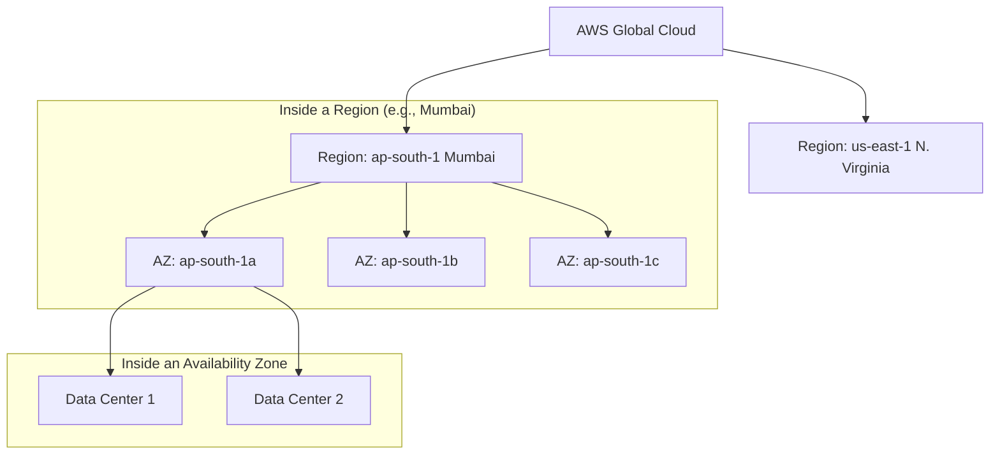
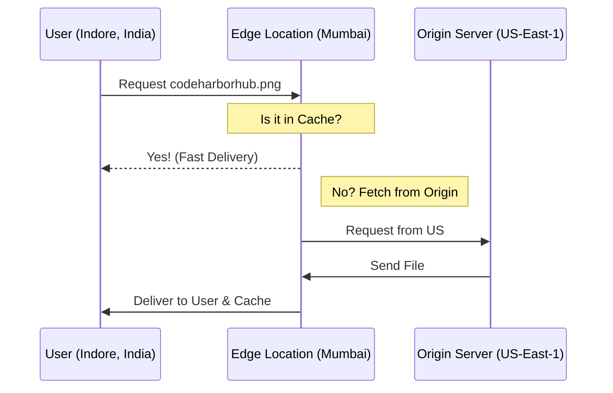

To build "Industrial Level" applications at **CodeHarborHub**, you must understand where your code actually lives. AWS doesn't just have "one big cloud"; it has a massive, physical footprint across every continent.

The AWS Global Infrastructure is built around three core concepts: **Regions**, **Availability Zones (AZs)**, and **Edge Locations**.

## The Infrastructure Hierarchy

Visualizing the relationship between these components is key to passing the **AWS Cloud Practitioner** exam and building resilient systems.

## 1. Regions

A **Region** is a physical location in the world where AWS clusters data centers.

:::info Key Fact
Each Region is completely independent and isolated from other regions. This achieves the greatest possible fault tolerance and stability.
:::

### How to Choose a Region?

When deploying your project (like a **MERN stack** app), consider these four factors:

1.  **Compliance:** Does the data need to stay in India (e.g., for government projects)?
2.  **Latency:** How close is the region to your users? (e.g., Choose Mumbai for users in **Madhya Pradesh**).
3.  **Pricing:** Some regions (like US-East) are cheaper than others (like Sao Paulo).
4.  **Service Availability:** Not all AWS services are available in every region.

## 2. Availability Zones (AZs)

An **Availability Zone** consists of one or more discrete data centers with redundant power, networking, and connectivity in an AWS Region.

| Feature | Description |
| :--- | :--- |
| **Isolation** | AZs are physically separated by miles to prevent "single point of failure." |
| **Connectivity** | Connected via ultra-fast, low-latency private fiber-optic networking. |
| **High Availability** | If one AZ goes down (flood/fire), your app fails over to another AZ. |

## 3. Edge Locations & CloudFront

**Edge Locations** are specialized data centers located in major cities globally. They are used by **Amazon CloudFront** (a Content Delivery Network) to deliver content to end-users with lower latency.

## Comparison Summary

To help you remember for your interviews, here is the "CodeHarborHub Cheat Sheet":

| Component | Physical Scale | Primary Purpose |
| :--- | :--- | :--- |
| **Region** | Large (Cluster of AZs) | Data Sovereignty & Latency. |
| **AZ** | Medium (Data Center) | High Availability & Disaster Recovery. |
| **Edge Location** | Small (Cache Point) | Content Delivery Speed (CDN). |

## Hands-on Tip: Selecting a Region

When you log into your **AWS Management Console**, look at the top right corner. You will see a dropdown menu (e.g., "N. Virginia").

:::warning Important
Always check your region **before** creating resources! If you create an EC2 instance in "Oregon" but your database is in "Mumbai," your application will be incredibly slow due to high latency.
:::