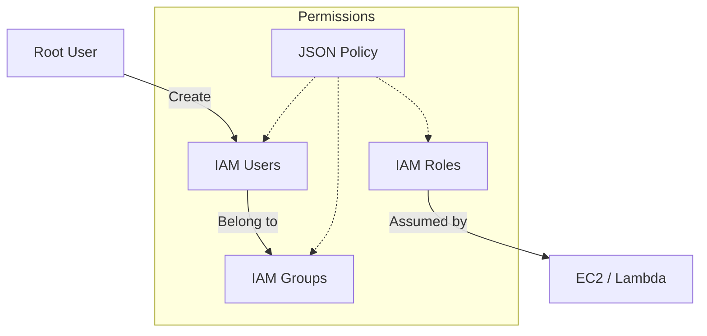
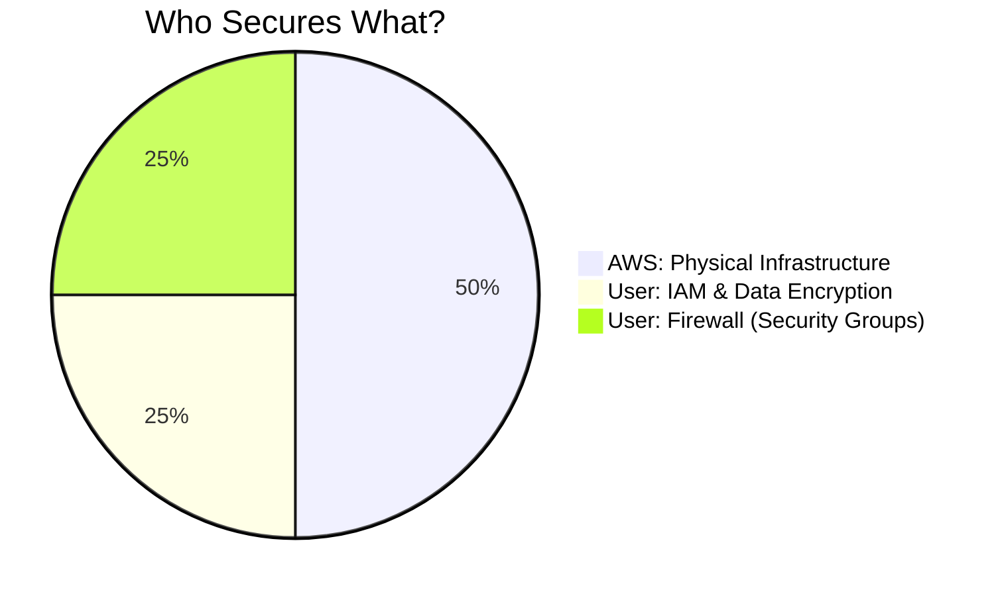

In the world of Cloud Computing, **Security is Job Zero**. **AWS IAM (Identity and Access Management)** is the service that allows you to manage access to AWS services and resources securely. 

At **CodeHarborHub**, we follow a **Zero-Trust Model**: by default, no one has access to anything until explicitly granted.

## The IAM Hierarchy

Understanding how IAM components interact is essential for building "Industrial Level" secure applications.



In this hierarchy:
* The **Root User** is the original account creator with full access. It should be locked
* **IAM Users** are individual identities for people or applications.
* **IAM Groups** are collections of users with shared permissions.
* **IAM Roles** are temporary identities that can be assumed by services (like EC2) or users.

:::info Principle of Least Privilege
Always grant the minimum permissions necessary for a user or service to perform their job. This minimizes the potential damage if credentials are compromised.
:::

## Core Components of IAM

| Component | What it is | Best Practice |
| :--- | :--- | :--- |
| **Users** | A person or application (e.g., "Developer-John"). | One IAM user per physical person. |
| **Groups** | A collection of users (e.g., "Admins", "Devs"). | Assign permissions to Groups, not individual Users. |
| **Roles** | Temporary identities for services or users. | Use Roles for EC2 instances to access S3. |
| **Policies** | JSON documents defining permissions. | Follow the **Principle of Least Privilege**. |

## Anatomy of an IAM Policy (JSON)

AWS uses JSON (JavaScript Object Notation) to define what a user can or cannot do. Here is a standard policy used at **CodeHarborHub** to allow a developer to read files from a specific S3 bucket.

```json title="s3-read-policy.json"
{
  "Version": "2012-10-17",
  "Statement": [
    {
      "Effect": "Allow",
      "Action": [
        "s3:Get*",
        "s3:List*"
      ],
      "Resource": "arn:aws:s3:::codeharborhub-assets/*"
    }
  ]
}
```

In this policy:
* The `Effect` is set to `Allow`, meaning the actions are permitted.
* The `Action` specifies which API calls are allowed (e.g., `s3:GetObject`).
* The `Resource` defines which AWS resource the policy applies to (in this case, all objects in the `codeharborhub-assets` S3 bucket).

### Breaking down the JSON:

  * **Effect:** Set to `Allow` or `Deny`.
  * **Action:** The specific API calls allowed (e.g., `s3:GetObject`).
  * **Resource:** The specific AWS resource (ARN) the policy applies to.

## Industrial Security Checklist

To protect your **CodeHarborHub** projects and avoid massive bills from hackers, follow these "Golden Rules":

<Tabs>
<TabItem value="root" label="1. Lock the Root" default>

  * **Never** use your Root Account for daily tasks.
  * Enable **MFA (Multi-Factor Authentication)** immediately.
  * Delete your Root Access Keys.

</TabItem>
<TabItem value="least" label="2. Least Privilege">

  * Only give users the permissions they need for their job.
  * If a developer only needs to upload images, don't give them "Administrator" access.

</TabItem>
<TabItem value="roles" label="3. Use Roles">

  * **Never** hardcode Access Keys inside your Node.js or Python code.

  * Use **IAM Roles** to allow your EC2 server to talk to your Database or S3 bucket securely.

</TabItem>

</Tabs>


## Shared Responsibility: Security Revisited

Remember, security is a two-way street. While AWS secures the data center, **you** secure the data.



:::danger Critical Warning
If you commit your AWS `ACCESS_KEY_ID` and `SECRET_ACCESS_KEY` to a public GitHub repository, bots will find them within seconds. They will launch the most expensive servers available to mine cryptocurrency, and **you** will be responsible for the bill. **Always use `.env` files and add them to `.gitignore`!**
:::

## Learning Challenge

1.  Log into your AWS Console.
2.  Search for **IAM**.
3.  Create a new **IAM User** with "Custom Password."
4.  Create a **Group** called `Developers` and attach the `PowerUserAccess` policy.
5.  Add your new user to the `Developers` group and try logging in with that user.