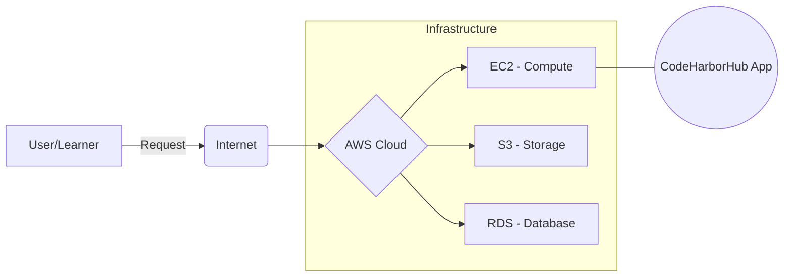
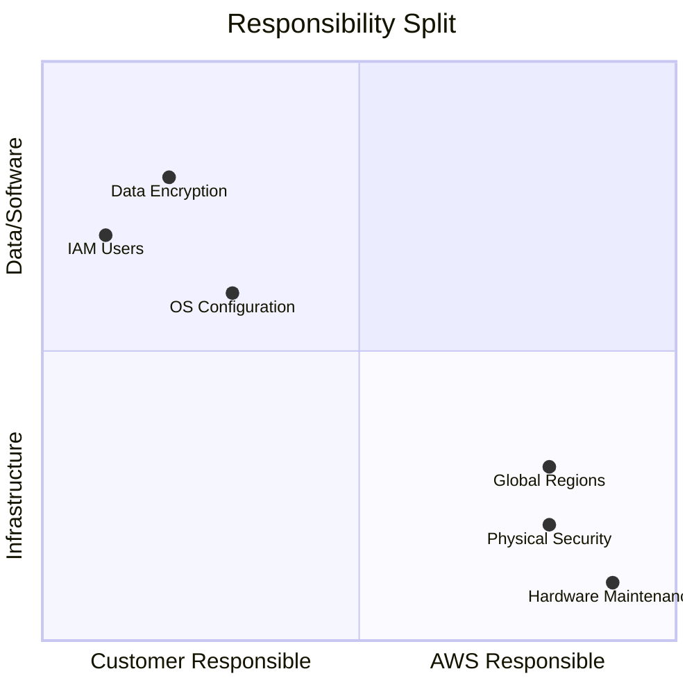

Welcome to the **CodeHarborHub** AWS series. **Amazon Web Services (AWS)** is the world's most broadly adopted cloud platform, offering over 200 fully featured services from data centers globally. 

Whether you are building a simple MERN stack application or a global AI-driven ecosystem, AWS provides the "Lego blocks" required to build, deploy, and scale your vision.

:::info Why AWS?
* **Market Leader:** AWS holds the largest market share in cloud computing, making it a critical skill for developers and businesses.
* **Comprehensive Services:** From compute to storage, databases to machine learning, AWS has a service for every need.
* **Global Reach:** With data centers in 25+ regions worldwide, AWS allows you to serve users with low latency and high availability.
:::

## What is Cloud Computing?

Before we dive into AWS specifically, we must understand the shift from **On-Premise** to **Cloud**.

:::info Definition
Cloud computing is the on-demand delivery of IT resources over the internet with **pay-as-you-go** pricing. Instead of buying, owning, and maintaining physical data centers and servers, you access technology services as needed.
:::

### The Visual Shift
How a request flows from a user to the CodeHarborHub infrastructure:

## Core Cloud Concepts

To master AWS, you must understand these four fundamental pillars:

| Pillar | Explanation | Why it matters at CodeHarborHub |
| :--- | :--- | :--- |
| **Agility** | Spin up resources in minutes. | Faster experimentation and deployment. |
| **Elasticity** | Scale up/down automatically based on traffic. | Handles 1,000 to 1M users seamlessly. |
| **Cost Savings** | Trade fixed expense for variable expense. | No upfront cost for expensive hardware. |
| **Global Reach** | Deploy globally in minutes. | Low latency for users in India and worldwide. |

## Deployment Models

How do you want to manage your infrastructure? Choose the model that fits your project needs.

<Tabs>
<TabItem value="public" label="Public Cloud" default>

**Everything is on AWS.**

  * No hardware to manage.
  * High scalability.
  * **Example:** Hosting the CodeHarborHub educational platform.

</TabItem>
<TabItem value="private" label="Private Cloud">

**On-premise resources.**

  * Used by government or highly regulated banks.
  * Complete control but high maintenance.
  * **Example:** A local Cooperative Bank (PACS) data center.

</TabItem>
<TabItem value="hybrid" label="Hybrid Cloud">

**The best of both worlds.**

  * Connects on-premise data centers to the AWS Cloud.
  * **Example:** Storing sensitive user data locally while using AWS for heavy AI processing.

</TabItem>

</Tabs>

## The AWS Shared Responsibility Model

Security is a "Shared Responsibility" between AWS and you (the Customer). This is a critical concept for the **AWS Cloud Practitioner** exam.

  * **AWS Responsibility (Security OF the Cloud):** Protecting the hardware, software, networking, and facilities that run AWS services.
  * **Customer Responsibility (Security IN the Cloud):** You are responsible for your data, firewall configurations (Security Groups), and identity management (IAM).

## Key Terminology for Beginners

Before moving to the next chapter, ensure you are familiar with these terms:

1.  **Region:** A physical location in the world where AWS has multiple Availability Zones.
2.  **Availability Zone (AZ):** One or more discrete data centers with redundant power and networking.
3.  **Edge Location:** Used by **CloudFront** to cache content closer to users (like in Indore or Mumbai) for faster loading.

:::tip Hands-on Task
Sign up for an **AWS Free Tier** account today. You will get **750 hours/month** of EC2 usage and **5GB** of S3 storage for free for the first 12 months!
:::