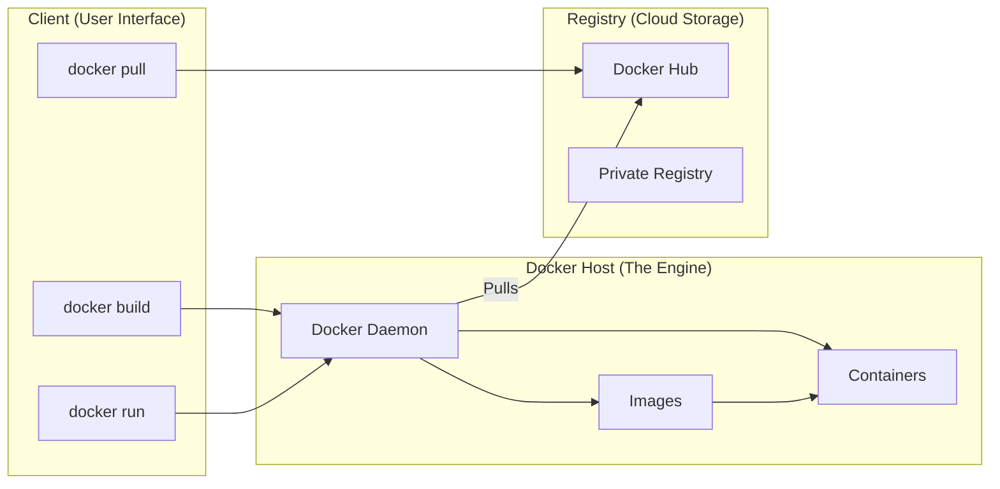

Docker uses a **Client-Server** architecture. Most beginners think that when they type a command, the terminal "is" Docker. In reality, the terminal is just a remote control talking to a powerful engine running in the background.

## The Three Pillars of Docker

Here is how the components interact when you want to run a container:

In this architecture:
1. **Client:** The command-line tool you use to interact with Docker.
2. **Docker Host:** The machine where the Docker Daemon runs and manages your containers.
3. **Registry:** A storage and distribution system for Docker images (like Docker Hub).

## 1. The Docker Client (The Messenger)

The Client is the primary way users interact with Docker. When you type `docker run`, the client sends this command to the **Docker Daemon** using a REST API.

  * **Analogy:** The remote control for your TV.

## 2. The Docker Host (The Engine Room)

This is where the "real" Docker lives. It consists of:

* **Docker Daemon (`dockerd`):** A background service that manages Docker objects like images, containers, networks, and volumes.
* **Objects:** 
    * **Images:** Read-only templates used to create containers.
    * **Containers:** The running instances of images.

## 3. Docker Registry (The Library)

A Registry is a stateless, highly scalable server side application that stores and lets you distribute Docker images.

* **Docker Hub:** The default public registry. It’s the "GitHub of Docker Images."
* **The Flow:** 
    1. You **Build** an image on your Host.
    2. You **Push** it to the Registry.
    3. Your teammate **Pulls** it from the Registry to their Host.

## The Logic of a Command

When you run `docker run hello-world`, the architecture follows this math:

$$Command \rightarrow Client \rightarrow API \rightarrow Daemon \rightarrow Registry \text{ (if not local)} \rightarrow Container$$

1.  **Client** tells the **Daemon** to run "hello-world".
2.  **Daemon** checks if the "hello-world" **Image** is in the local **Host** library.
3.  If **NOT**, the Daemon reaches out to **Docker Hub** (Registry) to download it.
4.  **Daemon** creates a new **Container** from that image and executes it.

## Why this matters for DevOps

At **CodeHarborHub**, we often separate these parts:

  * Your **Client** might be on your Windows laptop.
  * Your **Host** might be a powerful Linux server in the cloud (AWS/Azure).
  * Your **Registry** might be a private storage for your company's secret code.

By separating the "Control" (Client) from the "Execution" (Host), Docker allows us to manage thousands of servers from one single terminal.

## Summary Checklist

  * [x] I understand that the **Client** and **Daemon** can be on different machines.
  * [x] I know that the **Daemon** is the one that actually manages containers.
  * [x] I can explain that **Docker Hub** is a type of Registry.
  * [x] I understand the flow of a `docker run` command.

:::info Note
On Windows and Mac, "Docker Desktop" runs a tiny, invisible Linux Virtual Machine to act as the **Docker Host**, because the Docker Daemon needs a Linux Kernel to work!
:::