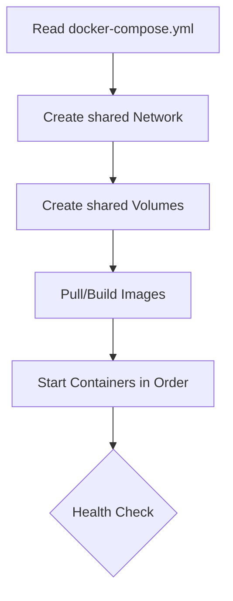

Until now, if you wanted to run a Full-stack app, you had to:
1. Create a network.
2. Start the Database container.
3. Start the Backend container (linking it to the DB).
4. Start the Frontend container (linking it to the Backend).

That is a lot of typing! **Docker Compose** allows you to write all these instructions in a single `docker-compose.yml` file. When you run `docker-compose up`, Docker reads the file and starts everything in the correct order. It's like being a **Fleet Commander** instead of a solo driver.

## 1. The "Orchestra" Analogy

Think of your containers as **Musicians**:
* **The Dockerfile:** Is the sheet music for *one* instrument (e.g., just the Violin).
* **Docker Compose:** Is the **Conductor**. The conductor doesn't play an instrument; they tell every musician when to start, how loud to play, and how to stay in sync.

## 2. The YAML Blueprint

Docker Compose uses **YAML** (Yet Another Markup Language). It is easy to read because it uses indentation instead of curly braces.

Here is a standard `docker-compose.yml` for a **CodeHarborHub** project:

```yaml
version: '3.8'

services:
  frontend:
    build: ./frontend
    ports:
      - "3000:3000"
    depends_on:
      - backend

  backend:
    build: ./backend
    ports:
      - "5000:5000"
    environment:
      - DB_URL=mongodb://database:27017/hub_db
    depends_on:
      - database

  database:
    image: mongo:latest
    volumes:
      - hub_data:/data/db

volumes:
  hub_data:
```

## 3. The 3 Steps of Compose

To get your entire system running, you only need three steps:

1.  **Define** each service's environment with its own `Dockerfile`.
2.  **Define** how they connect in the `docker-compose.yml`.
3.  **Run** `docker-compose up` to start the whole world.

## 4. Key Keywords to Remember

* **services:** These are your containers (e.g., `web`, `api`, `db`).
* **build:** Tells Docker to look for a `Dockerfile` in a specific folder.
* **image:** Tells Docker to download a pre-built image instead of building one.
* **ports:** Maps the Host port to the Container port (just like `-p`).
* **depends_on:** Tells Docker the order of operations (e.g., "Don't start the Backend until the Database is ready").
* **environment:** Passes variables (like API keys) into the container.

## The Logic of Orchestration

When you run `docker-compose up`, Docker performs the following "Math":



$$Total\_Stack = (Net + Vol) + \sum(Service_{1...n})$$

Where:

* **Net:** The shared network for all services.
* **Vol:** The shared volumes for data persistence.
* **Service:** Each individual container with its own configuration.

## Essential Compose Commands

| Command | Action |
| :--- | :--- |
| `docker-compose up` | Build, create, and start all containers. |
| `docker-compose up -d` | Run everything in the background (Detached). |
| `docker-compose ps` | See the status of your entire stack. |
| `docker-compose logs -f` | Watch the output from all containers at once. |
| `docker-compose stop` | Stop the services (but keep the containers). |
| `docker-compose down` | **The Cleanup:** Stop and REMOVE all containers and networks. |

## Summary Checklist
* [x] I understand that Compose is for **multi-container** apps.
* [x] I know that `docker-compose.yml` uses YAML indentation.
* [x] I can explain what `depends_on` does for startup order.
* [x] I understand that `docker-compose down` wipes the environment clean.

:::success 🎉 Docker Module Complete!
Congratulations! You have moved from a simple "Hello World" to orchestrating a complex, multi-service architecture. You are now officially a **Container Pro**.
:::