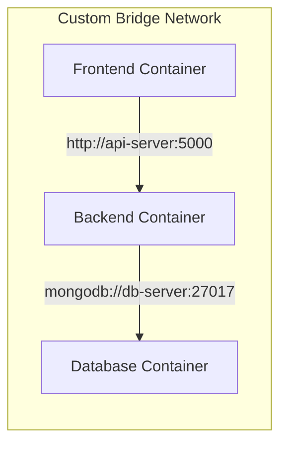

In a modern application, a **React Frontend** needs to talk to a **Node.js API**, which needs to talk to a **MongoDB Database**. If these were three separate physical servers, you would need cables. In Docker, we use **Virtual Networks**.

## 1. The "Gated Community" Analogy

Think of Docker Networking like a **Gated Community**:
* **The Containers:** These are the houses.
* **The Bridge Network:** This is the private internal road inside the community. Houses can talk to each other easily using their "Names" (DNS).
* **Port Mapping:** This is the "Main Gate." If someone from the outside world (the Internet) wants to visit, they must come through a specific gate number.

## 2. The Three Main Network Drivers

Docker provides different "Drivers" depending on how much isolation you need:

### A. Bridge Network (The Default)
The most common choice for **CodeHarborHub** projects. It creates a private space on your computer.
* **Key Feature:** Containers can talk to each other using their **Container Name**.
* **Usage:** `docker run --network my-bridge-net ...`

### B. Host Network
The container shares the **exact same IP and Ports** as your actual laptop/server. There is no isolation.
* **Key Feature:** Best for high-performance apps, but dangerous because ports can clash.

### C. None
The container has no network access at all. Total "Air-gap" security.

## 3. Port Mapping: Opening the Gates

By default, an app running inside a container on port `3000` is invisible to your browser. You must "Map" a port from your **Host** to the **Container**.

**The Formula:** `-p [Host_Port]:[Container_Port]`

```bash
docker run -p 8080:3000 my-web-app
```

* **Host Port (8080):** What you type in your browser (`localhost:8080`).
* **Container Port (3000):** Where the app is actually listening inside the "box."

## 4. Automatic Service Discovery

This is the "Magic" of Docker. If you put two containers on the same user-defined network, you don't need to know their IP addresses\!



Docker acts as a mini **DNS Server**. It knows that `api-server` belongs to the Backend container's IP address. This means you can write your code using friendly names instead of hard-coding IPs, which can change every time you restart the containers.

## Essential Networking Commands

| Command | Action |
| :--- | :--- |
| `docker network ls` | See all virtual networks on your machine. |
| `docker network create hub-net` | Create a new private road for your apps. |
| `docker network inspect hub-net` | See which containers are currently connected. |
| `docker network connect hub-net app1` | Add an existing container to a network. |

## The Math of Conflict

If you try to run two containers mapping to the same Host Port, Docker will throw an error:

$$Error = \text{Host\_Port\_8080} \in \text{Already\_In\_Use}$$

**Solution:** Map them to different host ports:

* Container A: `-p 8080:80`
* Container B: `-p 8081:80`

## Summary Checklist

* [x] I understand that **Bridge** is the default network for isolated apps.
* [x] I can explain **Port Mapping** (`-p host:container`).
* [x] I know that containers on the same network can talk using **Names** instead of IPs.
* [x] I understand that `localhost` inside a container refers to the container itself, not my laptop.

:::info Note
Never use the default "bridge" network for production. Always create your own named network (`docker network create ...`). Only **named networks** allow containers to look each other up by name!
:::