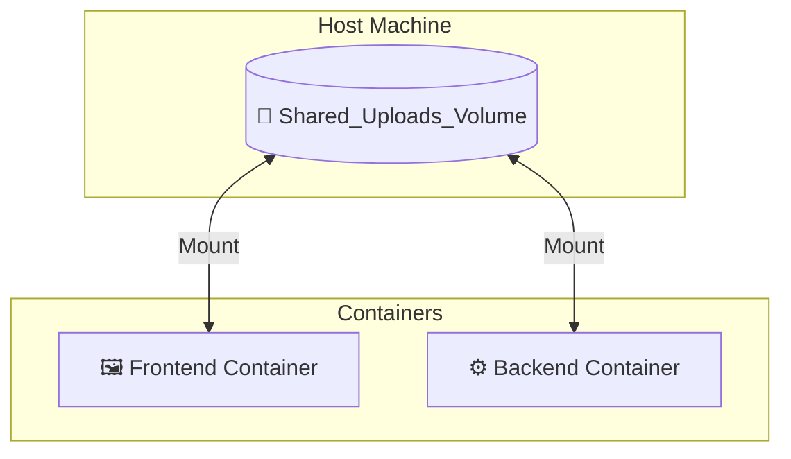

Imagine you are running a **MySQL Database** inside a Docker container. You store 1,000 user records. Suddenly, the container stops. When you restart it, your data is **GONE**. 

**Why?** Because containers are **Ephemeral** (Temporary). To fix this, we use **Volumes**.

## 1. The "USB Drive" Analogy

Think of a Container like a **Library Computer**. 
* You can sit down, create a document, and edit it. 
* But as soon as you log out, the computer "Resets" for the next person. 
* If you want to keep your work, you must plug in a **USB Flash Drive** (Volume) and save it there.

## 2. Types of Storage in Docker

There are two main ways to handle data in **CodeHarborHub** projects:

### A. Docker Volumes (The "Pro" Choice)

Managed entirely by Docker. You don't need to know exactly where the files are on your computer; Docker handles the storage in a special folder.

* **Best for:** Databases (MySQL, MongoDB) and production apps.
* **Command:** `docker run -v my_data:/var/lib/mysql mysql`

### B. Bind Mounts (The "Dev" Choice)

You map a **specific folder** on your laptop (like `C:/Users/Ajay/Project`) directly into the container.

* **Best for:** Development. If you change a line of code on your laptop, the container sees the change **instantly**.
* **Command:** `docker run -v $(pwd):/app node`

## Comparison: Volume vs. Bind Mount

| Feature | Docker Volumes | Bind Mounts |
| :--- | :--- | :--- |
| **Storage Location** | Managed by Docker (`/var/lib/docker/volumes`) | Anywhere on your Host Machine |
| **Ease of Use** | High (Docker handles it) | Medium (You manage paths) |
| **Performance** | High (Optimized for Linux) | Depends on Host OS |
| **Typical Use** | Production Data / Databases | Source Code / Development |

## 3. How to use Volumes in a Dockerfile?

You can define a "Place-holder" for data inside your Dockerfile using the `VOLUME` instruction. This tells anyone running the container: *"Hey, this folder contains important data, don't delete it!"*

```dockerfile title="Dockerfile with Volume"
FROM postgres:15-alpine
# Ensure the database data is stored in a volume
VOLUME /var/lib/postgresql/data
```

## The Logic of Data Sharing

If you have a **Frontend** container and a **Backend** container that both need access to "User Uploads," you can mount the **same volume** to both.



## Essential Volume Commands

| Command | Action |
| :--- | :--- |
| `docker volume create my_db` | Manually create a new storage "drive." |
| `docker volume ls` | See all your existing "USB drives." |
| `docker volume inspect my_db` | See exactly where the data is stored on your disk. |
| `docker volume rm my_db` | **CAUTION:** Permanently delete the data. |
| `docker volume prune` | Clean up all unused volumes. |

## Summary Checklist

  * [x] I understand that containers are **Ephemeral** (temporary).
  * [x] I know that **Volumes** are managed by Docker and **Bind Mounts** use my local folders.
  * [x] I understand that volumes allow data to survive even if the container is deleted.
  * [x] I know how to share data between two containers using a shared volume.

:::warning The "Golden Rule"
**Never** store your database files inside a container without a Volume. If you do, your data is only one `docker rm` away from being deleted forever\!
:::