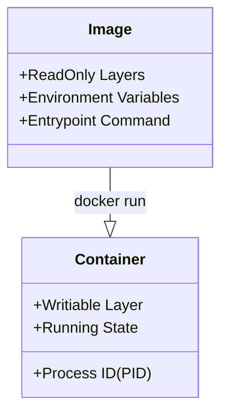

In the world of traditional software, you install an app. In Docker, you **run an image**. To understand the difference, let’s use three different analogies that every **CodeHarborHub** student can relate to.

## 1. The Architectural Analogy

Think of building a housing society:

* **The Image is the Blueprint:** It is a set of plans that describes exactly how the house should look, where the pipes go, and what color the walls are. You cannot "live" inside a blueprint.
* **The Container is the House:** It is the actual physical building created based on that blueprint. You can have 100 identical houses built from just one single blueprint.

## 2. The Programming Analogy (OOP)

If you are a coder, this is the most accurate way to think about it:

* **The Image is a Class:** It defines the properties and methods but doesn't hold state. It is a "Template."
* **The Container is an Object:** It is an "Instance" of that class. It is alive, it occupies memory, and it can be started or stopped.

## 3. The "Frozen Food" Analogy

* **The Image is a Frozen Pizza:** It’s sitting in your freezer (The Registry). It has all the ingredients (Node.js, your code, your libraries) perfectly preserved. It’s "Static."
* **The Container is the Cooked Pizza:** You take the image, put it in the "Oven" (The Docker Engine), and turn it on. Now it’s hot, ready to serve, and "Active."

## Technical Breakdown: Layers

A Docker Image is actually made of **Layers**. Each layer represents a change (like installing a library). These layers are **Read-Only**.

When you start a container, Docker adds a thin **Writable Layer** on top.

$$Container = Image\ (Read\ Only) + Writable\ Layer\ (Temporary)$$

* **Why this is genius:** If you run 10 containers of the same Nginx image, they all share the same 500MB image on your disk, but each has its own tiny writable layer. This saves massive amounts of storage!

## Essential Commands

| Command | Action | Analogy |
| :--- | :--- | :--- |
| `docker images` | List all blueprints in your library. | Checking your shelf. |
| `docker pull` | Download a blueprint from the cloud. | Buying a plan. |
| `docker run` | Create and start a building from a plan. | Constructing & Moving in. |
| `docker ps` | See all buildings currently occupied. | Checking the neighborhood. |
| `docker rm` | Demolish a building (The blueprint stays\!). | Demolition. |

## Summary Checklist

  * [x] I know that an **Image** is a static, read-only template.
  * [x] I understand that a **Container** is a running instance of an image.
  * [x] I can explain that one image can create many containers.
  * [x] I understand that changes inside a container don't change the original image.

:::warning Important Note
If you stop a container and delete it, any data created in that "Writable Layer" is **LOST forever**. To save data, we use **Volumes**, which we will learn in a later chapter\!
:::