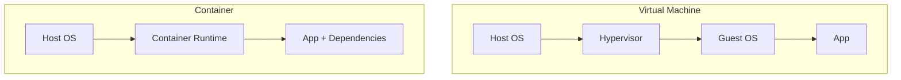

Imagine you are a shipping company in the 1950s. You need to transport **cars**, **grain**, and **glass**. 
* The cars need to be tied down. 
* The grain needs to be in sacks. 
* The glass needs to be in crates. 

Loading the ship is a nightmare because everything is a different shape. This is exactly how software used to be before Docker. One app needed **Python 3.8**, another needed **Node.js 14**, and another needed a specific **Linux library**. 

**Then came the Intermodal Shipping Container.** It didn't matter what was inside; the box was a standard size and fit on every ship, truck, and crane. **Docker is that shipping container for your code.**

## Virtual Machines vs. Containers

Before Docker, we used **Virtual Machines (VMs)** like VMware or VirtualBox. While they worked, they were "heavy."

### 1. The Virtual Machine (The House)

A VM is like building a whole new house just to stay for one night. It includes:
* **Guest OS:** A full copy of Windows or Linux (2GB+).
* **Virtual Hardware:** Fake RAM and Fake CPU.
* **Slow Start:** Takes minutes to boot up.

### 2. The Container (The Apartment)

A Container is like renting an apartment in a building. 
* **Shared OS:** All apartments share the same plumbing and foundation (The Host Linux Kernel).
* **Lightweight:** Only contains your code and its specific tools (MBs instead of GBs).
* **Instant:** Starts in milliseconds.

## The Magic of "Isolation"

At **CodeHarborHub**, we might run two different projects on the same server:
* **Project A:** Needs Node.js v14.
* **Project B:** Needs Node.js v18.

Without containers, these two would fight each other. With Docker, each app lives in its own "Bubble." 
* Project A thinks it is the only app on the server.
* Project B thinks the same.
* They never see each other's files or versions.

## The Efficiency Equation

Because containers share the Host OS Kernel, you can fit many more of them on a single server compared to VMs.

$$Efficiency = \frac{\text{Total Server Resources}}{\text{App Resource} + \text{OS Overhead}}$$

In a **VM**, the "OS Overhead" is huge. In a **Container**, the "OS Overhead" is almost **zero**.

## What exactly is Docker?

:::info Definition
**Docker** is the platform (the "Crane" and the "Ship") that allows you to build, run, and ship these containers. It provides a simple command-line tool to turn your code into a portable "Image."
:::

### Why Developers love it:

1. **Consistency:** If it runs in a Docker container on your laptop, it **will** run on the AWS server exactly the same way.
2. **Speed:** You can destroy and recreate your entire environment in seconds.
3. **Modularity:** You can have your Database in one container and your Backend in another.

## Summary Checklist
* [x] I understand that Containers are lighter than Virtual Machines.
* [x] I know that Containers share the **Host OS Kernel**.
* [x] I can explain the "Shipping Container" analogy.
* [x] I understand that Docker solves the "Works on my machine" problem.

:::info Visual Aid: The Architecture Comparison

**In this diagram, the "Guest OS" layer is missing in the Container architecture, which is why it's so much more efficient.**

Think of a **Virtual Machine** as an entire PC inside your PC. Think of a **Container** as just a "Process" (like Chrome or Spotify) that is isolated so it can't see the rest of your system.
:::