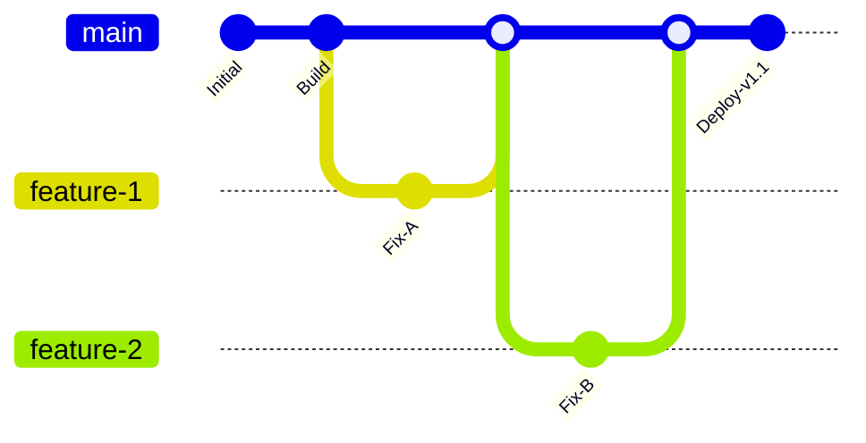

A **Branching Strategy** is a set of rules that defines when and how code is moved from a developer's laptop to the production server. If everyone pushes directly to the `main` branch, the site will break every 5 minutes. 

We need a "Traffic System" to ensure only tested, high-quality code reaches our users.

## 1. Trunk-Based Development (The High-Speed Choice)

In **Trunk-Based Development**, all developers work on a single branch (the "Trunk" or `main`). They make small, frequent updates and merge them multiple times a day.

* **Best for:** Senior teams with **Strong Automated Testing**.
* **Why it's DevOps-friendly:** It prevents "Merge Hell" (where two people change the same file and can't fix it later) and allows for **Continuous Integration (CI)**.

## 2. GitFlow (The Structured Choice)

**GitFlow** is a more complex, "Industrial Level" strategy used by large teams. It uses specific branches for different purposes.

| Branch Name | Purpose |
| :--- | :--- |
| `main` | **Production Ready.** Only contains stable, released code. |
| `develop` | **Integration.** Where features meet to be tested together. |
| `feature/*` | **New Work.** Where individual tasks are built (e.g., `feature/login-ui`). |
| `release/*` | **Polishing.** Final bug fixes before a big version launch. |
| `hotfix/*` | **Emergency.** Quick fixes for bugs currently live on the site. |

### The Flow of Code:

$$Feature \rightarrow Develop \rightarrow Release \rightarrow Main$$

* **Best for:** Large teams with **Complex Release Cycles**.
* **Why it's DevOps-friendly:** It provides a clear structure for managing different stages of development and allows for **Versioning** (e.g., v1.0, v1.1).

## 3. GitHub Flow (The Modern Standard)

This is the strategy we often use for **CodeHarborHub** open-source projects. It is simpler than GitFlow but safer than pure Trunk-based.

1.  **Create a Branch:** Give it a descriptive name (e.g., `update-readme`).
2.  **Add Commits:** Save your work.
3.  **Open a Pull Request (PR):** Ask for a "Peer Review" and let the CI tests run.
4.  **Discuss & Review:** Other developers suggest changes.
5.  **Merge & Deploy:** Once the green checkmark appears, merge to `main` and deploy.

## Comparing the Strategies

| Strategy | Speed | Risk | Complexity | Recommended For |
| :--- | :--- | :--- | :--- | :--- |
| **Trunk-Based** | Blazing Fast | High | Low | Startups / Daily Deploys |
| **GitHub Flow** | Balanced | Medium | Medium | Web Apps / SaaS |
| **GitFlow** | Slower | Very Low | High | Banks / Medical Software |

## DevOps Best Practice: Protected Branches

Regardless of the strategy you choose, a DevOps engineer **never** allows direct pushes to `main`.

In GitHub, we use **Branch Protection Rules**:

* **Require a Pull Request:** No one can merge without a review.
* **Require Status Checks:** The "Merge" button stays grey until the **Docker Build** and **Unit Tests** pass.
* **Require Signed Commits:** Ensures the code actually came from a verified team member.

## Summary Checklist

* [x] I can explain why pushing directly to `main` is dangerous.
* [x] I understand that **Trunk-Based** development requires great automated tests.
* [x] I know that **GitFlow** is best for complex, versioned releases.
* [x] I understand the 5-step process of **GitHub Flow**.

:::info Note
If your team is small (2-3 people), start with **GitHub Flow**. It provides the perfect balance of speed and safety without the headache of managing 5 different branch types\!
:::