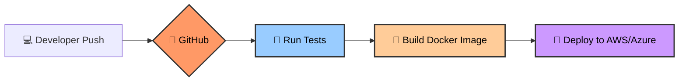

In your early coding days, you used Git to keep track of your `index.js` or `style.css`. In DevOps, we use Git to manage **everything**:
* **Infrastructure:** Your AWS server settings (Terraform/CloudFormation).
* **Configuration:** Your environment variables and API keys (Encrypted).
* **Pipelines:** The scripts that build and deploy your app (GitHub Actions YAML).
* **Containers:** The blueprints for your environment (Dockerfiles).

## 1. The "Control Tower" Analogy

Think of a busy airport. 
* The **Planes** are your application updates.
* The **Runway** is your Production Server.
* **Git is the Control Tower.** Nothing lands on the runway unless the Control Tower (Git) gives the green light. If a pilot (Developer) tries to land without permission, the system blocks them. If a plane crashes (A bug is deployed), the Control Tower can "Roll back" the runway to a safe state instantly.

## 2. Git as an Automation Trigger

In a manual world, you finish code and then manually upload it to a server. In a DevOps world, the moment you `git push`, a chain reaction starts.

### The "Git-Flow" Logic:

We use specific events in Git to trigger different actions:

1.  **Push to `feature` branch:** Triggers Unit Tests.
2.  **Pull Request to `main`:** Triggers Integration Tests and Peer Review.
3.  **Merge to `main`:** Triggers the final Deployment to the live website.

## 3. Audit Trails: The "Who, What, When"

One of the biggest requirements in "Industrial Level" DevOps is **Accountability**. If the **CodeHarborHub** website goes down at 2:00 AM, we don't guess what happened. We check the Git Log.

$$Change\_Log = \text{Author} + \text{Timestamp} + \text{Commit\_Hash} + \text{Diff}$$

Because every change to our infrastructure is committed to Git, we have a perfect "Time Machine." We can see exactly which line of code broke the server and revert it in seconds using:
`git revert <commit_hash>`

## 4. Collaboration at Scale

DevOps is about breaking down silos between Developers and Operations. Git is the "Meeting Room" where this happens.

* **Developers** write the app code.
* **Operations** write the Dockerfiles and Kubernetes manifests.
* They both collaborate on the **same repository**, ensuring that the environment matches the code.

## Essential DevOps Git Commands

While you know `commit` and `push`, these are the "Power User" commands for DevOps:

| Command | Why DevOps use it |
| :--- | :--- |
| `git diff` | To see exactly what configuration changed before deploying. |
| `git log --graph` | To visualize how different features are merging into production. |
| `git tag -a v1.0` | To mark a specific "Release" point in time for the servers. |
| `git stash` | To quickly clear the workspace when a production hotfix is needed. |
| `git cherry-pick` | To grab a specific bug fix from one branch and apply it to another. |

## Summary Checklist

  * [x] I understand that Git manages **Infrastructure** as well as **Code**.
  * [x] I know that a `git push` is often the trigger for a CI/CD pipeline.
  * [x] I understand how Git provides an audit trail for troubleshooting.
  * [x] I can explain why "Everything as Code" starts with Git.

:::info The "GitOps" Secret
The ultimate goal of DevOps is **GitOps**. This means the state of your production server is *always* an exact reflection of what is in your Git repository. If you change a value in Git, the server changes itself automatically\!
:::