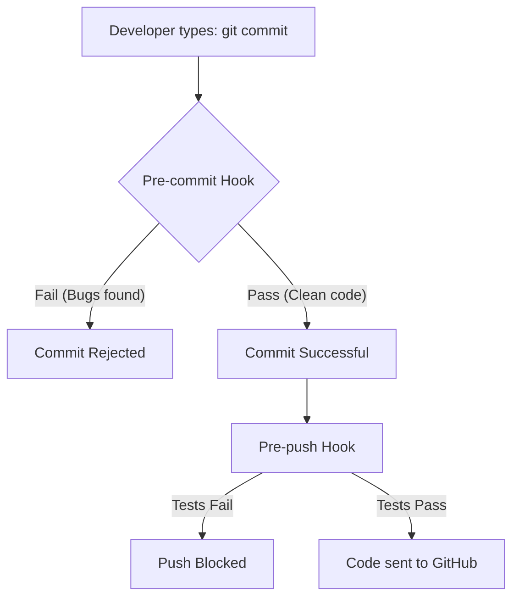

Have you ever committed code only to realize 5 minutes later that you left a `console.log` or a syntax error in the file? **Git Hooks** prevent these "silly mistakes" by running checks locally on your computer.

## 1. How Git Hooks Work

Inside every Git repository, there is a hidden folder called `.git/hooks`. This folder contains "Template" scripts for every stage of the Git lifecycle.



### The "Gatekeeper" Logic:

If a script in the `hooks` folder returns an **Error**, Git will stop the action immediately. For example, if your pre-commit hook runs a linter and finds a formatting issue, it will return a non-zero exit code, and Git will reject the commit. This forces you to fix the issue before it can be saved in your Git history.

## 2. The Two Most Important Hooks

As a DevOps engineer, you will focus on these two:

### A. Pre-commit (The Linter)

This runs the moment you type `git commit` but **before** the commit message is saved.

* **Job:** Check for formatting (Prettier), syntax errors (ESLint), or "Secret Leaks" (like accidentally committing your AWS Password\!).
* **Benefit:** Your Git history stays clean and professional.

### B. Pre-push (The Tester)

This runs when you type `git push`.

* **Job:** Run your **Unit Tests**.
* **Benefit:** Ensures that you never break the "Main" build on GitHub because you forgot to run tests locally.

## The Mathematics of Prevention

The cost of fixing a bug increases the further it travels from the developer's laptop.

$$Cost\_of\_Fix = \text{Local} < \text{GitHub} < \text{Staging} < \text{Production}$$

By using Git Hooks, we catch errors at the **Local** stage, saving hours of debugging time and server costs.

## 3. Professional Tooling: "Husky"

Manually managing scripts in `.git/hooks` is difficult because that folder is not shared with your team. For **CodeHarborHub** projects, we use a tool called **Husky**.

Husky makes it easy to share hooks across your whole team via your `package.json`.

### How to set up Husky:

1.  **Install:** `npm install husky --save-dev`
2.  **Initialize:** `npx husky install`
3.  **Add a Hook:**
    ```bash
    npx husky add .husky/pre-commit "npm run lint"
    ```

Now, every time a developer on your team tries to commit, Husky will automatically run the linter!

## 4. Best Practices

1.  **Keep them Fast:** A pre-commit hook shouldn't take more than 5-10 seconds. If it's too slow, developers will get frustrated and skip it.
2.  **Don't Over-automate:** Use pre-commit for "Small" things (Linting) and pre-push for "Big" things (Testing).
3.  **Never Commit Secrets:** Use a hook like `gitleaks` to scan your code for passwords before they ever leave your machine.

## Summary Checklist

* [x] I know that Git Hooks live in the `.git/hooks` folder.
* [x] I understand that a "Non-zero" exit code stops the Git action.
* [x] I can explain the difference between **pre-commit** and **pre-push**.
* [x] I know how to use **Husky** to share hooks with my team.

:::warning The "Skip" Button
You can skip hooks using `git commit --no-verify`. Use this **ONLY** in extreme emergencies. If you skip hooks, you are bypassing the safety net of your project\!
:::