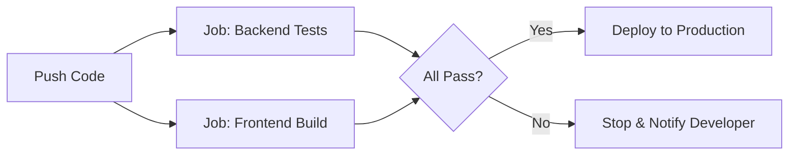

Building a **MERN (MongoDB, Express, React, Node.js)** application is one thing; ensuring it works perfectly every time you update it is another. In a professional environment like **CodeHarborHub**, we use GitHub Actions to automate the testing and building of both the **Frontend** and the **Backend**.

:::info Why Automate MERN?
MERN projects have multiple moving parts. You want to make sure that your React frontend doesn't break when you update your Node.js backend, and vice versa. Automation ensures that every change is tested and built correctly before it reaches production.
:::

## The MERN Pipeline Strategy

In a MERN project, your repository usually has two main folders: `frontend/` and `backend/`. Our automation needs to handle both.

**Typically, a MERN CI/CD pipeline will have three main stages:**

1.  **Dependency Install:** Download `node_modules` for both React and Node.js.
2.  **Lint & Test:** Check for syntax errors and run Unit Tests (using Jest or Mocha).
3.  **Build:** Create the production-ready "dist" or "build" folder for the frontend.


## Creating the MERN Workflow

Create a file named `.github/workflows/mern-ci.yml`. This workflow uses **Jobs** to keep the backend and frontend tasks organized.

```yaml title="mern-ci.yml"
name: MERN Stack CI

on:
  push:
    branches: [ main ]
  pull_request:
    branches: [ main ]

jobs:
  # JOB 1: Backend Testing
  backend-tests:
    runs-on: ubuntu-latest
    defaults:
      run:
        working-directory: ./backend # Tell GitHub to run commands inside 'backend' folder
    steps:
      - uses: actions/checkout@v4
      - name: Setup Node.js
        uses: actions/setup-node@v4
        with:
          node-version: '20'
          cache: 'npm' # Speeds up future builds!
          
      - run: npm install
      - run: npm test

  # JOB 2: Frontend Build
  frontend-build:
    runs-on: ubuntu-latest
    defaults:
      run:
        working-directory: ./frontend
    steps:
      - uses: actions/checkout@v4
      - name: Setup Node.js
        uses: actions/setup-node@v4
        with:
          node-version: '20'
          cache: 'npm'

      - run: npm install
      - run: npm run build
```

## Parallel vs. Sequential Execution

By default, GitHub Actions runs `backend-tests` and `frontend-build` at the **same time** (Parallel). This is the "Industrial Standard" because it saves time.



## Handling Environment Variables (.env)

In your local MERN app, you use a `.env` file for your `MONGODB_URI`. **Never** commit that file to GitHub!

Instead, for your CI/CD tests, you can provide "dummy" variables directly in the YAML:

```yaml title="mern-ci.yml"
- name: Run Backend Tests
  run: npm test
  env:
    MONGODB_URI: mongodb://localhost:27017/test-db
    JWT_SECRET: codeharborhub_secret_key
```

## Performance Tip: Caching

MERN projects have massive `node_modules` folders. Without caching, your workflow might take 5 minutes. With caching, it can drop to 1 minute\!

Notice the `cache: 'npm'` line in our workflow above? That tells GitHub:
*"If the `package-lock.json` hasn't changed, reuse the modules from the last time we ran this."*

## Professional "MERN" Rules

| Rule | Why? |
| :--- | :--- |
| **Separate Folders** | Use `working-directory` so your frontend tests don't try to run in the backend folder. |
| **Node Versioning** | Always match the Node version in your workflow to your local development version. |
| **Status Badges** | Add a "Build Passing" badge to your `README.md` to show off your professional automation! |


:::info Industrial Level Bonus: Deployment
Once your tests and builds are successful, you can add a third job to deploy your MERN app automatically. For example, you can deploy the backend to **AWS EC2** and the frontend to **Vercel** or **Netlify** with just a few extra steps in your workflow.

If you are using **Docker** for your MERN app, your GitHub Action can also build a **Docker Image** and push it to **Docker Hub** automatically after the tests pass. This is how real-world MERN applications are deployed at scale!
:::