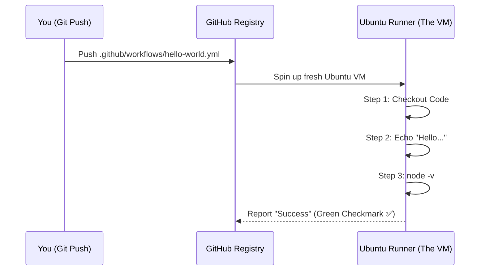

Welcome to the hands-on part of the **CodeHarborHub** DevOps track! If you've ever felt the stress of "I hope I didn't break anything" before pushing code, this lesson is for you.

We are going to build a **CI (Continuous Integration)** workflow that automatically greets you and checks your code environment every time you push to GitHub.

:::info Why This Workflow?
This is a simple, beginner-friendly workflow that demonstrates the core concepts of GitHub Actions. It will help you understand how to structure your YAML files, use pre-built actions, and run shell commands in an automated environment. Plus, it's a fun way to see automation in action!
:::

## The "Chef" Analogy

Think of a GitHub Action Workflow like a **Cooking Recipe**:

| Technical Term | Recipe Equivalent | What it does |
| :--- | :--- | :--- |
| **Event** | Someone orders food | The trigger that starts the process. |
| **Runner** | The Kitchen | The environment where the work happens. |
| **Job** | The Chef | A specific worker assigned to a task. |
| **Step** | A Recipe Instruction | A single action (e.g., "Boil water"). |
| **Action** | A Pre-made Sauce | A reusable component that performs a common task (e.g., "Use pre-made tomato sauce"). |

## Step 1: Preparing the Kitchen

GitHub looks for workflows in a very specific folder. If you don't put them here, they won't run!

1. Open your project in VS Code.
2. Create a folder named `.github` (don't forget the dot!).
3. Inside `.github`, create another folder named `workflows`.
4. Inside `workflows`, create a file named `hello-world.yml`.

## Step 2: Writing the YAML Code

Copy and paste this code into your `hello-world.yml` file. Don't worry—we will break down exactly what each line does below.

```yaml title="hello-world.yml"
# The name of your automation
name: CodeHarborHub First Automation

# When should this run? (The Trigger)
on: [push]

# What should it actually do?
jobs:
  say-hello:
    # Use a fresh Ubuntu Linux server provided by GitHub
    runs-on: ubuntu-latest

    steps:
      # Step 1: Download the code from your repo onto the runner
      - name: Checkout Repository
        uses: actions/checkout@v4

      # Step 2: Run a simple terminal command
      - name: Greet the Developer
        run: echo "Hello CodeHarborHub Learner! Your automation is working! 🚀"

      # Step 3: Check the environment version
      - name: Check Node Version
        run: node -v
```

## Step 3: Understanding the "Why"

Let's look at the "Industrial Level" logic behind these lines:

### The `on: [push]` Trigger

This tells GitHub: "The moment someone pushes code to *any* branch, start this engine." In professional settings, we often change this to `on: [pull_request]` so we only run tests when someone wants to merge code.

### The `uses: actions/checkout@v4`

This is a **Pre-built Action**. Imagine you are a chef, and instead of farming the wheat yourself, you just buy flour. This action "buys the flour" by automatically cloning your code into the virtual machine so the next steps can use it.

### The `run:` command

This is exactly like typing a command into your computer's Terminal or Command Prompt. Anything you can do in a terminal, you can do here! In a real-world scenario, this is where you would run your tests (`npm test`), build your app (`npm run build`), or deploy to a server.

## Visualizing the Execution

Once you push this file to GitHub, here is what happens behind the scenes:



## Step 4: Seeing it in Action

1.  **Commit and Push:** Run `git add .`, `git commit -m "Add first workflow"`, and `git push`.
2.  **Go to GitHub:** Open your repository in your browser.
3.  **Click the "Actions" Tab:** You will see a yellow circle (running) or a green checkmark (finished).
4.  **Click the Workflow:** Click on "CodeHarborHub First Automation" to see the logs. You can expand each step to see the output!

## Common Mistakes for Beginners

  * **Indentation Matters:** YAML is very picky. If your `steps:` is not indented correctly under `jobs:`, the workflow will fail. Always use **spaces**, never tabs.
  * **Typing the Folder Name:** Ensure it is `.github/workflows`. If you name it `.github/workflow` (singular), it will not work.
  * **Case Sensitivity:** `on: push` is different from `On: Push`. Always use lowercase for keywords.

:::tip Tip for Absolute Beginners
Don't worry if it doesn't work the first time! Check the logs in the "Actions" tab to see what went wrong. The error messages are usually very descriptive and will guide you to the fix. This is how professional developers debug their CI/CD pipelines!

In the industrial world, we use these logs to debug **MERN** applications. If your frontend build fails, the logs here will tell you exactly which line of code caused the error! It's like having a detective's magnifying glass to find the culprit in your code.
:::