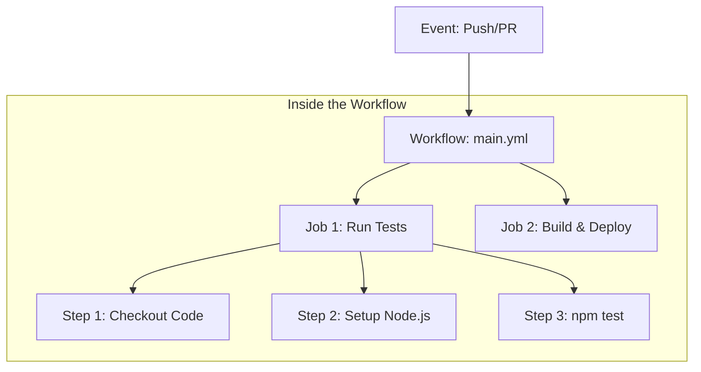
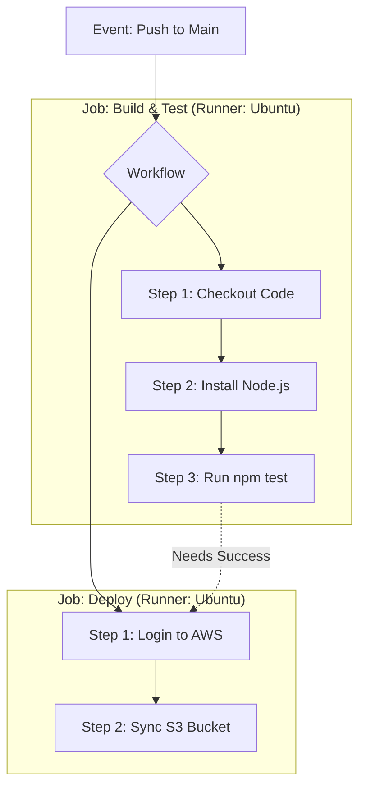

To build professional automation at **CodeHarborHub**, you need to speak the language of GitHub Actions. It isn't just about "running scripts"; it's about orchestrating a series of events across virtual environments.

## The Automation Anatomy

A GitHub Action is structured like a Russian Nesting Doll (Matryoshka). Each layer lives inside another.



In this example, the developer pushes code to a branch, which triggers the GitHub Actions workflow. The runner installs dependencies and runs tests. If the tests pass, it automatically deploys to production. If they fail, it notifies the developer to fix the code.

### 1. Workflow

The highest level of organization. A workflow is an automated process that you add to your repository. It is defined by a **YAML** file in your `.github/workflows` directory.
* *Example:* `production-deploy.yml` or `unit-tests.yml`.

### 2. Events

An event is a specific activity in a repository that triggers a workflow run. 
* **Webhook events:** `push`, `pull_request`, `create` (new branch).
* **Scheduled events:** `cron` (e.g., run backups every night at 12 AM).
* **Manual events:** `workflow_dispatch` (a button you click to run the script).

### 3. Jobs

A job is a set of **steps** that execute on the same **runner**. 
* By default, multiple jobs in a workflow run in **parallel** (at the same time).
* You can make jobs dependent on each other (e.g., Don't "Deploy" until "Test" is finished).

### 4. Steps

A step is an individual task. It can be a shell command (`run`) or an action (`uses`). All steps in a job run sequentially on the same runner.

### 5. Actions

An action is a standalone application that performs a complex but frequently repeated task. You "use" them to reduce the amount of code you write.
* *Example:* `actions/checkout@v4` (Clones your code into the runner).

## How They Connect (The Logic Flow)



## The Runner: Where the Magic Happens

A **Runner** is a server that has the GitHub Actions runner application installed. It listens for available jobs, runs the steps, and reports the progress back to GitHub.

<Tabs>
<TabItem value="gh-hosted" label="GitHub-hosted Runners" default>

  * **Managed by:** GitHub.
  * **OS:** Ubuntu Linux, Windows, or macOS.
  * **Clean Slate:** Every time a job runs, you get a fresh, clean virtual machine.
  * **Best For:** Most CodeHarborHub projects and standard MERN apps.

</TabItem>
<TabItem value="self-hosted" label="Self-hosted Runners">

  * **Managed by:** You (on your own server or EC2).
  * **Customization:** You can pre-install large dependencies to save time.
  * **Security:** Good for accessing private data centers.
  * **Best For:** Large-scale industrial apps with specific hardware needs.

</TabItem>

</Tabs>

## Understanding the YAML Syntax

A typical **CodeHarborHub** configuration looks like this. Notice the clear, indented structure:

```yaml title="ci-pipeline.yml"
name: CI-Pipeline           # 1. The Workflow Name
on: [push]                  # 2. The Trigger (Event)

jobs:                       # 3. List of Jobs
  test-app:                 # Job ID
    runs-on: ubuntu-latest  # 4. The Runner Environment
    
    steps:                  # 5. List of Steps
      - name: Get Code
        uses: actions/checkout@v4
        
      - name: Install dependencies
        run: npm install    # 6. Standard Shell Command
```

## Industrial Level Best Practices

| Concept | Professional Tip |
| :--- | :--- |
| **Timeouts** | Always set a `timeout-minutes` for your jobs so a stuck test doesn't waste your minutes. |
| **Caching** | Use the `actions/cache` to remember your `node_modules`. This makes your builds 5x faster! |
| **Matrix Strategy** | Use a `matrix` to test your app on Node 18, 20, and 22 simultaneously to ensure compatibility. |
| **Secrets Management** | Store sensitive data (API keys, passwords) in GitHub Secrets and reference them in your workflow. |

:::info Did you know? 
You can also use **GitHub Environments** to set up different deployment targets (e.g., staging vs production) with specific secrets and approval rules. This adds an extra layer of control to your deployment process.

At **CodeHarborHub**, we recommend starting with a simple "Test" workflow. Once you see that green checkmark appearing on your Pull Requests, you'll never want to go back to manual testing!
:::