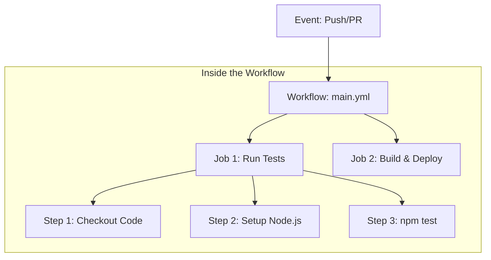
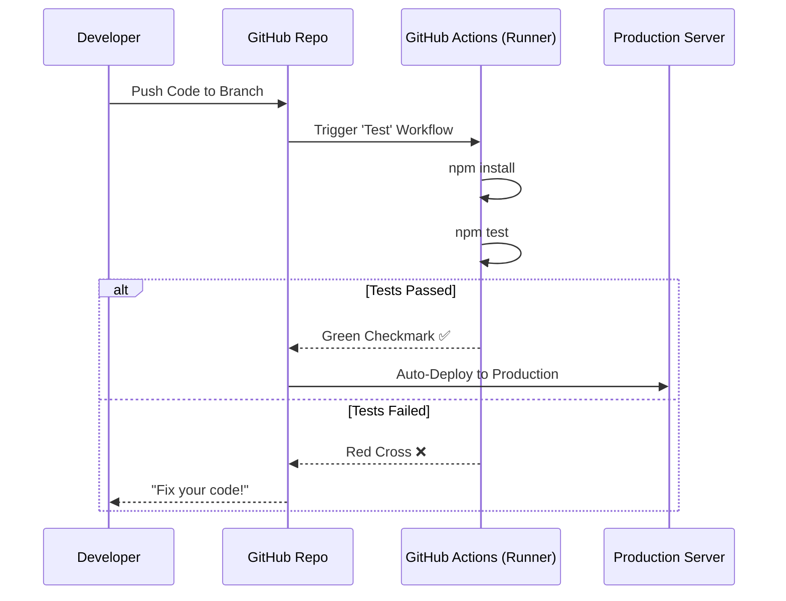

At **CodeHarborHub**, we believe developers should spend their time writing code, not manually running tests or uploading files to servers. **GitHub Actions** is the engine that makes this possible. 

It is a **Continuous Integration and Continuous Delivery (CI/CD)** platform that allows you to automate your build, test, and deployment pipeline right from your GitHub repository.

:::info Fun Fact
GitHub Actions was launched in 2018 and has since become one of the most popular CI/CD tools in the developer community, with millions of workflows running every day.
:::

## The CI/CD Philosophy

The core idea behind GitHub Actions is to automate the software development lifecycle. This means that every time you make a change to your code, you can automatically run tests, build your application, and even deploy it without lifting a finger.

:::info Why CI/CD?
CI/CD helps catch bugs early, ensures consistent builds, and allows you to deliver features to users faster. It's like having a robot assistant that takes care of the repetitive tasks, so you can focus on writing amazing code.
:::

To understand GitHub Actions, you must understand the two halves of the automation coin:

### 1. Continuous Integration (CI)
Every time you `git push` your MERN stack code, the CI pipeline automatically:
* Installs dependencies (`npm install`).
* Runs your test suite (`npm test`).
* Checks for code linting errors.
* **Goal:** Catch bugs before they reach the main branch.

### 2. Continuous Delivery (CD)
Once the tests pass, the CD pipeline automatically:
* Builds the production version of your app (`npm run build`).
* Deploys the code to **AWS EC2**, **Vercel**, or **S3**.
* **Goal:** Deliver features to users as fast as possible.

## The Core Components

GitHub Actions uses a specific hierarchy to organize automation. Think of it as a "Recipe" for your code.

| Component | What it is | Analogy |
| :--- | :--- | :--- |
| **Workflow** | The entire automated process (`.yml` file). | The Cookbook. |
| **Event** | The trigger (Push, Pull Request, Schedule). | The Hunger (Why you start cooking). |
| **Job** | A set of steps running on the same server. | A Chef in the kitchen. |
| **Step** | An individual task (command or action). | A single instruction (e.g., "Chop onions"). |
| **Runner** | The virtual server (Ubuntu/Windows) running the code. | The Kitchen itself. |

## Why Developers Love It

<Tabs>
<TabItem value="integrated" label="Native to GitHub" default>

No need to set up external tools like Jenkins or CircleCI. Everything happens inside your "Actions" tab in the repository. It's like having a built-in kitchen in your house!

</TabItem>
<TabItem value="marketplace" label="Action Marketplace">

Don't reinvent the wheel! Use pre-built "Actions" created by the community for common tasks like setting up Docker, sending Slack notifications, or deploying to AWS. It's like having a pantry stocked with ready-to-use ingredients.

</TabItem>
<TabItem value="matrix" label="Matrix Builds">

Automatically test your **CodeHarborHub** app across multiple versions of Node.js (18, 20, 22) and multiple Operating Systems (Linux, macOS, Windows) simultaneously. It's like having multiple chefs working on the same recipe to ensure it tastes good for everyone.

</TabItem>
</Tabs>

## Visualizing a Production Workflow

This is how a typical **CodeHarborHub** industrial-level pipeline behaves when a developer submits a Pull Request:

 

In this example, the developer pushes code to a branch, which triggers the GitHub Actions workflow. The runner installs dependencies and runs tests. If the tests pass, it automatically deploys to production. If they fail, it notifies the developer to fix the code.

## Best Practices for Absolute Beginners

1.  **Fail Fast:** Put your tests at the beginning of the workflow. If they fail, don't waste time/money building the app.
2.  **Stay Secure:** Never put passwords in your YAML files. Use **GitHub Secrets**.
3.  **Use Versions:** When using community actions, always specify a version (e.g., `actions/checkout@v4`) to prevent your pipeline from breaking when the action updates.

:::info Did you know?
GitHub Actions is free for public repositories! For private repositories, GitHub provides a generous amount of free minutes every month, which is plenty for most startup projects and personal portfolios.
:::