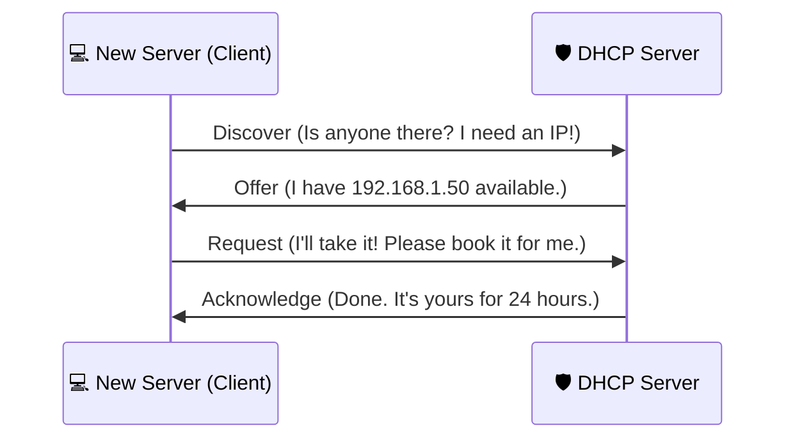

In a large data center like the ones used by **CodeHarborHub**, there are thousands of servers. Manually assigning an IP to each one would be a nightmare. Furthermore, expecting users to remember `142.250.190.46` instead of `google.com` is impossible. 

This is where **DHCP** and **DNS** come in.

## 1. DHCP (The Hotel Hostess)

**DHCP (Dynamic Host Configuration Protocol)** is the service that automatically assigns an IP address to a device when it joins a network.

### The "DORA" Process
When your laptop or a new AWS server turns on, it performs a 4-step "handshake" to get an IP.

:::info The "Lease" Concept
IP addresses from DHCP aren't permanent. They are **Leased**.
If a server at **CodeHarborHub** goes offline for a week, the DHCP server will eventually take that IP back and give it to someone else.
:::

## 2. DNS (The Global Phonebook)

**DNS (Domain Name System)** is a distributed database that translates a Domain Name (URL) into an IP Address.

### The Hierarchy of DNS

DNS doesn't live in one place. It is a tree structure:

1. **Root Servers:** The "Grandparents" who know where the `.com`, `.org`, and `.in` servers are.
2. **TLD Servers:** Top-Level Domain servers (e.g., The `.com` server).
3. **Authoritative Servers:** The server that actually holds the record for `codeharborhub.github.io`.

## 3. How a DNS Query Works

When you type `codeharborhub.github.io` in your browser, this "Detective Work" happens in milliseconds:

$$Query \rightarrow Recursive Resolver \rightarrow Root \rightarrow TLD \rightarrow Authoritative \rightarrow IP$$

### Common DNS Record Types

As a DevOps engineer, you will manage these records often:

| Record Type | Purpose | Example |
| :--- | :--- | :--- |
| **A Record** | Points a name to an **IPv4** address. | `codeharborhub.github.io` -\> `1.2.3.4` |
| **AAAA Record** | Points a name to an **IPv6** address. | `site.github.io` -\> `2001:db8::1` |
| **CNAME** | An "Alias" (Points a name to another name). | `www` -\> `codeharborhub.github.io` |
| **MX Record** | Directs **Emails** to the right server. | `mail` -\> `google-mail.github.io` |
| **TXT Record** | Used for verification (e.g., proving you own the site). | `v=spf1 include...` |

## 4. DNS Caching (The Memory)

To save time, your computer and your ISP "remember" (Cache) the IP address for a certain amount of time. This is called the **TTL (Time To Live)**.

$$TTL = \text{Time in seconds the record stays in cache}$$

* **Low TTL (60s):** Good for when you are moving servers and need fast changes.
* **High TTL (3600s):** Good for stable sites to reduce traffic.

## Summary Checklist

  * [x] I understand that **DHCP** gives out IPs and **DNS** resolves names.
  * [x] I can remember the **DORA** steps for DHCP.
  * [x] I know the difference between an **A Record** and a **CNAME**.
  * [x] I understand that **TTL** controls how long DNS records are cached.

:::info DNS Propagation
When you change your DNS records at **CodeHarborHub** and don't see the change immediately, it's usually because of **DNS Propagation**. The world's "Phonebooks" are still updating their cache based on your old TTL!

This can take anywhere from a few minutes to 48 hours, depending on the previous TTL settings. In DevOps, we often set a low TTL before making changes to speed up this process.
:::