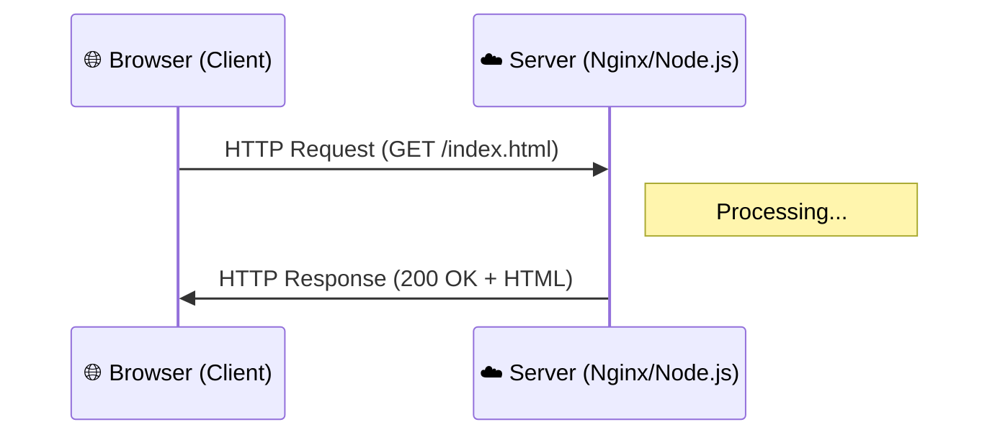

**HTTP (HyperText Transfer Protocol)** is the foundation of the World Wide Web. It is a "Stateless" protocol, meaning the server doesn't remember who you are after a request is finished every request is a brand new start.

## 1. The Request-Response Cycle

Every interaction on **CodeHarborHub** follows this simple pattern:

### Anatomy of a Request:

1.  **Method:** What do you want to do? (GET, POST, etc.)
2.  **Path:** Where is the resource? (`/blog/devops`)
3.  **Headers:** Extra info (e.g., "I am using Chrome").
4.  **Body:** The data you are sending (used in POST requests).

## 2. The HTTP "Verbs" (Methods)

As a Full-stack developer, you must use the right "Verb" for the right action.

| Method | Human Action | DevOps/DB Action |
| :--- | :--- | :--- |
| **GET** | "Show me this." | READ |
| **POST** | "Create this for me." | CREATE |
| **PUT** | "Replace this entirely." | UPDATE |
| **PATCH** | "Fix a small part of this." | MODIFY |
| **DELETE** | "Get rid of this." | DELETE |

## 3. Status Codes: The Server's Mood

When a server at **CodeHarborHub** replies, it starts with a 3-digit number.

  * **2xx (Success):** "Everything went great!" (e.g., `200 OK`, `201 Created`).
  * **3xx (Redirection):** "The file moved, go here instead." (e.g., `301 Moved Permanently`).
  * **4xx (Client Error):** "YOU messed up." (e.g., `404 Not Found`, `401 Unauthorized`).
  * **5xx (Server Error):** "I messed up." (e.g., `500 Internal Server Error`).

:::info The Math of Errors
Statistically, if your site has a 99.9% uptime (The "Three Nines"), it means it can only return a **5xx** error for a total of **8.77 hours per year**.

$$Uptime \% = \frac{\text{Total Time} - \text{Downtime}}{\text{Total Time}} \times 100$$

However, in DevOps, we aim for "Four Nines" (99.99%), which allows for only **52.56 minutes of downtime per year**! This is crucial for high-traffic sites like **CodeHarborHub**.

:::

## 4. Why the "S" Matters (HTTPS)

**HTTP** sends data in "Plain Text." If you type your password on an HTTP site, anyone on the same Wi-Fi can see it. **HTTPS** uses **TLS (Transport Layer Security)** to encrypt the data.

### How HTTPS Works (The TLS Handshake):

1.  **The Hello:** Client asks for a secure connection.
2.  **The Certificate:** Server sends its **SSL Certificate** (The Digital ID).
3.  **The Key Exchange:** They agree on a secret code using fancy math.
4.  **The Lock:** All data is now scrambled. Even if a hacker steals the "Packets," they just see gibberish.

If you see a padlock in the browser, it means HTTPS is working. This is non-negotiable for any site that handles user data, including **CodeHarborHub**. In DevOps, we often use tools like **Let's Encrypt** to get free SSL certificates and automate the renewal process.

## Inspecting the Traffic

You don't need fancy tools to see this!

1.  Open **CodeHarborHub** in Chrome.
2.  Press `F12` (Developer Tools).
3.  Click the **Network** tab.
4.  Refresh the page.
    
You are now looking at real-time HTTP requests! You can see the methods, status codes, and even the headers. This is how DevOps engineers debug issues and optimize performance.

## Summary Checklist

  * [x] I understand that HTTP is **Stateless**.
  * [x] I can explain the difference between a **GET** and a **POST** request.
  * [x] I know that **404** is a user error and **500** is a server error.
  * [x] I understand that **HTTPS** encrypts data using a TLS Handshake.

:::info Testing with `curl`
In DevOps, we often use a tool called `curl` to test HTTP.
`curl -I https://codeharborhub.github.io`
This command will show you just the "Headers" of the site without downloading the whole page!
:::