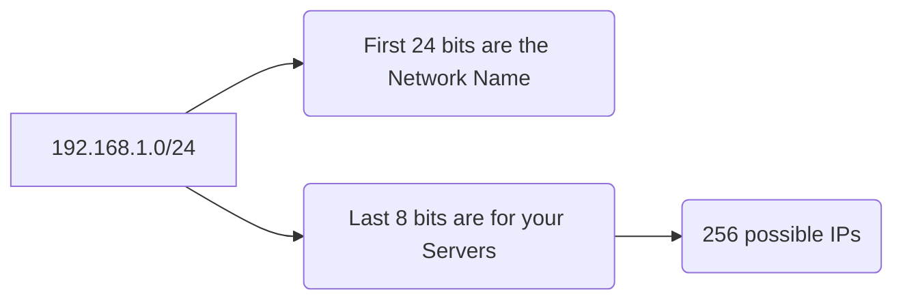

If the **OSI Model** is the set of rules, the **IP Address** is the specific location. Without a unique address, a data packet has no destination. At **CodeHarborHub**, we use these addresses to identify our Web Servers, Databases, and Load Balancers.

## 1. Anatomy of an IPv4 Address

An IPv4 address is a **32-bit** number, usually written as four decimal numbers (octets) separated by dots.

* **Format:** `192.168.1.1`
* **The Math:** Each octet is 8 bits. Since $2^8 = 256$, each number can range from **0 to 255**.
* **Total Capacity:** $$Total \approx 2^{32} \approx 4.3 \text{ Billion addresses}$$ *(Which is why the world is moving to IPv6—we've run out of IPv4s!)*

## 2. Public vs. Private IPs

Not every IP address is visible to the internet. 

* **Public IP:** Like your home's physical mailing address. It is unique globally.
* **Private IP:** Like an extension number in an office (e.g., "Dial Ext. 102"). It only works inside your local network (LAN) or your Cloud VPC.

:::info Reserved Private Ranges
You will see these constantly in DevOps:
* `10.0.0.0` - `10.255.255.255` (Large Corporations)
* `172.16.0.0` - `172.31.255.255` (Mid-size)
* `192.168.0.0` - `192.168.255.255` (Home routers)
:::

## 3. Subnetting & CIDR (The "Slicing" Logic)

As a DevOps engineer, you don't just get one IP; you get a **Block** of IPs. We define these blocks using **CIDR (Classless Inter-Domain Routing)** notation.

### What is the `/24` or `/16`?
The number after the slash tells us how many bits are "Locked" (The Network part) and how many are "Free" (The Host part).

* **/24:** 24 bits for the network, leaving 8 bits for hosts. This gives you 256 total IPs (254 usable).
* **/16:** 16 bits for the network, leaving 16 bits for hosts. This gives you 65,536 total IPs (65,534 usable).

### The Math of Subnets:

To find out how many servers (hosts) you can fit in a subnet:
$$Hosts = 2^{(32 - \text{CIDR})} - 2$$
*(We subtract 2 because the first IP is the **Network ID** and the last is the **Broadcast**).*

* **Example `/24`:** $2^{(32-24)} - 2 = 254$ available IPs.
* **Example `/32`:** $2^{(32-32)} = 1$ IP (A single specific machine).

## 4. IPv6: The Infinite Frontier

Because we ran out of IPv4 addresses, **IPv6** was created. It uses **128-bit** addresses written in Hexadecimal.

* **Example:** `2001:0db8:85a3:0000:0000:8a2e:0370:7334`
* **The Math:** $$Total = 2^{128}$$ This is enough addresses to give every grain of sand on Earth its own IP address!

## DevOps Best Practices

1.  **Start Big:** When creating a VPC for **CodeHarborHub**, start with a large range like `/16` (65,536 IPs). You can always slice it into smaller subnets later.
2.  **Isolate:** Put your Databases in a **Private Subnet** (no Public IP) and your Web Servers in a **Public Subnet**.
3.  **Use Static IPs sparingly:** Only use a fixed (Static/Elastic) IP for things that truly need it, like Load Balancers.

## Summary Checklist

  * [x] I can identify the 4 octets of an IPv4 address.
  * [x] I understand that a Private IP is not reachable from the internet.
  * [x] I know that a smaller CIDR number (like `/16`) means a **larger** network.
  * [x] I understand why we subtract 2 from the total host count in a subnet.

:::info Subnetting Analogy
Think of **Subnetting** like a cake. The CIDR number is how many times you cut the cake. The more "locked" bits (higher CIDR), the smaller the individual slices (fewer IPs per subnet).
:::