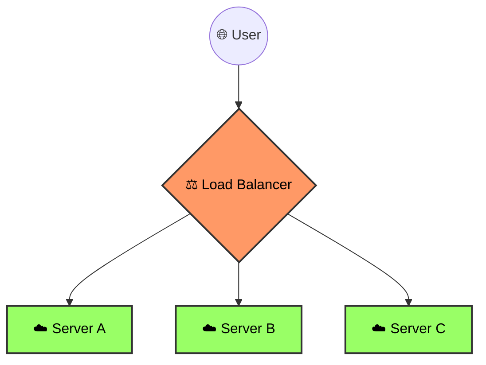

At **CodeHarborHub**, we don't want our users talking directly to our sensitive Databases or even our main App Servers. Instead, we put a "Security Guard" in front. This guard is either a **Forward Proxy**, a **Reverse Proxy**, or a **Load Balancer**.

## 1. Forward vs. Reverse Proxies

The word "Proxy" just means "on behalf of." 

### Forward Proxy (The Client's Guard)

A Forward Proxy sits in front of the **Users**. It hides the user's IP from the internet.
* **Use Case:** A school blocking social media sites or a VPN hiding your location.

::info The "Forward" Logic
The "Forward" in Forward Proxy means it forwards the user's request to the internet while hiding their IP. It's like a "Mask" for the client.
:::

### Reverse Proxy (The Server's Guard)

A Reverse Proxy sits in front of the **Web Servers**. Users think they are talking to the website, but they are actually talking to the Proxy (like **Nginx**).
* **Use Case:** Hiding your server's private IP, handling SSL (HTTPS), and caching images to make the site faster.

::info The "Reverse" Logic
The "Reverse" in Reverse Proxy means it does the opposite of a Forward Proxy. Instead of hiding the client's IP, it hides the server's IP. It's like a "Reverse Mask."
:::

## 2. Load Balancers (The Traffic Cop)

When **CodeHarborHub** goes viral, one server isn't enough. A Load Balancer (LB) takes incoming requests and spreads them across a "Pool" of multiple servers.

### How does it choose? (Algorithms)

The LB uses math to decide which server gets the next user:

1.  **Round Robin:** Simply goes in order (A -> B -> C -> A). 
2.  **Least Connections:** Sends the user to the server that is currently the least busy.
3.  **IP Hash:** Ensures that a specific user (based on their IP) always goes to the same server (Important for "Login Sessions").

If Server B is down, the LB will automatically skip it and send traffic to A and C until B is back up. This is called **Fault Tolerance**.

## 3. Layer 4 vs. Layer 7 Load Balancing

Remember the **OSI Model**? Load balancers work at different levels:

* **Layer 4 (Transport):** Faster. It only looks at IP addresses and Ports. It doesn't care if the request is for an image or a video.
* **Layer 7 (Application):** Smarter. It looks at the actual HTTP request. 
    * *Example:* It can send all `/api` requests to a powerful server and all `/images` requests to a storage server.

## 4. The Math of High Availability

In DevOps, we calculate the "Health" of our cluster. If we have $N$ servers and each can handle $R$ requests per second, our total capacity is:

$$Total\_Capacity = N \times R$$

However, a good DevOps engineer always plans for a "Failure State" ($N-1$):

$$Safe\_Capacity = (N - 1) \times R$$

:::info Health Checks
The Load Balancer constantly pings your servers: *"Are you alive?"* If Server B doesn't respond, the LB immediately stops sending traffic there until it's fixed. This is called **Self-Healing**.
:::

## Common Tools
* **Nginx:** The world's most popular Reverse Proxy.
* **HAProxy:** A high-performance Load Balancer.
* **AWS ELB (Elastic Load Balancer):** The cloud version used by most startups.

## Summary Checklist
* [x] I know that a **Reverse Proxy** protects the server.
* [x] I can explain the difference between **Round Robin** and **Least Connections**.
* [x] I understand that **Layer 7** Load Balancing is "Application Aware."
* [x] I understand that **Health Checks** prevent users from seeing "404" or "500" errors.

:::success Networking & Protocols Complete!
Congratulations! You've learned how to manage traffic and protect your servers using Load Balancers and Proxies. This is a critical skill for any DevOps engineer, especially when scaling applications like **CodeHarborHub**. In the next chapter, we will dive into **Monitoring & Logging** to keep an eye on our systems and catch issues before users do!
:::