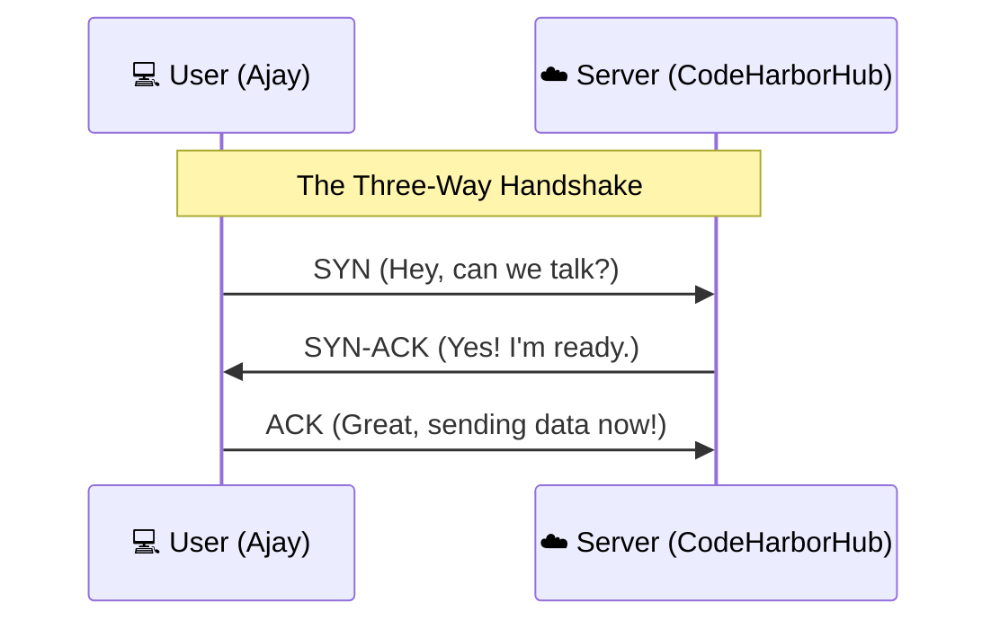

At **Layer 4 (Transport)** of the OSI model, we have two main ways to move data. Imagine you are sending a message to a friend across a busy park:

* **TCP** is like walking over, tapping them on the shoulder, and making sure they heard every single word.
* **UDP** is like standing on a bench and shouting your message through a megaphone, hoping they catch most of it.

## TCP (Transmission Control Protocol)

TCP is the **"Reliable"** protocol. It ensures that every single packet of data arrives in the correct order and without any errors.

### The "Three-Way Handshake"
Before any data is sent, TCP performs a formal introduction.

### Why use TCP?

  * **Error Recovery:** If a packet is lost, TCP asks the server to send it again.
  * **Ordered Data:** If Packet \#3 arrives before Packet \#2, TCP rearranges them.
  * **Best for:** Websites (HTTP/S), Email (SMTP), Databases, and File Transfers (FTP).

## UDP (User Datagram Protocol)

UDP is the **"Fast"** protocol. It doesn't care about handshakes, errors, or order. It just sends data as fast as the network allows.

### The "Fire and Forget" Method

UDP simply pours data onto the wire. If a packet falls off, it’s gone forever.

### Why use UDP?

  * **Low Latency:** There is no waiting for "ACK" (acknowledgment) messages.
  * **Efficiency:** Smaller headers mean less overhead.
  * **Best for:** Live Video Streaming (Zoom/YouTube Live), Online Gaming, and Voice calls (VoIP).

## Side-by-Side Comparison

| Feature | TCP (The Librarian) | UDP (The Megaphone) |
| :--- | :--- | :--- |
| **Connection** | Connection-oriented (Handshake) | Connectionless (Just sends) |
| **Reliability** | Guaranteed delivery | Best-effort (No guarantee) |
| **Speed** | Slower (Wait for ACKs) | Blazing Fast |
| **Order** | Guaranteed order | No specific order |
| **Header Size** | Large ($$20 \text{ bytes}$$) | Small ($$8 \text{ bytes}$$) |

## The Mathematics of Reliability

In TCP, we use a **Check-sum** to verify data integrity. Think of it as a simple math equation:
If the sender sends:
$$Data + Key = Result$$
The receiver performs the same math. If the result is different, the packet is considered "Corrupt" and is thrown away.

## DevOps Insight: Which one to choose?

At **CodeHarborHub**, you will mostly work with TCP because web applications *cannot* afford to lose data (imagine a CSS file missing half its code!).

However, if you are building a **Real-time Monitoring Dashboard** that updates every millisecond, you might use UDP to ensure the "Current" data is always as fresh as possible, even if a few updates are missed.

## Summary Checklist

  * [x] I can explain the **Three-Way Handshake** (SYN, SYN-ACK, ACK).
  * [x] I understand that TCP is for **Accuracy** and UDP is for **Speed**.
  * [x] I know that HTTP/S always runs on top of TCP.
  * [x] I can identify a "Lossy" connection as one where UDP packets are disappearing.

:::info Fun Fact
Did you know that **DNS** (which we will learn next) uses **UDP** for small requests because it needs to be incredibly fast, but switches to **TCP** if the data is too large? It uses the best of both worlds!
:::