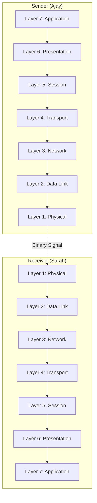

If you’ve ever had a "Connection Timed Out" error, the problem could be anywhere—from a broken underwater cable in the ocean to a typo in your JavaScript code. The **OSI Model** helps us "divide and conquer" these problems by breaking networking into 7 distinct layers.

## The Layered Logic

In the OSI model, data moves **down** the layers on the sending machine and **up** the layers on the receiving machine.

:::info The "Pizza Delivery" Analogy
Imagine ordering a pizza:
1. **Application:** You choose the pizza on an app.
2. **Presentation:** The app formats your order (JSON).
3. **Session:** The shop keeps your "tab" open until you pay.
4. **Transport:** They decide to use a car (TCP) or a bike (UDP).
5. **Network:** They find the fastest route to your house (IP).
6. **Data Link:** The driver follows traffic lights and lanes (MAC).
7. **Physical:** The actual road surface the tires touch (Cables).
:::

## Visualizing the Flow

Here is how data travels between two people (like Ajay and Sarah) at **CodeHarborHub**:

## Deep Dive into the 7 Layers

### Layer 7: Application (The Interface)

This is the only layer the user touches. It’s where your browser or email client lives.

  * **Protocols:** HTTP, FTP, SMTP, DNS.
  * **DevOps Role:** Ensuring the API returns the correct data.

### Layer 6: Presentation (The Translator)

This layer ensures that data is in a usable format. It handles **Encryption** and **Compression**.

  * **Key Task:** Converting XML to JSON, or encrypting traffic via SSL/TLS.

### Layer 5: Session (The Conversation)

This layer opens, manages, and closes the "dialogue" between two devices.

  * **Key Task:** If you are downloading a 1GB file and the connection drops, this layer handles the "checkpoint" so you don't start from zero.

### Layer 4: Transport (The Logic)

This layer decides **how** much data to send and at what speed.

  * **Protocols:** TCP (Reliable) and UDP (Fast).
  * **Mathematics of Data:** The size of a data segment can be represented as:

    $$Segment = Header + Data$$

### Layer 3: Network (The Post Office)

This layer handles **Routing**. It finds the best physical path for the data to take.

  * **Key Concept:** IP Addresses and Routers.
  * **Formula for IPv4 space:**

    $$Total_{IPs} = 2^{32}$$

### Layer 2: Data Link (The Local Map)

This handles communication between two devices on the **same** network (like your laptop and your router).

  * **Key Concept:** MAC Addresses and Switches.

### Layer 1: Physical (The Hardware)

The actual raw bitstream. It’s the electricity in the copper wire, the light in the fiber optic, or the radio waves in the air.

  * **Unit:** Bits (0s and 1s).

## Why DevOps Engineers Love the OSI Model

When a site at **CodeHarborHub** is down, we use the OSI model to troubleshoot from the **bottom up**:

1.  **Layer 1 Check:** Is the server plugged in? Is the cable broken?
2.  **Layer 3 Check:** Can I `ping` the server IP?
3.  **Layer 4 Check:** Is the port (e.g., 80 or 443) open?
4.  **Layer 7 Check:** Is the Nginx service actually running?

## Summary Checklist

  * [x] I know there are **7 layers** in the OSI model.
  * [x] I understand that **Layer 7** is for Apps and **Layer 1** is for Hardware.
  * [x] I can explain why **TCP/UDP** live in Layer 4 (Transport).
  * [x] I understand that **IP Addresses** are a Layer 3 (Network) concept.

:::tip
In modern DevOps, we often talk about the **TCP/IP Model**, which is a simplified 4-layer version of OSI. However, everyone still uses OSI terminology (e.g., "That's a Layer 7 issue!") in technical interviews. Master the 7 layers first!
:::