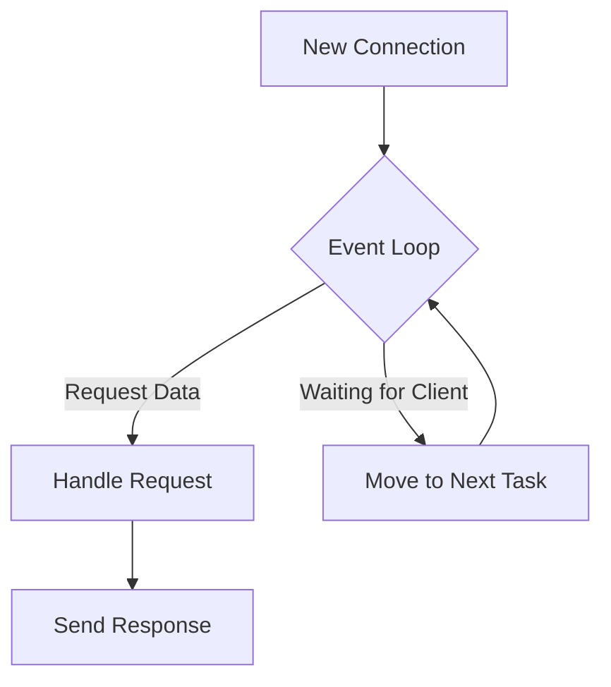

Before we start writing configuration files, it is important to understand why Nginx is so fast. Unlike traditional web servers that create a new "thread" or "process" for every user, Nginx uses an **Asynchronous, Event-Driven Architecture**.

:::info What does "Event-Driven" mean?
In an event-driven model, Nginx can handle multiple requests at the same time without waiting for one to finish before starting the next. This allows it to serve thousands of users with minimal resources.
:::

## The Master-Worker Model

Nginx operates using a hierarchical process model. It divides the labor to ensure that if one part of the system is busy, the rest of the server stays responsive.

### 1. The Master Process
The "Manager" of the server. Its main jobs are:
* Reading and validating the configuration files (`nginx.conf`).
* Starting, stopping, and managing **Worker Processes**.
* Performing privileged operations (like opening network ports).

### 2. The Worker Processes
The "Employees" who do the heavy lifting.
* They handle the actual network connections.
* They read and write content to the disk.
* They communicate with backend servers (like your Node.js API).
* **Industrial Standard:** Usually, you run one worker process per CPU core on your server.

## The Event Loop (Why it Scales)

In a typical MERN app, a user might have a slow internet connection. A traditional server would "block" and wait for that user to finish. Nginx doesn't wait. It uses an **Event Loop**.



This allows a single Nginx worker to handle **thousands** of concurrent users with very low RAM usage.

## Installation Guide

At **CodeHarborHub**, we recommend learning Nginx on a Linux environment (Ubuntu) or using Docker for consistent local development.

<Tabs>
<TabItem value="ubuntu" label="Ubuntu / Debian" default>

**1. Update your package index:**

```bash
sudo apt update
```

**2. Install Nginx:**

```bash
sudo apt install nginx -y
```

**3. Verify Installation:**

```bash
nginx -v
# Output: nginx version: nginx/1.18.0 (Ubuntu)
```

**4. Check Service Status:**

```bash
sudo systemctl status nginx
```

</TabItem>
<TabItem value="docker" label="Docker (Recommended for Dev)">

If you don't want to install Nginx directly on your OS, use Docker. This is perfect for testing your **CodeHarborHub** projects locally.

**1. Pull and Run the Image:**

```bash
docker run --name chh-nginx -p 80:80 -d nginx
```

**2. Test it:**
Open `http://localhost` in your browser. You should see the "Welcome to nginx!" page.

</TabItem>
<TabItem value="mac" label="macOS">

Using **Homebrew**:

```bash
brew install nginx
sudo brew services start nginx
```

</TabItem>
</Tabs>

## Managing the Nginx Service

Once installed, you will use these commands constantly. Bookmark these!

| Command | Action | When to use? |
| :--- | :--- | :--- |
| `sudo systemctl start nginx` | Start Nginx | After a reboot or manual stop. |
| `sudo systemctl stop nginx` | Stop Nginx | To take the server offline. |
| `sudo systemctl restart nginx` | Hard Restart | To apply major system changes. |
| `sudo systemctl reload nginx` | **Graceful Reload** | **Best Practice:** Apply config changes without dropping user connections. |

## Verification: The "Welcome" Page

After installation, Nginx automatically starts a default website. If you navigate to your server's IP address (or `localhost`), you should see:

:::warning Firewall Check
On AWS or local Linux, if you can't see the page, ensure **Port 80** is open in your Security Groups or `ufw` firewall:
`sudo ufw allow 'Nginx Full'`
:::