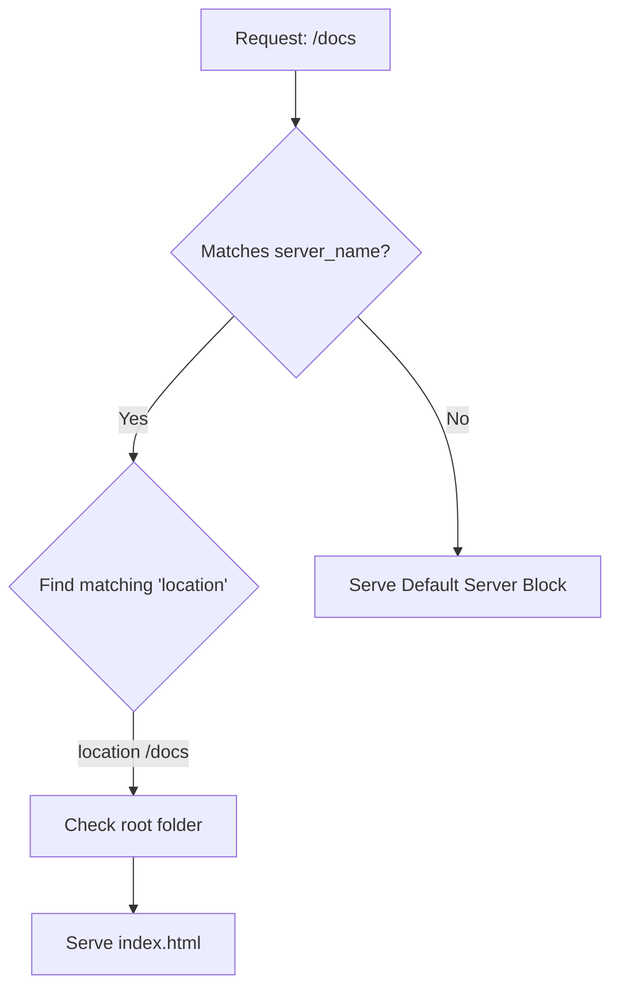

Nginx doesn't have a graphical interface. Everything you want it to do—from hosting a **Docusaurus** site to securing a **MERN** API—is defined in simple text files. 

At **CodeHarborHub**, we follow the "Industrial Standard" of modular configuration. Instead of one giant file, we break our settings into smaller, manageable pieces.

:::info Why Modular Configuration?
This approach allows us to:

1.  **Organize by Purpose:** Keep frontend and backend settings separate.
2.  **Enable/Disable Easily:** Just move a file from `sites-available` to `sites-enabled` to activate it.
3.  **Collaborate:** Multiple developers can work on different configs without conflicts.
:::

## The File Hierarchy

On a Linux server (Ubuntu), Nginx stores its files in `/etc/nginx/`. Here is the structure you need to know:

| File/Folder | Purpose |
| :--- | :--- |
| **`nginx.conf`** | The main "Global" configuration file. |
| **`sites-available/`** | Where you store individual website configs (The "Drafts"). |
| **`sites-enabled/`** | Where "Active" website configs live (The "Live" versions). |
| **`conf.d/`** | General configuration snippets included by the main file. |

## The Anatomy of a Config File

Nginx uses a **Block-based** syntax. It looks very similar to CSS or JSON. A block is defined by curly braces `{ }`.

### 1. The Directives
A **Directive** is a single instruction. It ends with a semicolon `;`.
* *Example:* `listen 80;`

### 2. The Context (Blocks)
A **Context** is a group of directives. 
* **Main:** The global settings (outside any braces).
* **Events:** Connection handling settings.
* **Http:** Settings for all web traffic.
* **Server:** Settings for a specific website (Virtual Host).
* **Location:** Settings for a specific URL path.

## Writing a Basic Server Block

This is the most common task for a **CodeHarborHub** developer. Below is a professional template for hosting a static site (like your Docusaurus build).

```nginx
server {
    listen 80;                          # Listen on Port 80 (HTTP)
    server_name codeharborhub.com;      # Your Domain Name

    # Where the website files are stored
    root /var/www/codeharborhub/build; 

    # The default file to load
    index index.html;

    # URL Handling
    location / {
        # Check if the file exists, if not, load index.html
        # (Crucial for React/Docusaurus routing!)
        try_files $uri $uri/ /index.html;
    }
}
```

## How Nginx Processes a Request

When a user visits `codeharborhub.com/docs`, Nginx follows a logical "Decision Tree" to find the right file.



## Essential Directives to Memorize

<Tabs>
<TabItem value="server" label="Server Directives" default>

  * **`listen`**: Defines the port (80 for HTTP, 443 for HTTPS).

  * **`server_name`**: Defines the domain (e.g., `api.example.com`).

  * **`error_page`**: Defines custom pages for 404 or 500 errors.

</TabItem>
<TabItem value="location" label="Location Directives">

  * **`proxy_pass`**: Forwards the request to another server (Node.js).

  * **`root`**: The base folder for searching files.

  * **`alias`**: Defines a replacement for the path.

  * **`return`**: Used for redirects (e.g., redirecting HTTP to HTTPS).

</TabItem>

</Tabs>

## Best Practices for CodeHarborHub Learners

1.  **Always Test Your Config:** Before restarting Nginx, run this command to check for syntax errors:

    ```bash
    sudo nginx -t
    ```

    *If it says "syntax is ok," you are safe to reload\!*

2.  **Use Reload, Not Restart:**

    * **Restart:** Stops the server and starts it again (brief downtime).
    * **Reload:** Applies changes without stopping the server (zero downtime).

        ```bash
        sudo systemctl reload nginx
        ```

3.  **Permissions:** Ensure the `nginx` user has permission to read your `/var/www/` folders.


:::tip Tip for Local Development
When testing Nginx locally, you can use `localhost` or `127.0.0.1`. If you want to test with a custom domain (like `codeharborhub.local`), add this line to your `/etc/hosts` file:

```
127.0.0.1 codeharborhub.local
```

This way, you can mimic a real domain environment on your local machine.
:::